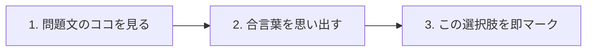

# 応用情報技術者試験（AP）直感攻略ノート一覧

応用情報技術者試験の出題範囲（シラバス）の中分類単元に準拠した体系的インデックスです。

---

## 📂 フォルダの運用サイクル

1. **`docs/inputs/` (入力・投入)**:
   - 過去問道場で間違えた問題（スクショ画像、CSV、問題番号メモなど）を置くフォルダ。
   - 「inputsのファイルから解説を作って」と指示すると、AIがこのフォルダを読み取って自動作成します。
2. **`docs/inbox/` (生成・未読)**:
   - 新しく自動生成された解説ノートが入る受信用フォルダ（単元ごとに自動分類）。
   - バス通勤中などにスマホでサクッと読み進めます。
3. **`docs/ap-prep/` (定着・保管)**:
   - 読了して「腹落ち・理解できた」ノートを移動してストック・復習するアーカイブフォルダ。

---

## 🚌 通勤スマホ・超集中（ADHDフレンドリー）解説MD作成ルール（厳格ガイドライン）

今後AI（Antigravity）が新しい解説ノートを作成・改修する際は、**従来の「問題→解説」構造を維持したまま、以下の「i-have-adhd（脳の摩擦ゼロ＆ドーパミン獲得）」の原則を融合させた新テンプレート** を厳格に遵守すること。

### 1. デザイン原則（集中力維持 ＆ 記憶定着）
- **ワーキングメモリ負荷ゼロ**: 「〜を頭に置いて読んでください」は禁止。画面にある情報だけでその場で完結させる。
- **脱線の完全排除（Suppress tangents）**: 枝葉の学説・めったに出ない例外・うんちくは全カット。合格ライン（60点）を突破するための最短コアだけを書く。
- **行動の番号付け（Number multi-step tasks）**: 「そして次に〜」の長文を避け、思考手順を「1. 〇〇を見る → 2. △△を思い出す → 3. □□を選ぶ」の1ステップ1行動にする。
- **合言葉の音読リズム**: 「Bは元気・Rはリペア」のように、視覚とリズムで脳に焼き付くフレーズを必ず入れる。
- **即効ドーパミン（次の2分アクション）**: ノートの末尾に「今すぐ2分以内にできる具体的な1行動（過去問道場で1問解く等）」を置き、達成感を即時獲得させる。
- **ネタバレ厳禁（折りたたみ正解）**: `<details>` タグで正解を隠し、自力で考えてからタップするクイズ体験を担保。
- **数式の平易化（文字化け防止）**: LaTeX記法（`$\frac{2}{3}$` 等）は使わず、誰でも読める自然な分数（`2/3`）や日本語の四則演算にする。

### 2. 必須構成テンプレート
````markdown
# タイトル：[日常のたとえ話] で覚える「[重要キーワード]」

> **所要時間**: 5〜6分（具体的かつ短く）  
> **対象過去問**: 応用情報技術者 [年度・期 午前問XX]  
> **一言でいうと**: [脳内に残す1行の結論・合言葉]  
> **省いたもの**: [難解な枝葉・試験に出ないウンチク]  

---

## 【対象過去問】[年度・期 午前問XX]

**【問題】**  
[問題文]

- **ア**: ...
- **イ**: ...
- **ウ**: ...
- **エ**: ...

<details>
<summary>▶ タップして正解を表示する</summary>

**正解: [記号]（[正解の記述]）**

</details>

---

## 0. 一枚で：反射で解く「3秒手順」＆ 合言葉！



### 🧠 脳に刻む合言葉：
> **『 [短くリズムが良いワンフレーズ] 』**

---

## 1. なぜそうなるのか？（日常のたとえ話 × 3ステップ）

身近なモノ（スマホ・ATM・ラーメン屋など）でイメージを固定します。

1. **【状況】**: [誰でも知っている日常のシーン]
2. **【仕組み】**: [専門用語を日常の言葉に置き換えて説明]
3. **【結論】**: [だからこの答えになる！]

---

## 2. 選択肢のひっかけ見分けパズル（消去の1秒ルール）

脱線ゼロで「なぜ×か、なぜ◯か」だけを瞬時に見抜くポイント：

- **ア**: [×の理由] → **[見分けるキーワード]**
- **イ**: [×の理由] → **[見分けるキーワード]**
- **ウ**: [×の理由] → **[見分けるキーワード]**
- **エ**: [◯の理由] → **[これが正解！]**

---

## 3. 午後試験 記述対策チェックリスト（※該当する場合）

- [ ] **Q. [記述で狙われる問い]**  
  → **「[40字程度の模範解答]」**

---

## 🎯 次の2分アクション（即効ドーパミン獲得！）

- [ ] **今すぐ [問題番号] を道場でもう一度解いて、「即答できる快感」を味わう！**
````

---

## 04. システム構成要素

| ファイル名 | テーマ・過去問 | 日常のたとえ話（暗記フック・要約） | 状態 |
| :--- | :--- | :--- | :---: |
| [sys-availability-mtbf-mttr.md](./inbox/04_システム構成要素/sys-availability-mtbf-mttr.md) | **稼働率とMTBF・MTTR**<br>（[R4秋 問14](https://www.ap-siken.com/kakomon/04_aki/q14.html)） | 『Bは元気・Rはリペア（修理）』<br>スマホの元気時間と入院時間。両方1.5倍になっても比率だから「変わらない」！ | inbox |

## 09. データベース

| ファイル名 | テーマ・過去問 | 日常のたとえ話（暗記フック・要約） | 状態 |
| :--- | :--- | :--- | :---: |
| [db-acid-properties.md](./inbox/09_データベース/db-acid-properties.md) | **トランザクションのACID特性**<br>（[R2秋 問30](https://www.ap-siken.com/kakomon/02_aki/q30.html)） | 銀行のATM1万円送金<br>A:全か無か、C:矛盾なし、I:一人ずつ隔離、D:落雷停電でも消えない耐久力（Durability） | inbox |
| [db-three-schema-architecture.md](./inbox/09_データベース/db-three-schema-architecture.md) | **3層スキーマ構造と内部設計**<br>（[H31春 問26](https://www.ap-siken.com/kakomon/31_haru/q26.html)） | 3段のお重イメージ<br>上段:外部（画面）、中段:概念（テーブル設計）、下段:内部（記録媒体・インデックス） | inbox |

## 10. ネットワーク

| ファイル名 | テーマ・過去問 | 日常のたとえ話（暗記フック・要約） | 状態 |
| :--- | :--- | :--- | :---: |
| [network-ipv6-notation.md](./inbox/10_ネットワーク/network-ipv6-notation.md) | **IPv6アドレス表記ルール**<br>（[R4春 問31](https://www.ap-siken.com/kakomon/04_haru/q31.html)） | 小学生の引き算パズル<br>「::」は1回だけ！2回あると引き算が壊れて復元不能。ドット混入は即消去 | inbox |
| [network-osi-7layers-protocols.md](./inbox/10_ネットワーク/network-osi-7layers-protocols.md) | **OSI参照モデルとプロトコル**<br>（[R5春 問34](https://www.ap-siken.com/kakomon/05_haru/q34.html)） | 7階建てマンションの住人<br>4階（トランスポート層）の住人は「TCP」と「UDP」だけ！HTTPは7階、IPは3階 | inbox |
| [network-wifi-80211ac.md](./inbox/10_ネットワーク/network-wifi-80211ac.md) | **無線LAN規格（11acと周波数帯）**<br>（[R3春 問33](https://www.ap-siken.com/kakomon/03_haru/q33.html)） | 『あっ（a）、クリア（ac）な5GHz！』<br>電子レンジの邪魔が入らない5GHz専用。無線は衝突回避（CA）なのでCDは即消去 | inbox |
| [network-dns.md](./ap-prep/10_ネットワーク/network-dns.md) | **DNSキャッシュポイズニングとDNSSEC**<br>（午前・午後頻出） | カミンスキー型攻撃がTTL待ちを回避する原理と、DS/DNSKEY/RRSIGの信頼の連鎖 | ap-prep |
| [network-frame-relay.md](./ap-prep/10_ネットワーク/network-frame-relay.md) | **フレームリレー方式**<br>（午前頻出） | 交換機での誤りチェックをサボって高速化。CIR超過パケットはDE=1で混雑時に優先破棄 | ap-prep |
| [network-tcp-vs-udp.md](./ap-prep/10_ネットワーク/network-tcp-vs-udp.md) | **TCP と UDP の違い**<br>（午前頻出） | 書留郵便（TCP: 再送・3ウェイハンドシェイク） vs 拡声器（UDP: 投げっぱなし・生配信） | ap-prep |

## 11. セキュリティ

| ファイル名 | テーマ・過去問 | 日常のたとえ話（暗記フック・要約） | 状態 |
| :--- | :--- | :--- | :---: |
| [sec-session-hijacking-reauth.md](./inbox/11_セキュリティ/sec-session-hijacking-reauth.md) | **セッション乗っ取り対策（再認証）**<br>（[H28春 問41](https://www.ap-siken.com/kakomon/28_haru/q41.html)） | ホテルのカードキーと貴重品金庫<br>部屋の鍵を盗まれても、最後の金庫（個人情報）を開ける直前のパスワード再入力で防ぐ | inbox |
| [sec-tls-client-authentication.md](./inbox/11_セキュリティ/sec-tls-client-authentication.md) | **TLSクライアント認証の送付順序**<br>（[R3春 問45](https://www.ap-siken.com/kakomon/03_haru/q45.html)） | 高級会員制クラブの名刺交換<br>詐欺を警戒してまず店側が名刺（b） → 客が会員証（a） → 店が確認（c）！ | inbox |
| [sec-ipsec-ah-esp.md](./inbox/11_セキュリティ/sec-ipsec-ah-esp.md) | **IPsec（AHとESP）**<br>（[R3秋 問43](https://www.ap-siken.com/kakomon/03_aki/q43.html)） | 宅配便の封蝋と頑丈な金庫<br>AHは認証・改ざん防止のみ（暗号化なし）。ESPは暗号化＋認証の万能選手 | inbox |

## 12. システム開発技術

| ファイル名 | テーマ・過去問 | 日常のたとえ話（暗記フック・要約） | 状態 |
| :--- | :--- | :--- | :---: |
| [dev-square-quality-characteristics.md](./inbox/12_システム開発技術/dev-square-quality-characteristics.md) | **ソフトウェア品質特性 (SQuaRE)**<br>（[R1秋 問47](https://www.ap-siken.com/kakomon/01_aki/q47.html)） | スマホ選びの8大チェック項目<br>機能適合性＝明示的＆暗黙の「ニーズを満足させる」機能があるかどうか | inbox |

## 13. ソフトウェア開発管理技術

| ファイル名 | テーマ・過去問 | 日常のたとえ話（暗記フック・要約） | 状態 |
| :--- | :--- | :--- | :---: |
| [dev-cmmi-maturity-levels.md](./inbox/13_ソフトウェア開発管理技術/dev-cmmi-maturity-levels.md) | **CMMI（能力成熟度モデル統合）**<br>（[H29秋 問49](https://www.ap-siken.com/kakomon/29_aki/q49.html)） | 開発組織のオトナ度ピラミッド<br>M＝Maturity（成熟度）。共通フレームは作業基準、CMMIは組織の通信簿 | inbox |

## 14. プロジェクトマネジメント

| ファイル名 | テーマ・過去問 | 日常のたとえ話（暗記フック・要約） | 状態 |
| :--- | :--- | :--- | :---: |
| [pm-cost-assignment-puzzle.md](./inbox/14_プロジェクトマネジメント/pm-cost-assignment-puzzle.md) | **要員割り当て最小コストパズル**<br>（[R1秋 問54](https://www.ap-siken.com/kakomon/01_aki/q54.html)） | 『期限で絞って・重い順に・パズルする！』<br>遅いCさんは4キロの仕事を2か月で終わらせられない（足切り脱落）から解く | inbox |

## 15. サービスマネジメント

| ファイル名 | テーマ・過去問 | 日常のたとえ話（暗記フック・要約） | 状態 |
| :--- | :--- | :--- | :---: |
| [service-level-management-sla.md](./inbox/15_サービスマネジメント/service-level-management-sla.md) | **サービスレベル管理 (SLM) と SLA**<br>（[H27秋 問56](https://www.ap-siken.com/kakomon/27_aki/q56.html)） | ホテルの宿泊プラン契約<br>顧客とサービス目標を「合意文書（SLA）」として交わし、定期的にPDCAを回す | inbox |

## 16. システム監査

| ファイル名 | テーマ・過去問 | 日常のたとえ話（暗記フック・要約） | 状態 |
| :--- | :--- | :--- | :---: |
| [audit-system-audit-charter-approval.md](./inbox/16_システム監査/audit-system-audit-charter-approval.md) | **規程の承認者と3者の力関係**<br>（[H30春 問59](https://www.ap-siken.com/kakomon/30_haru/q59.html)） | 警察と裁判所と社長<br>現場にルールを決めさせたら不正が隠せる（自己監査の禁止）。承認は社長一択！ | inbox |

## 19. 経営戦略マネジメント

| ファイル名 | テーマ・過去問 | 日常のたとえ話（暗記フック・要約） | 状態 |
| :--- | :--- | :--- | :---: |
| [strategy-value-chain-frameworks.md](./inbox/19_経営戦略マネジメント/strategy-value-chain-frameworks.md) | **バリューチェーンと4大フレームワーク**<br>（[R3秋 問67](https://www.ap-siken.com/kakomon/03_aki/q67.html)） | パン屋さんのバトンリレー<br>「5つの主活動と4つの支援活動」＝バリューチェーン。SWOT・BSCとの見分け方 | inbox |

## 21. ビジネスインダストリ

| ファイル名 | テーマ・過去問 | 日常のたとえ話（暗記フック・要約） | 状態 |
| :--- | :--- | :--- | :---: |
| [strategy-cps-cyber-physical-system.md](./inbox/21_ビジネスインダストリ/strategy-cps-cyber-physical-system.md) | **サイバーフィジカルシステム (CPS)**<br>（[R4秋 問73](https://www.ap-siken.com/kakomon/04_aki/q73.html)） | 現実と仮想の卓球ラリー<br>畑のデータを測る（現実） → AIで分析（仮想） → 自動散水（現実にフィードバック） | inbox |
| [strategy-edge-computing.md](./inbox/21_ビジネスインダストリ/strategy-edge-computing.md) | **エッジコンピューティング**<br>（[R6春 問72](https://www.ap-siken.com/kakomon/06_haru/q72.html)） | 現場の店長が即決！<br>本社（クラウド）のお伺い待ちをなくし、端末の近傍で超低遅延処理＆回線負荷軽減 | inbox |

## 22. 企業活動

| ファイル名 | テーマ・過去問 | 日常のたとえ話（暗記フック・要約） | 状態 |
| :--- | :--- | :--- | :---: |
| [strategy-breakeven-point.md](./inbox/22_企業活動/strategy-breakeven-point.md) | **損益分岐点・安全余裕率**<br>（[R1秋 問77](https://www.ap-siken.com/kakomon/01_aki/q77.html)） | 『粗利を・こそげて・安心』<br>ラーメン屋の家賃回収パズル。小数を10倍して消す途中式を全記載 | inbox |

## 23. 法務

| ファイル名 | テーマ・過去問 | 日常のたとえ話（暗記フック・要約） | 状態 |
| :--- | :--- | :--- | :---: |
| [law-sensitive-personal-information.md](./inbox/23_法務/law-sensitive-personal-information.md) | **要配慮個人情報（個人情報保護法）**<br>（[R6春 問80](https://www.ap-siken.com/kakomon/06_haru/q80.html)） | 個人情報のデリケート度3段階<br>要配慮＝差別の防止！病歴、前科、信条など知られたら不当な不利益が生じる情報 | inbox |
| [law-giteki-mark-regulations.md](./inbox/23_法務/law-giteki-mark-regulations.md) | **技適マークと各国の認証マーク**<br>（[R1秋 問80](https://www.ap-siken.com/kakomon/01_aki/q80.html)） | スマホの電波の車検シール<br>日本の電波法に適合している証明。EUはCE、米はFCC、家電安全はPSE | inbox |
| [law-labor-contract-dispatch-subcontract.md](./inbox/23_法務/law-labor-contract-dispatch-subcontract.md) | **請負・派遣・出向の契約形態**<br>（[R5秋 問80](https://www.ap-siken.com/kakomon/05_aki/q80.html)） | 労働形態の三角関係<br>請負で客先が指示したら「偽装請負」！出向は出向先と指揮命令関係が生じる | inbox |

