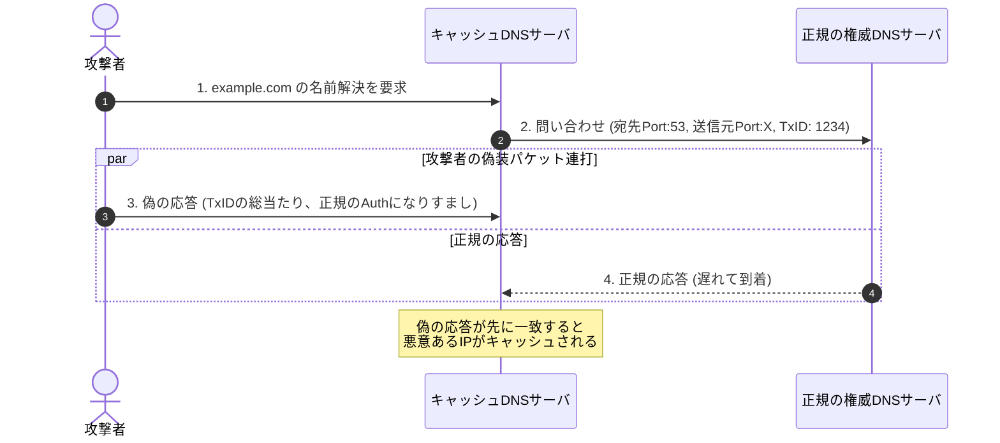
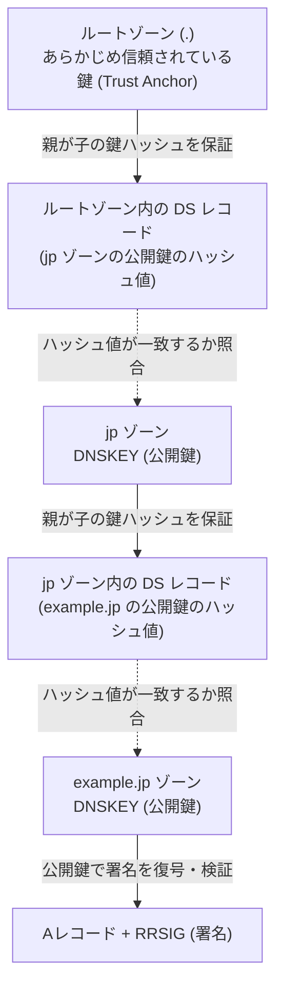

# DNSキャッシュポイズニングとDNSSEC：なぜ偽の応答が受け入れられ、どう防ぐのか

> **想定読者**: 基本情報レベルのDNS基礎（ドメイン名とIPの対応、UDPを使うこと）は理解しているが、応用情報の午後試験で問われるキャッシュポイズニングの成立条件やDNSSECの署名検証チェーンが曖昧な受験者  
> **省いたもの**: ドメイン名前解決の基本定義、DNSパケットの全フォーマット  
> **所要時間**: 12分  
> **検証方法**: Windows PowerShell の `Resolve-DnsName` による実DNSSECレコード（DNSKEY / DS）の取得確認  

---

## 0. 一枚で

| 技術・攻撃 | 核心の仕組み | 応用情報・午後試験での問われ方（頻出フレーズ） |
| :--- | :--- | :--- |
| **従来のキャッシュポイズニング** | 権威DNSより先に「TxID」「宛先ポート」「送信元IP」が一致する偽のUDP応答を送りつける | キャッシュのTTLが切れるまで次の攻撃試行ができない |
| **カミンスキー型攻撃** | 存在しないサブドメイン（`rand1.example.com`等）を次々問い合わせさせ、権威情報（NSレコード）を上書きする | **「キャッシュのTTL待ちが不要となり、短時間で大量の攻撃試行が可能になる」** |
| **ソースポートランダマイゼーション (SPR)** | 送信元ポート番号（宛先ポート）を問い合わせごとにランダム化（約 $2^{16} \times 2^{16} \approx 4.3 \times 10^9$ 通りに増大） | 推測困難にする確率的対策。**「暗号学的な改ざん防止技術ではない」** |
| **DNSSEC** | レコード群に電子署名（RRSIG）を付与し、親ゾーンのDSレコードからルートまで信頼の連鎖を検証する | **「改ざん検知となりすまし防止を行うが、通信の暗号化（盗聴防止）は行わない」** |

---

## 1. なぜ偽の応答が信じられてしまうのか

キャッシュDNSサーバは、自身が送った問い合わせに対する応答かどうかを **3つの値の完全一致** のみで判定します。

1. **送信元IPアドレス**: 問い合わせ先の権威DNSサーバのIP
2. **宛先ポート番号**: キャッシュDNSサーバが問い合わせ時に使用したUDPポート
3. **トランザクションID (TxID)**: 16ビット（65,536通り）の識別番号

UDPはコネクションレスであるため、送信元IPアドレスの偽装（IPスプーフィング）が容易です。



### カミンスキー型攻撃のブレイクスルー
従来の攻撃では、一度問い合わせたドメインがキャッシュされると、TTL（有効期限）が切れるまでキャッシュDNSサーバは再問い合わせを行いませんでした。  
カミンスキー型攻撃は、**「毎回異なるランダムなサブドメイン（`a1.example.com`, `a2.example.com`）」** を問い合わせます。

- 毎回キャッシュミスが発生し、連続して権威DNSへ問い合わせが飛ぶ。
- 偽の応答の **追加情報セクション（Additional Section）に「example.com のDNSサーバは攻撃者のサーバである」という偽のNSレコード** を含めて送り込む。
- これにより、TTL待ちを完全に無視して数秒〜数分で毒入れが完了します。

---

## 2. 第1の防壁：ソースポートランダマイゼーション（SPR）

かつて多くのキャッシュDNSサーバは、外部への問い合わせポートを「53番固定」または「連番」にしていました。  
そのため、攻撃者が当てるべきは **16ビット（TxIDの65,536通り）だけ** でした。

### ポート番号も推測対象にする
ソースポートランダマイゼーション（Source Port Randomization: SPR）では、問い合わせごとにエフェメラルポート（約1,024〜65,535）からランダムにポートを選びます。

- 探索空間: $65,536 \text{ (TxID)} \times \text{約 } 60,000 \text{ (Port)} \approx \mathbf{40億通り}$
- これにより、総当たり攻撃を成功させるための必要パケット数が天文学的に跳ね上がります。

> **午後試験の落とし穴**:  
> SPRはあくまで「当てにくくする（確率的な防御）」であり、同一LAN内でのパケット盗聴（スニッフィング）や中間者（MitM）に対しては無力です。**暗号学的な完全性・真正性の保証には DNSSEC が必要** になります。

---

## 3. 第2の防壁：DNSSECの信頼の連鎖（Trust Anchor）

DNSSEC（DNS Security Extensions）は、**公開鍵暗号とデジタル署名** を用いてDNS応答の正当性を検証します。

### 登場する主要レコード

| レコード | 役割 | 誰が発行するか |
| :--- | :--- | :--- |
| **RRSIG** (Resource Record Signature) | Aレコードなどのレコード群（RRset）に対する**電子署名** | 当該ゾーン（ZSKで署名） |
| **DNSKEY** | 署名を検証するための**公開鍵**（ZSK / KSK） | 当該ゾーン |
| **DS** (Delegation Signer) | 子ゾーンの公開鍵（KSK）の**ハッシュ値** | **親ゾーン** |

### 階層的な検証チェーン（Trust Chain）

キャッシュDNSサーバは、世界で共通の「ルートゾーンの公開鍵（Trust Anchor）」をあらかじめ保持しています。



### 実機での検証（実コマンドの出力例）

実際に Windows PowerShell の `Resolve-DnsName` で `example.com` の DNSSEC レコードを確認すると、暗号アルゴリズム（13 = ECDSA P-256）と鍵情報が取得できます。

```powershell
# 1. ゾーンの公開鍵（DNSKEY）の取得
Resolve-DnsName -Name example.com -Type DNSKEY

# 出力:
# Name         Type   TTL   Flags  Protocol Algorithm
# example.com  DNSKEY 3600  257    DNSSEC   13 (ECDSA)  <- KSK (鍵署名鍵: Flags 257)
# example.com  DNSKEY 3600  256    DNSSEC   13 (ECDSA)  <- ZSK (ゾーン署名鍵: Flags 256)

# 2. 親ゾーン（.com）が持つ子ゾーンの鍵ハッシュ（DSレコード）の取得
Resolve-DnsName -Name example.com -Type DS

# 出力:
# Name         Type TTL   KeyTag Algorithm DigestType Digest
# example.com  DS   86400 2371   13        2 (SHA256) {201, 136, 236, 66...}
```

- **KSK (Key Signing Key)**: ZSKを署名するための鍵。このハッシュ値が親ゾーンの `DSレコード` に登録される。
- **ZSK (Zone Signing Key)**: 日常のレコード（A, MX等）を署名するための鍵。

---

## 4. 午後試験 記述対策チェックリスト

試験問題文に次のキーワードや状況が出たら、以下の言い回しで解答を組み立てます。

- [ ] **Q. カミンスキー型攻撃が成功しやすい理由は？**  
  → **「存在しないサブドメインを問い合わせることで、キャッシュのTTL切れを待たずに連続して攻撃試行できるため」**（35字）
- [ ] **Q. ソースポートランダマイゼーションの目的は？**  
  → **「問い合わせ時の宛先ポート番号をランダム化し、偽応答の合致条件の推測を困難にするため」**（35字）
- [ ] **Q. DNSSECを導入しても防止できない脅威は何か？**  
  → **「通信内容の暗号化は行わないため、パケットの盗聴（盗聴による情報漏洩）は防げない」**（33字）
- [ ] **Q. キャッシュサーバがDNS応答の正当性を確認する手順は？**  
  → **「親ゾーンから取得したDSレコードと、子ゾーンのDNSKEYのハッシュ値を照合し、信頼の連鎖を検証する」**（43字）

---

## 5. 理解度チェック

各設問について、頭の中で記述解答（またはメモ）を作ってから開いてください。

### 問1（カミンスキー型攻撃の脅威）
**【問題】** 従来のDNSキャッシュポイズニング攻撃と比較して、カミンスキー型攻撃が短時間で成功に至る理由を、「TTL」「キャッシュ」の用語を用いて40字以内で述べよ。

<details>
<summary>解答と解説を表示</summary>

**模範解答:**  
**存在しないサブドメインへの問い合わせにより、TTLによるキャッシュを回避して試行できるため。**（42字）  
（または：毎回異なるサブドメインを問い合わせ、TTL切れを待たずに連続試行できるため。）

**解説:**  
正規のドメイン名（`example.com`）に対する攻撃だと、一度キャッシュされるとTTLが切れるまでサーバは再問い合わせしません。カミンスキー型攻撃は毎回ランダムなサブドメインを対象にするため、キャッシュミスが連続発生し、総当たり試行回数を短時間で稼ぐことができます。
</details>

### 問2（DNSSECの保護範囲）
**【問題】** ある組織では、DNSのセキュリティ強化のためにDNSSECを導入した。しかしセキュリティ担当者は「DNSSECだけでは通信のプライバシー保護としては不十分である」と指摘した。その理由を「暗号化」という語を用いて30字以内で説明せよ。

<details>
<summary>解答と解説を表示</summary>

**模範解答:**  
**DNSSECは改ざんを検知する技術であり、通信内容の暗号化は行わないため。**（34字）

**解説:**  
DNSSECが付与するのは「電子署名（完全性と認証）」です。DNSのクエリやレスポンスの平文データそのものは暗号化されないため、盗聴を防ぐには DNS over HTTPS (DoH) や DNS over TLS (DoT) などのトランスポート層暗号化技術が別途必要になります。
</details>

### 問3（DSレコードの役割）
**【問題】** DNSSECにおいて、子ゾーンの公開鍵の正当性を担保するために、親ゾーンに登録される「DSレコード」の役割を、「ハッシュ値」「親ゾーン」という語を用いて40字以内で述べよ。

<details>
<summary>解答と解説を表示</summary>

**模範解答:**  
**子ゾーンの公開鍵のハッシュ値を親ゾーンに登録し、署名により改ざんを防ぐ役割。**（36字）

**解説:**  
親ゾーンが自身のリソースとして子ゾーンの公開鍵（KSK）のハッシュ値（DSレコード）を持ち、親自身の鍵で署名（RRSIG）しておくことで、上位から下位への「信頼の連鎖（Chain of Trust）」が成立します。
</details>
