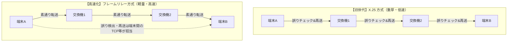
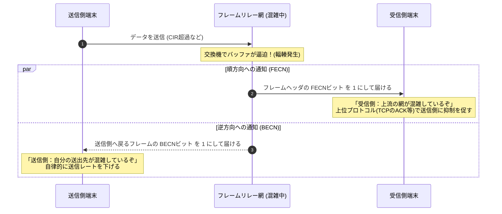

# フレームリレー方式：なぜ高速化でき、どう輻輳を制御したのか

> **想定読者**: パケット通信やOSI参照モデルの基本（レイヤ2・レイヤ3の役割）は知っているが、情報処理技術者試験（AP）で問われる「X.25との差」「CIRとDEビット」「FECN/BECNの方向」が混同しやすい受験者  
> **省いたもの**: OSI参照モデルの初歩解説、物理層の規格詳細  
> **所要時間**: 10分  
> **検証方法**: RFC 1490 / 情報処理技術者試験（応用情報・高度ネットワーク）過去問シラバスとの照合  

---

## 0. 一枚で

| 概念・機能 | 核心の仕組み | 試験での問われ方（頻出フレーズ） |
| :--- | :--- | :--- |
| **X.25 との最大の違い** | 各交換機（中継ノード）での**誤り訂正・再送制御を省略**し、エンド端末間（上位層）に任せる | **「通信回線の高品質化を背景に、中継ノードでの処理を簡素化して高速伝送を実現した」** |
| **CIR (認定情報速度)** | 通信事業者が最低限保証する通信速度。これを超えるデータ送出も許容される（ベストエフォート） | **「CIRを超えたフレームにはDEビットが設定される」** |
| **DEビット (廃棄適格ビット)** | 網が混雑（輻輳）した際、**優先的に破棄してよい**ことを示すフラグ | **「網内で輻輳が発生した際、DE=1 のフレームから優先して破棄される」** |
| **FECN (順方向輻輳通知)** | パケットの進行方向（**受信側端末**）へ「網が混雑している」と通知 | 受信端末が上位層（TCP等）を通じて送信側にレート低下を促す |
| **BECN (逆方向輻輳通知)** | パケットの逆方向（**送信側端末**）へ「送出レートを下げろ」と直接通知 | 送信端末が自律的にフレーム送出速度を抑制する |
| **DLCI** | レイヤ2（データリンク層）で仮想回線（VC）を識別する識別子 | **「フレームのヘッダに含まれ、同一物理回線上の複数の仮想回線を識別する」** |

---

## 1. なぜ高速化できたのか：X.25 との割り切りの差

フレームリレー以前の公衆パケット網（X.25）は、**「通信回線（アナログ線など）の品質が悪く、ビット誤りが多発する」** 前提で作られていました。  
そのため、途中の交換機（中継ノード）ごとに毎回CRCチェックとACK/NAKによる再送制御を行っていました。

光ファイバの普及によって回線品質が劇的に向上したため、フレームリレーは設計思想を根本から変えました。



- **中継ノードの動作**: フレームが壊れていたら（FCSエラー）、**単にフレームを破棄するだけ**（再送要求はしない）。
- **再送の責任**: 破棄されたパケットの再送は、エンド端末同士のトランスポート層（TCPなど）が担当する。

中継ノードのCPU負荷とバッファ保持時間が大幅に削減されたことで、大容量・高速なWAN通信が可能になりました。

---

## 2. 帯域制御の肝：CIR と DEビット

フレームリレーは「専用線」ではなく「1本の物理回線を複数拠点で共有するパケット交換網」です。  
そのため、**契約速度（CIR）** と **一時的なバースト転送** を組み合わせた柔軟な課金体系が取られました。

```
通信速度
  ^
  |  [バースト領域] (網が空いていれば流れるが、DE=1 が付く)
  +---------------------------------------------------
  |  [契約保証領域: CIR] (確実に配送。DE=0)
  +---------------------------------------------------> 時間
```

- **CIR (Committed Information Rate: 認定情報速度)**:
  事業者との契約で「この帯域までは保証して届けます」と定めた速度。
- **DE (Discard Eligibility: 廃棄適格) ビット**:
  端末がCIRを超える速度でフレームを送り出した場合、網の入口（または端末自身）で **DEビット = 1** が付与されます。
  - 網が空いていれば、DE=1 のフレームも問題なく相手に届きます。
  - 網内で混雑（輻輳）が発生した場合、交換機は **DE=1 のフレームから優先的にゴミ箱へ捨てます**。

---

## 3. 混雑をどう知らせるか：FECN と BECN

網の破綻を防ぐため、フレームリレーには2種類の輻輳通知ビットが用意されています。  
試験では **「どっち向きに通知が飛ぶか」** が頻出です。



- **FECN (Forward Explicit Congestion Notification)**:
  - **向き**: データの流れる方向（**順方向 / 受信端末宛て**）。
  - **意味**: 「このフレームが通ってきた経路が混雑していました」。
- **BECN (Backward Explicit Congestion Notification)**:
  - **向き**: データの流れる逆方向（**逆方向 / 送信端末宛て**）。
  - **意味**: 「あなたが送っている先の経路が混雑しているので、送出を控えてください」。

---

## 4. 午後試験・午前試験 対策チェックリスト

- [ ] **Q. X.25 と比べたフレームリレーの特徴は？**  
  → **「交換機での誤り制御や再送制御を省略し、フレームの廃棄と再送を端末間（上位層）に任せることで高速化した」**（49字）
- [ ] **Q. CIR を超えて送信されたフレームの扱いは？**  
  → **「DEビット（廃棄適格ビット）が付与され、網の混雑時に優先して破棄される」**（36字）
- [ ] **Q. BECN ビットの役割は？**  
  → **「通信経路の逆方向（送信側）に対して、網の輻輳を通知して送信速度の抑制を促す」**（37字）
- [ ] **Q. DLCI の役割は？**  
  → **「フレームリレー網において、1本の物理回線上に多重化された論理的な仮想回線（VC）を識別する」**（44字）

---

## 5. 理解度チェック

### 問1（設計思想と高速化の理由）
**【問題】** フレームリレー網において、中継交換機が伝送途中でFCS（フレームチェックシーケンス）の誤りを検出した際に行う動作として、適切なものはどれか。

- ア: 送信元端末に対して直ちにNAK（否定応答）を返し、再送を要求する。
- イ: 直前の中継交換機に対してフレームの再送を要求する。
- ウ: 誤りのあるフレームを破棄し、再送要求などの処理は行わない。
- エ: 誤り訂正符号を用いてフレームを復元し、そのまま次の中継交換機へ転送する。

<details>
<summary>解答と解説を表示</summary>

**正解: ウ**

**解説:**  
フレームリレーでは、中継ノードは「壊れたフレームを単に破棄する」だけであり、再送制御や誤り訂正は行いません。再送の管理はエンド端末の上位プロトコル（TCPなど）に一任することで、交換機の負荷を下げ高速転送を実現しています。
</details>

### 問2（帯域制御とDEビット）
**【問題】** フレームリレーの帯域制御において、契約で定められたCIR（認定情報速度）を超えるトラフィックが発生した際のネットワーク側の挙動について、「DEビット」「優先」という言葉を用いて35字以内で説明せよ。

<details>
<summary>解答と解説を表示</summary>

**模範解答:**  
**超過フレームにDEビットを設定し、輻輳発生時に優先して破棄する。**（32字）

**解説:**  
CIRを超えたデータは即座に遮断されるのではなく、一時的なバーストとして送信が許容されます。ただし「DE=1」の印が付けられ、網が混雑した場合には真っ先に破棄の対象となります。
</details>

### 問3（輻輳通知の識別）
**【問題】** フレームリレーにおいて、網内の交換機がバッファの枯渇などによる輻輳を検知した。このとき、データフレームの受信側端末に対して輻輳を通知するためにセットされるビットはどれか。また、受信側端末はその通知を受けて通常どのようなアクションを取るか。

<details>
<summary>解答と解説を表示</summary>

**模範解答:**  
- **セットされるビット**: **FECN**（順方向明示的輻輳通知）
- **受信側の挙動**: 上位プロトコル（TCPのフロー制御等）を利用して、送信元端末に対して送信データ量の抑制を促す。

**解説:**  
受信側（順方向）に送られるのが **FECN (Forward)**、送信側（逆方向）に直接送られるのが **BECN (Backward)** です。受信側端末自身は送出レートを直接下げることはできないため、TCPのACKパケットで受信ウィンドウサイズを小さく通知するなどの方法で送信元に抑制を促します。
</details>
