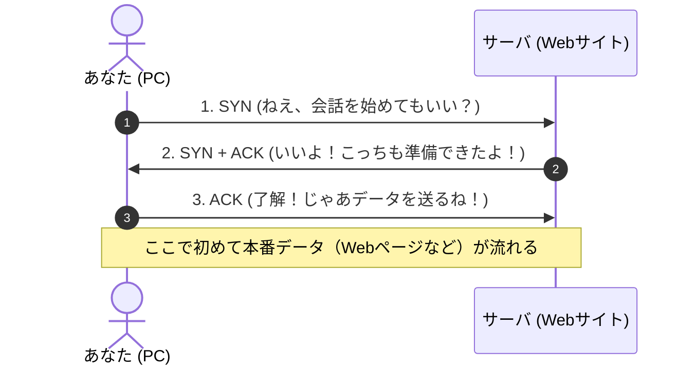

# TCP と UDP の違い：なぜネット銀行は慎重派で、生中継や通話は雑でもいいのか？

> **想定読者**: 文系出身で、「トランスポート層」と言われてもピンとこないが、TCPとUDPの役割の違いや午後試験での特徴記述をスッキリ理解したい受験者  
> **省いたもの**: パケットヘッダの全ビット詳細、進数変換  
> **所要時間**: 8分  
> **検証方法**: RFC 793 (TCP) / RFC 768 (UDP) および応用情報技術者過去問シラバスとの照合  

---

## 0. 一枚で

| 比較項目 | **TCP (Transmission Control Protocol)** | **UDP (User Datagram Protocol)** |
| :--- | :--- | :--- |
| **日常のたとえ** | **「受領印が必要な書留郵便・電話」** | **「普通ハガキのポスト投函・街頭の拡声器」** |
| **性格を一言で** | 「絶対に1文字も漏らさず届ける慎重派」 | 「届いたかどうかは気にしないスピード狂」 |
| **通信の始め方** | **コネクション型**（まず「もしもし、聞こえますか？」と挨拶してから話す） | **コネクションレス型**（挨拶なしでいきなり送りつける） |
| **荷物が消えたら？** | **再送してくれる**（届くまで送り直す） | **無視して次へ進む**（再送しない） |
| **データの順番** | **絶対に番号順に並べ直す** | バラバラに届いてもそのまま受け取る |
| **速度と負荷** | 確認の手間が多いので**遅く、処理が重い** | 余計な確認がないので**超高速・超軽量** |
| **代表的な使われ方** | **Web閲覧 (HTTP/HTTPS)**、**メール (SMTP)**、**ファイル転送 (FTP)** | **音声通話 (VoIP)**、**動画生配信**、**オンラインゲーム**、**DNS** |

---

## 1. 日常のたとえ話：書留郵便と普通ハガキ

インターネットを流れるデータは、すべて小さく小分けにされた **「荷物（パケット）」** です。  
この荷物を運ぶルール（プロトコル）が、大きく2種類あります。

### 書留郵便（TCP）
あなたが銀行の送金手続きをしたり、契約書のPDFをダウンロードしたりするとき、途中で1文字でもデータが消えたら大惨事になります。
そこでTCPは、**「相手に確実に届いたか、ハンコをもらいながら進める書留郵便」** のように動きます。

- 「1番の荷物を送ったよ」
- 「1番受け取ったよ、次は2番を送って」
- もし途中で荷物が紛失したら、**「2番が届かないからもう一回送って！」と自動で再送** します。

### 街頭の拡声器（UDP）
一方、LINE通話やYouTubeの生配信、オンラインゲームはどうでしょうか？  
もし通話中に「あ」という音が途切れたとき、1秒後に「あ」だけ遅れて再送されてきたら、かえって会話がめちゃくちゃになります。

UDPは、**「届いたかどうかいちいち確認せず、どんどん声を届ける拡声器」** です。
- 「途中で一瞬ノイズが入ったり、パケットが1個消えても気にしない！」
- **「それより、今のリアルタイムな声を1ミリ秒でも速く届けることが命！」**

---

## 2. TCPの人間ドラマ：なぜ「3回のお辞儀（3ウェイハンドシェイク）」をするのか？

TCPはとても丁寧です。荷物を送る前に、必ずお互いに挨拶を交わして**「通信のパイプ（コネクション）」**をつなぎます。  
この挨拶を **「3ウェイハンドシェイク」** と呼びます。

### 略語の英語と意味
- **SYN** (*Synchronize: 同期*):  
  「お互いの番号（シーケンス番号）を揃えて、会話を始めよう！」という合図。
- **ACK** (*Acknowledgment: 承認・了解*):  
  「了解した！メッセージはちゃんと届いているよ！」という返事。

3回やり取りして「お互いに相手の声が聞こえていること」を100%確認してからデータを流します。  
だからこそ安全ですが、**「本題に入る前の挨拶に時間がかかる」** という弱点があります。

---

## 3. UDPの人間ドラマ：なぜ「不親切」なのに重宝されるのか？

UDPには挨拶（3ウェイハンドシェイク）もなければ、受領確認（ACK）もありません。  
相手が起きているかどうかも確かめず、一方的にパケットを投げつけます。

### それでもUDPが愛される3つの理由

1. **挨拶の時間がゼロで、すぐ届く（即時性・低遅延）**  
   Webサイトの住所を調べる **DNS** など、「一往復でパッと答えがほしい」処理では、挨拶に往復している時間が無駄です。
2. **消えた荷物を待たない（リアルタイム性）**  
   音声通話や生放送では、**「過去の正確さ」よりも「現在の鮮度」** のほうが圧倒的に大事です。
3. **1対多数（ブロードキャスト / マルチキャスト）ができる**  
   TCPは「1対1」でガッチリ手を繋ぐので、クラス全員に同時に同じ動画を配るような配信が苦手です。UDPなら拡声器のように「全員一斉に受けてくれ！」とばら撒けます。

---

## 4. 午後試験 記述対策チェックリスト

試験問題で「TCPとUDPの特徴や違い」を聞かれたら、以下のフレーズをそのまま使えます。

- [ ] **Q. TCPの特徴を一言で説明せよ。**  
  → **「コネクションを確立し、パケットの順序制御や再送制御によって信頼性の高い通信を行う。」**（41字）
- [ ] **Q. 音声通話（VoIP）でTCPではなくUDPが採用される理由は？**  
  → **「再送による遅延を防止し、リアルタイム性の高い通信を優先するため。」**（33字）
- [ ] **Q. TCPのコネクション確立手順（3ウェイハンドシェイク）の目的は？**  
  → **「送信側と受信側の双方が、データ送受信の準備が整ったことを確認するため。」**（35字）

---

## 5. 実際の過去問で腕試し（午前・午後）

本試験で実際にどのように出題されたかを見てみましょう。頭の中で解答を作ってから開いてください。

---

### 【午前過去問】平成28年秋期 午前問34
**【問題】**  
TCP/IPネットワークにおいて、トランスポート層のプロトコルである **UDP** の特徴として、適切なものはどれか。

- **ア**: コネクション確立の手順を省き、相手の受信準備状態を確認せずにデータを送信する。
- **イ**: データの送達確認と再送制御を行い、信頼性の高い通信を提供する。
- **ウ**: パケットに順序番号を付与し、受信側で送信順序通りにデータを組み立てる。
- **エ**: フロー制御を行い、受信側のバッファオーバフローを防ぐ。

正解と解説を表示

**正解: ア**

**文系目線での解説:**
- **ア（正解）**: これがまさにUDPの性格（普通ハガキ）です。挨拶（3ウェイハンドシェイク）もせず、相手が起きているかも確かめずに投げつけます。
- **イ・ウ・エ**: これらはすべて **TCP** のお仕事（書留郵便の機能）です。
  - イ＝受領印をもらって再送する（再送制御）
  - ウ＝荷物に番号を振って順番通り並べる（順序制御）
  - エ＝受取人がパンクしないように送るスピードを加減する（フロー制御）

---

### 【午前過去問】令和元年秋期 午前問33
**【問題】**  
TCPのコネクション確立手順である「3ウェイハンドシェイク」において、クライアントからサーバへ最初に送信されるパケットの制御ビットはどれか。

- **ア**: ACK
- **イ**: FIN
- **ウ**: RST
- **エ**: SYN

正解と解説を表示

**正解: エ**

**文系目線での解説:**
- **エ（正解）**: 最初の挨拶は **SYN**（Synchronize: 「会話を同期しよう＝始めよう」）です。
- **流れの復習**:
  1. クライアント → サーバ: **SYN**（ねえ、話そう！）
  2. サーバ → クライアント: **SYN + ACK**（いいよ！了解！）
  3. クライアント → サーバ: **ACK**（了解！じゃあ送るね！）
- **他の選択肢**:
  - `FIN` (Finish): 会話を終了して切断するときの合図
  - `RST` (Reset): 異常が発生して接続を強制リセット・拒絶するときの合図

---

### 【午後過去問（記述式）】平成29年秋期 午後問5 抜粋
**【問題】**  
社内LANにIP電話（VoIP）を導入するプロジェクトに関する問題です。  
電話の音声データをIPパケットで送受信する際、通信プロトコルとして **TCP ではなく UDP が採用される技術的な理由** について、パケットがネットワーク内で消失した場合の挙動に着目し、「再送」「遅延」の2語を用いて35字以内で述べよ。

模範解答と解説を表示

**IPA公式 模範解答例:**  
**パケットの再送を行わないため、音声の再生遅延を防ぐことができるから。**（34字）  
（または：**再送による遅延が発生せず、リアルタイムな通話を維持できるため。**）

**採点のポイント（文系の答案作成術）:**
1. **問題文の条件を拾う**: 「再送」「遅延」の2語を必ず使うこと。
2. **因果関係を明確にする**:
   - 原因: 「パケットの再送を行わない（諦める）」
   - 結果: 「遅延が発生しない（防げる）」
3. **なぜこれでマルになるか**:  
   通話では「昔のパケットが遅れて再送されて届く」と声がダブったりズレたりして会話が崩壊します。「遅延させないために、あえて再送を捨てる」というUDPの割り切りが書けていれば満点がつきます。

