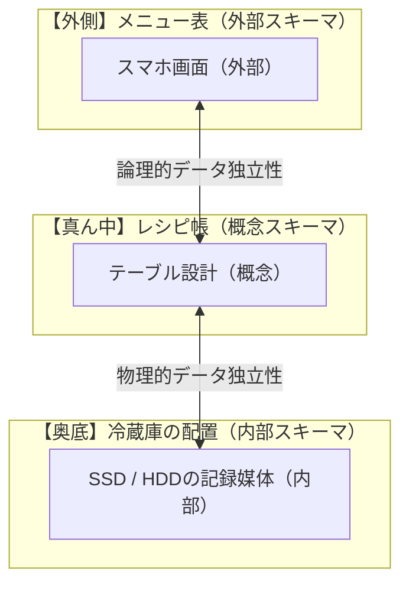

# 3層スキーマ構造：3段のお重で覚える「外部・概念・内部」の役割分担

> **想定読者**: 「外部スキーマ」「概念スキーマ」「内部スキーマ」の違いが抽象的すぎて、試験でどれがどれだか毎回混ざってしまう文系受験者  
> **省いたもの**: ANSI/SPARCの規格番号、専門的なハードウェアの磁気記録方式  
> **所要時間**: 8分  
> **対象過去問**: 応用情報技術者 平成31年春期 午前問26（※過去問道場で3回間違えた最重要問題）  

---

## 0. 一枚で：3段のお重（じゅうばこ）イメージで一発暗記！

データベースの3層スキーマは、**「上から順に人間の目に近い」** と覚えると絶対に忘れません。

```
┌─────────────────────────────────┐
│ 【上段】外 部 ス キ ー マ       │  ← 【目に見える】スマホ画面・メニュー表
├─────────────────────────────────┤
│ 【中段】概 念 ス キ ー マ       │  ← 【頭で考えた】設計図・テーブル（ER図）
├─────────────────────────────────┤
│ 【下段】内 部 ス キ ー マ       │  ← 【機械の奥底】SSD・HDDなどの「記録媒体」
└─────────────────────────────────┘
```

- **「記録媒体にどう格納するか」** と聞かれたら？  
  → 一番底にある **「内部スキーマ」**！
- **「利用者やアプリごとにどう見せるか（ビュー）」** と聞かれたら？  
  → 一番外側（人間の目の前）にある **「外部スキーマ」**！
- **「データの関係性を論理的にどう定義するか（テーブル）」** と聞かれたら？  
  → まんなかの設計図である **「概念スキーマ」**！

---

## 1. なぜ「外部・概念・内部」という名前なの？（言葉の由来）

漢字の意味をそのまま分解するとスッキリします。

1. **外部（がいぶ: 外の世界）**  
   コンピュータの外の世界にいる **「人間（ユーザー）が見る窓口」** だから「外部」。
2. **概念（がいねん: 頭の中のアイデア）**  
   「顧客」と「注文」という現実のビジネスの仕組みを、**頭の中で論理的な表（テーブル）に整理したもの** だから「概念」。
3. **内部（ないぶ: 機械の奥底）**  
   パソコンのフタを開けた中にある **「SSDやハードディスクという機械の中」** だから「内部」。

---

## 2. 「データの独立性」ってなに？（どっちが論理でどっちが物理？）

試験でよく「論理的データ独立性」と「物理的データ独立性」の違いが問われます。これも日常で例えれば一発です。



- **物理的データ独立性（内部 ⇄ 概念）**:  
  「古いハードディスクを最新の超高速SSDに買い替えた！」としても、テーブル設計（概念）は1文字も書き直す必要がありません。**物理的な機械を変えても独立している** から「物理的データ独立性」。
- **論理的データ独立性（概念 ⇄ 外部）**:  
  「テーブルの設計を少し手直しした！」としても、アプリ側の見せ方（ビュー）でうまく吸収すれば、ユーザーのスマホ画面（外部）は壊れません。**設計を手直しても画面は独立している** から「論理的データ独立性」。

---

## 3. 午後試験 記述対策チェックリスト

- [ ] **Q. 内部スキーマとは何か？**  
  → **「データを記憶媒体（ディスク）上にどのように物理的に格納するかを定義したもの。」**（39字）
- [ ] **Q. 物理的データ独立性のメリットは？**  
  → **「ディスク構成や格納方式を変更しても、概念スキーマを変更する必要がない点。」**（38字）

---

## 4. 実際の過去問で腕試し

### 【午前過去問】平成31年春期 午前問26
**【問題】**  
データベースを記録媒体にどのように格納するかを記述したものはどれか。

- **ア**: 概念スキーマ
- **イ**: 外部スキーマ
- **ウ**: サブスキーマ
- **エ**: 内部スキーマ

<details>
<summary>正解と解説を表示</summary>

**正解: エ**

**文系目線でのスピード解法:**
- 問題文のキーワード：**「記録媒体にどのように格納するか」**
- 「記録媒体（ハードディスクやSSDの奥底）」＝ 3段のお重の一番下！
- 迷わず **「エ: 内部スキーマ」** を選べば即座に1点ゲットです。
</details>

---

### 【午前過去問】令和4年春期 午前問27
**【問題】**  
ANSI/SPARC 3層スキーマモデルにおける **内部スキーマの設計** に含まれるものはどれか。

- **ア**: SQL問合せ応答時間の向上を目的としたインデックスの定義
- **イ**: エンティティ間の"1対多"，"多対多"などの関連を明示するE-Rモデルの作成
- **ウ**: エンティティ内やエンティティ間の整合性を保つための一意性制約や参照制約の設定
- **エ**: データの冗長性を排除し，更新の一貫性と効率性を保持するための正規化

<details>
<summary>正解とスピード解法を表示</summary>

**正解: ア**

**文系目線でのスピード解法:**
- 各スキーマで行う「作業」の役割分担を整理しましょう：
  - **概念スキーマ（設計図作り）**:
    - **E-Rモデルの作成**（イ）
    - **一意性制約・参照制約の設定**（ウ）
    - **テーブルの正規化**（エ）
    - $\rightarrow$ イ・ウ・エはすべて「頭で考えたデータの論理構造」なので概念スキーマ！
  - **内部スキーマ（機械の奥底の工夫）**:
    - **インデックス（索引）の定義**（ア）
    - データの物理的な配置・格納方式
    - $\rightarrow$ 「SSDの中でどう探すか、検索スピードを上げるための索引」は機械側の話なので **内部スキーマ（アが正解！）** です。
</details>

