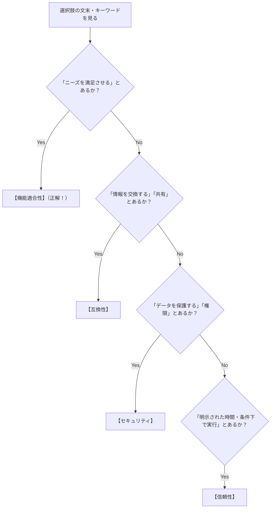

# ソフトウェア品質特性（SQuaRE）：スマホ選びで覚える「8つのチェック項目」

> **想定読者**: JIS X 25010（品質特性）のお役所言葉の定義文がどれも同じに見えて、試験でどの特性か見分けがつかない文系受験者  
> **省いたもの**: JIS規格の改定履歴、副特性（計31個）の細かい枝葉の暗記  
> **所要時間**: 8分  
> **対象過去問**: 応用情報技術者 令和元年秋期 午前問47（※過去問道場で2回間違えた重要問題）  

---

## 0. 一枚で：新しいスマホを買うときの「8つの基準」！

「機能適合性」「信頼性」「使用性」などの難しい言葉は、**スマホを選ぶときのチェック項目** に置き換えると一発で理解できます。

| 品質特性 | スマホ選びに例えると？ | 試験で出るキーワード（決定打） |
| :--- | :--- | :--- |
| **機能適合性** ★ | **「電話・カメラ・LINEなど、欲しい機能がちゃんと揃っているか？」** | **「明示的ニーズ及び暗黙のニーズを満足させる」** |
| **性能効率性** | **「サクサク動くか？バッテリーの減りが早くないか？」** | **「応答時間」「処理時間」「資源（CPU/メモリ）の消費量」** |
| **互換性** | **「パソコンやイヤホンとスムーズに繋がるか？」** | **「他のシステムと情報交換できる度合い」** |
| **使用性 (ユーザビリティ)** | **「説明書を読まなくても直感的に操作できるか？」** | **「ユーザーが理解、習得、使用しやすい度合い」** |
| **信頼性** | **「フリーズしたり勝手に電源が落ちたりしないか？」** | **「明示された時間・条件下で機能を維持し続ける度合い」** |
| **セキュリティ** | **「顔認証やパスコードで他人に中身を見られないか？」** | **「権限に応じたアクセス」「情報及びデータを保護する度合い」** |
| **保守性** | **「OSアップデートや画面割れの修理がしやすいか？」** | **「修正・改善・環境適応が容易な度合い」** |
| **移植性** | **「他社のSIMや新しい機種にお引越ししやすいか？」** | **「別の環境（OSや機器）に移行できる度合い」** |

---

## 1. 最重要：「機能適合性」って結局なんなの？

試験で一番ひっかけとして狙われるのが **「機能適合性」** です。  
お役所言葉で「機能適合性の説明」と言われると難しく感じますが、言っていることは超シンプルです。

> **「お客さんが『これが欲しい！』と言った機能（明示的ニーズ）はもちろん、わざわざ口に出さなくても『当然あるよね？』と思っている機能（暗黙のニーズ）もちゃんと備えていること」**

### たとえ話：ラーメン屋の注文
- **明示的ニーズ**: 「チャーシュー麺を大盛りで！」 $\rightarrow$ チャーシュー麺大盛りが出てくること。
- **暗黙のニーズ**: わざわざ「お箸とレンゲも付けてね」と言わなくても、当然お箸が付いてくること。

この両方を満たして **「お客さんのニーズを満足させる機能を提供する度合い」** を、小難しく **機能適合性** と呼んでいます！

---

## 2. 試験の選択肢を一瞬で見分ける判定マップ

選択肢の日本語から、以下のキーワードを拾うだけで即答できます！

---

## 3. 午後試験 記述対策チェックリスト

- [ ] **Q. 機能適合性とはどのような品質特性か？**  
  → **「利用者の明示されたニーズ及び暗黙のニーズを満足させる機能をシステムが提供する度合い。」**（43字）
- [ ] **Q. 信頼性と性能効率性の違いを一言で説明せよ。**  
  → **「信頼性は障害なく安定稼働し続ける度合いであり、性能効率性は処理速度や資源の消費効率の度合い。」**（47字）

---

## 4. 実際の過去問で腕試し

### 【午前過去問】令和元年秋期 午前問47
**【問題】**  
JIS X 25010:2013 で規定されたシステム及びソフトウェア製品の品質特性の一つである **"機能適合性"** の説明はどれか。

- **ア**: 同じハードウェア環境又はソフトウェア環境を共有する間，製品，システム又は構成要素が他の製品，システム又は構成要素の情報を交換することができる度合い，及び／又はその要求された機能を実行することができる度合い
- **イ**: 人間又は他の製品若しくはシステムが，認められた権限の種類及び水準に応じたデータアクセスの度合いをもてるように，製品又はシステムが情報及びデータを保護する度合い
- **ウ**: 明示された時間帯で，明示された条件下に，システム，製品又は構成要素が明示された機能を実行する度合い
- **エ**: 明示された状況下で使用するとき，明示的ニーズ及び暗黙のニーズを満足させる機能を，製品又はシステムが提供する度合い

正解とスピード解法を表示

**正解: エ**

**文系目線でのスピード解法:**
- 「機能適合性」を探すときは、**「ニーズを満足させる」** という言葉を探すだけ！
- **エ** にだけ「明示的ニーズ及び暗黙のニーズを満足させる機能を…提供する度合い」とズバリ書かれています！
- 他の選択肢の復習：
  - **ア**: 他の製品と情報を交換する $\rightarrow$ **互換性**
  - **イ**: データを保護する $\rightarrow$ **セキュリティ**
  - **ウ**: 明示された時間・条件下で実行する $\rightarrow$ **信頼性**

