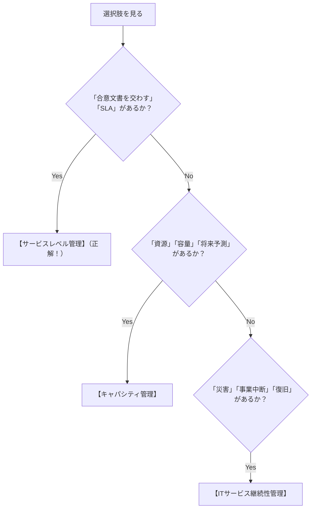

# サービスレベル管理（SLM）：ホテルの接客品質で覚える「SLAと合意文書」

> **想定読者**: ITサービスマネジメント（ITIL）の「サービスレベル管理」「キャパシティ管理」「継続性管理」が似たような言葉で並んで見分けがつかない文系受験者  
> **省いたもの**: ITIL v3とITIL 4の版ごとの用語差分、細かいメトリクスの計算式  
> **所要時間**: 6分  
> **対象過去問**: 応用情報技術者 平成27年秋期 午前問56（※過去問道場で2回間違えた重要問題）  

---

## 0. 一枚で：ホテルのサービスで一発暗記！

ITサービスマネジメントは、**「ホテルがお客さんと交わすサービスの約束」** に例えると一発で整理できます。

| 管理プロセス | 日常のたとえ（ホテル） | 要するに何をする？（試験の決定打） |
| :--- | :--- | :--- |
| **サービスレベル管理 (SLM)** ★ | **「チェックイン時の宿泊プラン契約・アンケート改善」** | **顧客と「サービス目標（SLA）」を合意し、文書を交わして品質を監視・改善する** |
| **キャパシティ管理** | **「混雑時期の客室数やベッドの増設予測」** | CPU・メモリ・回線などの **「IT資源（リソース）の過不足を予測・最適化」** する |
| **ITサービス継続性管理** | **「地震・火災時の非常用電源や避難マニュアル」** | **「災害・重大障害時」** でも合意期間内にシステムを復旧させる |
| **財務管理** | **「ホテルの設備投資の予算管理と資金確保」** | サービス提供に必要な **「予算と資金」** を管理する |

---

## 1. SLAってなに？（合意文書の正体）

サービスレベル管理（Service Level Management: SLM）の中心にあるのが **SLA (Service Level Agreement: サービスレベル合意書)** です。

```
【ホテルと客のSLA（約束）の例】
・部屋の清掃は毎日14時までに終わらせます
・Wi-Fiは99.9%の時間、途切れずに使えます
・もしエアコンが壊れたら、30分以内に別の部屋を用意します
```

システムの世界でも全く同じです：
- 「システムの稼働率は 99.95% 以上を保証します」
- 「万が一障害が起きても、2時間以内に復旧させます」
- 「バックアップは毎日深夜に取ります」

これを顧客とベンダーの間で **「合意文書（SLA）」** として交わし、定期的に達成状況を監視して改善していく活動が **サービスレベル管理** です。

---

## 2. 試験の選択肢を一瞬で見分けるキーワード

問題文に **「サービスレベル管理」** と出たら、選択肢から **「合意」「SLA」「目標」** を探してください！



- **「合意文書を交わす」** $\rightarrow$ **サービスレベル管理（SLM）**
- **「資源（リソース）の予測と最適化」** $\rightarrow$ **キャパシティ管理**
- **「災害や事業中断からの復旧」** $\rightarrow$ **ITサービス継続性管理**
- **「予算と資金」** $\rightarrow$ **財務管理**

---

## 3. 午後試験 記述対策チェックリスト

- [ ] **Q. SLAを締結する目的を一言で説明せよ。**  
  → **「提供するサービスの範囲や品質目標を明確にし、利用者と提供者の間で共通認識を持つため。」**（44字）
- [ ] **Q. サービスレベル管理（SLM）におけるPDCAとは何か？**  
  → **「合意したサービス水準を定期的に測定・評価し、目標未達の場合に改善策を実施する活動。」**（41字）

---

## 4. 実際の過去問で腕試し

### 【午前過去問】平成27年秋期 午前問56
**【問題】**  
ITサービスマネジメントにおけるサービスレベル管理プロセスの活動はどれか。

- **ア**: ITサービスの提供に必要な予算に対して，適切な資金を確保する。
- **イ**: 現在の資源の調整と最適化，及び将来の資源要件に関する予測を記載した計画を作成する。
- **ウ**: 災害や障害などで事業が中断しても，要求されたサービス機能を合意された期間内に確実に復旧できるように，事業影響度の評価や復旧優先順位を明確にする。
- **エ**: 提供するITサービス及びサービス目標を特定し，サービス提供者が顧客との間で合意文書を交わす。

<details>
<summary>正解とスピード解法を表示</summary>

**正解: エ**

**文系目線でのスピード解法:**
- 「サービスレベル管理」の主役は **「サービス目標」** と **「顧客との合意文書（SLA）」** です！
- 選択肢を見ると、**エ** にバッチリ「サービス目標を特定し、顧客との間で合意文書を交わす」と書かれています！
- 他の選択肢の復習：
  - ア＝財務管理
  - イ＝キャパシティ管理（資源の予測）
  - ウ＝ITサービス継続性管理（災害・復旧）
</details>
