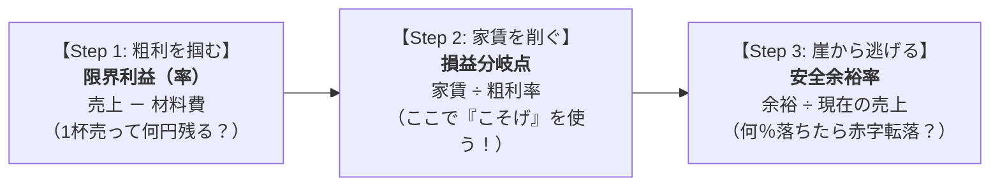

# 損益分岐点・安全余裕率：数学10点でも絶対解ける「ラーメン屋の家賃回収パズル」

> **想定読者**: 「高校数学10点台」「分数の割り算や小数の計算が出た瞬間に脳がフリーズする」という文系受験者  
> **省いたもの**: 複雑な会計用語、難しい公式の暗記の強要  
> **所要時間**: 10分  
> **対象過去問**: 応用情報技術者 令和元年秋期 午前問77（※過去問道場で3回間違えた最頻出問題）  

---

## 0. 一枚で：解く手順は必ずこの「3ステップ」！

試験問題で損益分岐点の表を見たら、**絶対にこの順番（1 → 2 → 3）** でしか解きません！



### 覚える合言葉はこれだけ！
> **『 粗利（あらり） を・ こそげて ・ 安心（あんしん） 』**  
> 1. **あらり（粗利・限界利益）**: まず「1杯売ったときの儲け」を計算する！（引き算）  
> 2. **こそげ（損益分岐点）**: 下の「こそげの図」を使って、家賃をチャラにする売上を計算する！（割り算）  
> 3. **あんしん（安全余裕率）**: 赤字の崖っぷちからどれだけ離れていて安心かを計算する！（比率）  

---

### Step 2 で使う「こそげ」の図
「損益分岐点」を計算するときだけ、この丸を思い出してください。

```
       ┌──────────────┐
       │   固 定 費   │  ← 家賃（回収したい目標額）
       ├──────┬───────┤
       │損益  │ 限界  │
       │分岐点│利益率 │  ← Step 1 で出した粗利率（%）
       └──────┴───────┘
    【合言葉は「こそげ（削げ）」！】
```

- **損益分岐点** を求めたいときは？  
  → 「損益分岐点」を手で隠すと、**「固定費 ÷ 限界利益率」** が残る！
- **固定費** を求めたいときは？  
  → 「固定費」を手で隠すと、**「損益分岐点 × 限界利益率」** が残る！

---

## 1. なぜその計算になるの？（数式を使わない言葉の理屈）

### ①「限界利益」ってなに？
ラーメン1杯を **1,000円** で売ったとします。  
麺やチャーシューの材料費（変動費）が **400円** かかったとします。  
手元に残る儲けは、 $1,000 - 400 = \mathbf{600円}$ ですね。

この **「1杯売るごとに手元に残る 600円」** のことを、専門用語で **「限界利益」** と呼びます。  
そして、売上（1,000円）のうち 600円 は **60%（0.6）** ですね。これを **「限界利益率」** と呼びます。

### ②「損益分岐点」ってなに？
お店には、売上に関係なく毎月必ず払わないといけない **家賃（固定費）が 900万円** あるとします。  
目標は **「この家賃900万円を、ラーメンの儲け（600円）を何杯積み上げたらチャラにできるか？」** です。

- ラーメン1杯売ると、家賃が 600円 返せる。
- 100円売るごとに、家賃が 60円（0.6）返せる。
- じゃあ、**家賃900万円を回収するには、いくら売上が必要？**

👉 だから計算は **「家賃 900万円 ÷ 0.6」** になるのです！

---

## 2. 小数の割り算の途中式（筆算レベルで全部書く！）

数学が苦手な方が一番つまずくのが **「900万 ÷ 0.6 ってどう計算するの？ なんで数字が増えるの？」** というところです。

### 途中計算の手順（小数を消す！）
小数の割り算は、**割る数と割られる数の両方を「10倍」して小数を消す** のが鉄則です！

$$900 \div 0.6$$

1. 両方を10倍する（イコールで結ばれているので値は変わりません）：  
   $$= (900 \times 10) \div (0.6 \times 10)$$
2. 整数同士の割り算にする：  
   $$= 9,000 \div 6$$
3. 9000 を 6 で割る：  
   - $9 \div 6 = 1$ 余り $3$
   - $30 \div 6 = 5$
   - ゼロを2つつける
   $$= \mathbf{1,500}$$

👉 これで **「損益分岐点は 1,500万円！」** と小学生の割り算だけで出せました！

> **【超重要Q&A】10倍したままで計算終わってるけど、後で10で割らなくていいの？**  
> **結論：割り算は、両方を10倍したら「そのまま」でOK！後から戻さなくて大丈夫です！**  
> 
> * **掛け算のとき**（戻す必要がある）：  
>   $900 \times 0.6$ を計算するとき、0.6を10倍して $900 \times 6 = 5400$ にしたら、答えが10倍に膨らんでしまっているので、**最後に10で割って 540 に戻す** 必要があります。  
> * **割り算のとき**（戻したらダメ！）：  
>   割り算は「分け前（比率）」の計算です。  
>   - 「ケーキ **6個** を **2人** で分ける」 $\rightarrow$ 1人 **3個**（$6 \div 2 = 3$）  
>   - 両方を10倍して「ケーキ **60個** を **20人** で分ける」 $\rightarrow$ 1人 **3個**（$60 \div 20 = 3$）  
>   
>   両方を10倍しても、**1人あたりの分け前（答え）は「3」のまま変わりませんよね！**  
>   もし後から10で割ってしまったら $0.3$ になって答えが狂ってしまいます。  
>   だから **「割られる数と割る数の“両方”を10倍したなら、答えはそのまま触らなくて大正解」** なのです！

---

## 3. 「安全余裕率」のイメージ図（崖っぷちの距離）

安全余裕率は、**「いま崖っぷちから何メートル離れて立っているか？」** という安心感の割合です。

```
[売上ゼロ]────────[損益分岐点]────────────[現在の売上]
 (倒産)              (赤字の崖)                 (今ここ！)
                     |<────── 安全の余裕 ──────>|
```

今の売上が 2,000万円 で、損益分岐点（崖）が 1,500万円 なら、
- 崖までの距離は: 2,000万 － 1,500万 ＝ **500万円**
- 売上全体（2,000万）のうち、この余裕は何パーセント？

### 途中計算（小数の出し方）
500万円 ÷ 2,000万円 を分数にします：
$$\frac{500}{2000} = \frac{5}{20} = \frac{1}{4} = \mathbf{0.25 \quad (25\%)}$$

- ゼロを2つ消す： $5 \div 20$
- 5で約分する： $1 \div 4$
- 1 を 4 で割る： $1.0 \div 4 = \mathbf{0.25}$（25%）

つまり **「売上が25%（4分の1）落ちたら赤字転落する」** という意味です！

---

## 4. 実際の過去問を解いてみる

### 【午前過去問】令和元年秋期 午前問77
**【問題】**  
損益分岐点分析でA社とB社を比較した記述のうち、適切なものはどれか。

| 項目 | A社 | B社 |
| :--- | :--- | :--- |
| 売上高 | 2,000万円 | 2,000万円 |
| 変動費（材料費） | 800万円 | 1,400万円 |
| 固定費（家賃） | 900万円 | 300万円 |

- **ア**: 安全余裕率はB社の方が高い。
- **イ**: 売上高が両社とも3,000万円である場合、営業利益はB社の方が高い。
- **ウ**: 限界利益率はB社の方が高い。
- **エ**: 損益分岐点売上高はB社の方が高い。

<details>
<summary>正解とステップ・バイ・ステップの解法を表示</summary>

**正解: ア**

#### ステップ1：A社とB社の「ラーメン1杯の粗利（限界利益）」を出す
- **A社**: $2,000万 - 800万 = \mathbf{1,200万円}$（粗利率は $1,200 \div 2,000 = \mathbf{0.6}$）
- **B社**: $2,000万 - 1,400万 = \mathbf{600万円}$（粗利率は $600 \div 2,000 = \mathbf{0.3}$）
- 粗利率（限界利益率）は A社(0.6) ＞ B社(0.3) なので、**ウは間違い**。

#### ステップ2：損益分岐点（家賃をチャラにする売上）を出す
- **A社**: $900万 \div 0.6 = 9,000 \div 6 = \mathbf{1,500万円}$
- **B社**: $300万 \div 0.3 = 3,000 \div 3 = \mathbf{1,000万円}$
- 損益分岐点は A社(1500万) ＞ B社(1000万) なので、**エは間違い**。

#### ステップ3：安全余裕率（どっちが崖から離れているか）を比べる
今の売上はどちらも 2,000万円 です。
- **A社**: 崖（1500万）まであと 500万円。  
  余裕度: $500 \div 2,000 = \frac{1}{4} = \mathbf{25\%}$
- **B社**: 崖（1000万）まであと 1,000万円。  
  余裕度: $1,000 \div 2,000 = \frac{1}{2} = \mathbf{50\%}$

B社は売上が半分（50%）消えても耐えられるので、**B社の方が安全余裕率が高い（アが正解！）**。
</details>
