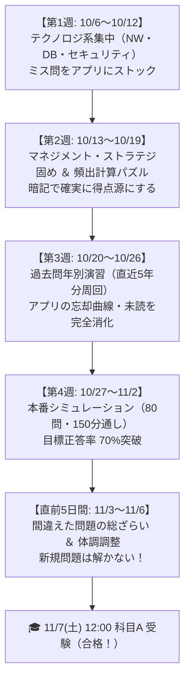

# 🎯 応用情報技術者（AP）科目A 4週間合格ロードマップ

> **受験日**: 科目A 2026年11月7日(土) 12:00（福岡・香椎駅前テストセンター）  
> **合格基準**: 80問中 48問以上正解（得点率 60%以上）  
> **所要時間**: いつでも確認できる行動指針  
> **最終目標**: 過去問道場 ＆ AP MindMap Ankiで科目Aを突破し、12/6の科目Bへ弾みをつける！

---

## 📅 受験日程 ＆ 会場情報

| 試験区分 | 受験日時 | 会場 | 住所・連絡先 |
| :--- | :--- | :--- | :--- |
| **科目A（150分）** | **2026年11月7日(土) 12:00** | 香椎駅前アポロパソコンスクールテストセンター | 福岡市東区香椎駅前1-8-14 エポックビル 5階 TEL: 092-674-1633 |
| **科目B（150分）** | **2026年12月6日(日) 12:00** | 香椎駅前アポロパソコンスクールテストセンター | （同上） |

---

## 🗺️ 全体ロードマップ（Mermaidチャート）

---

## 🎯 週別詳細アクションプラン

### 【第1週】10/6(火) 〜 10/12(月)：現状把握 ＆ テクノロジ系集中
* **目標**: 出題比率が最も高い「テクノロジ系（基礎理論・NW・セキュリティ・DB）」の頻出パターンを把握する。
* **やること**:
  1. **過去問道場（分野別）**: 「ネットワーク」「セキュリティ」「データベース」から着手（各分野30〜40問）。
  2. **間違えた問題の即時ストック**: 不正解または迷った問題をピックアップし、アプリの解説ノートで確認。
  3. **日常のたとえ話でイメージ化**: 用語の丸暗記ではなく、「ラーメン屋」「銀行ATM」「スマホ」など直感的なモデルで理解する。

### 【第2週】10/13(火) 〜 10/19(月)：マネジメント・ストラテジ系 ＆ 計算問題の潰し込み
* **目標**: 得点源にしやすい非テクノロジ分野を固め、テクノロジの計算問題アレルギーを解消する。
* **やること**:
  1. **マネジメント・ストラテジ系（コスパ最強分野）**:
     * プロジェクトマネジメント（EVM、クリティカルパス、アジャイル等）
     * サービスマネジメント（ITIL、SLA、SLM等）
     * 企業と法務（著作権、派遣・請負・出向の違い、労働法、損益分岐点等）
  2. **頻出計算パズルのパターン化**:
     * 稼働率（MTBF/MTTR）、IPアドレス/CIDR計算、損益分岐点売上高。
  3. **アプリの復習**: 未読ノートを消化し、読了チェックをつけていく。

### 【第3週】10/20(火) 〜 10/26(月)：年別（回別）過去問演習 ＆ 忘却曲線フル稼働
* **目標**: ランダム出題に慣れ、**過去問道場での初見正答率70%** を目指す。
* **やること**:
  1. **回別演習**: 直近4〜6期分（令和4年〜令和6年）を、1日40問〜80問ペースで解く。
  2. **再出題問題の瞬殺**: 見た瞬間に選択肢を選べるレベルの「頻出定番問題」を増やす。
  3. **アプリの未読ノート全消化**: アプリのすべてのノートを「読了済」にする。

### 【第4週】10/27(火) 〜 11/2(月)：本番想定（通し演習）＆ 弱点撲滅
* **目標**: 150分で80問を解くペース配分を体得し、マークミス・時間配分の不安をなくす。
* **やること**:
  1. **本番シミュレーション**: 週末に1回、**80問通し（制限時間150分）** で解く。
     * 目安：1問あたり約1.5分（約120分で解き終わり、30分見直し）。
  2. **合格ライン確認**: 初見回で **70〜75%以上** 取れれば科目Aは安全圏。
  3. **苦手ジャンルのピンポイント補強**: アプリ内の苦手分野ノートを集中周回。

### 【直前5日間】11/3(火祝) 〜 11/6(金)：総ざらい ＆ コンディション調整
* **目標**: 新しいことには手を出さず、**「間違えたことのある問題」を確実に正解**できるようにする。
* **やること**:
  1. **新規問題の演習をストップ**: 新しい問題で自信をなくすのを避ける。
  2. **アプリの全ノート総ざらい**: これまでにストックした解説ノートを最初から最後まで流し読み。
  3. **生活リズムの調整**: 試験は **12:00開始** なので、11:00頃に頭が一番冴えるよう起床時間や昼食のタイミングを合わせる。

---

## ⏱️ 1日の推奨学習ルーティン

| 時間帯 | 目安時間 | 学習内容 | 使うツール |
| :--- | :---: | :--- | :--- |
| **朝・スキマ時間** | 20〜30分 | 前日までに読んだノートのサクッと復習 | **本アプリ（スマホ）** |
| **日中・移動中** | 20〜30分 | 1問1答形式でサクサク過去問を解く | **過去問道場**（スマホ/iPad） |
| **夜（メイン）** | 60〜90分 | 分野別・回別演習 ＋ ミス問の解説読み込み | **PC/iPad**（道場 ＋ 本アプリ） |
| **合計** | **約1.5〜2.5時間** | （休日は3〜4時間確保してまとまった演習） | |

---

## 💡 本番（11/7）に向けた3大攻略ポイント

1. **過去問の再出題（約40〜50%）を絶対に落とさない**:
   - 科目Aは過去問からの流用が極めて多い試験です。既出問題は「見た瞬間に正解がわかる」レベルまで反射神経を鍛えます。
2. **CBT操作（フラグ機能）を活用する**:
   - 迷った問題は深追いせず「見直しフラグ」をつけて飛ばし、解ける問題から確実に解答します。
3. **科目B（12/6）に繋がる意識を持つ**:
   - 「セキュリティ」「アルゴリズム」は科目Bの土台となります。単なる答え暗記ではなく、「なぜそう動くのか」の理屈を本ノートで押さえておきましょう。
