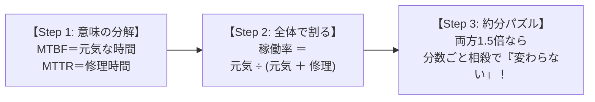

# 稼働率とMTBF・MTTR：スマホの「元気な時間と入院時間」で覚える計算

> **所要時間**: 5分（短くサクッと）  
> **対象過去問**: 応用情報技術者 令和4年秋期 午前問14（※過去問道場で2回間違えた重要問題）  
> **一言でいうと**: 『両方1.5倍になっても比率だから変わらない！』  
> **省いたもの**: ワイブル分布による故障率曲線、バスタブ曲線の微積分理論  

---

## 【対象過去問】令和4年秋期 午前問14

**【問題】**  
あるシステムにおいて，MTBFとMTTRがともに1.5倍になったとき，アベイラビリティ(稼働率)は何倍になるか。

- **ア**: 2/3（3分の2）
- **イ**: 1.5
- **ウ**: 2.25
- **エ**: 変わらない

<details>
<summary>▶ 正解を表示する</summary>

**正解: エ（変わらない）**

</details>

---

## 0. 一枚で：解く手順は必ずこの「3ステップ」！

稼働率の計算問題は、公式を覚えるのではなく **「時間の割合（比率）」** として解きます。



### 合言葉：『 ビー（B）は元気・アール（R）はリペア（修理） 』
- **MTBF** の `B` ＝ **Between（故障と故障の間＝元気に動いている時間！）**
- **MTTR** の `R` ＝ **Repair（修理・入院にかかっている時間！）**
- **稼働率** ＝ **「全体の時間のうち、元気に動いていた時間の割合」**

---

## 1. なぜその計算になるの？（数式を使わない言葉の理屈）

あなたが持っているスマホをイメージしてください。

```
[元気に動いている時間（MTBF）: 10時間] ── [修理・入院（MTTR）: 2時間]
|<────────────────── 全体の時間: 12時間 ──────────────────>|
```

このスマホがちゃんと使えた割合（稼働率）は：

> **稼働率** ＝ **元気な時間 ÷ 全体の時間**  
> ＝ 10 ÷ (10 ＋ 2)  
> ＝ 10/12  
> ＝ **5/6（約83.3%）**

### 「MTBFとMTTRがともに1.5倍になった」とは？
- 元気な時間: 10時間 × 1.5 ＝ **15時間**
- 修理時間: 2時間 × 1.5 ＝ **3時間**

新しい稼働率は：

> **新しい稼働率** ＝ 15 ÷ (15 ＋ 3)  
> ＝ 15/18  
> ＝ **5/6（約83.3%）**

👉 **「比率」を計算しているだけなので、両方が同じ倍率（1.5倍）で伸びても、約分したら元の割合に戻るため「まったく変わらない」のです！**

---

## 2. 小学生の分数パズルで見る証明

数式で書くと難しそうに見えますが、小学生の分数の「約分」そのものです。

```
                    1.5 × MTBF
新しい稼働率 ＝ ────────────────────────
                 1.5 × (MTBF ＋ MTTR)
```

- 分母と分子にある **「1.5」を約分でスパッと消す**：

```
                      MTBF
             ＝ ───────────────
                  MTBF ＋ MTTR
```

👉 **元の式と完全に一致するため、答えは「変わらない」になります！**（計算時間：5秒）

---

## 3. 午後試験 記述対策チェックリスト

- [ ] **Q. システムの可用性（アベイラビリティ）を高める2つのアプローチは？**  
  → **「予防保守などでMTBF（平均故障間隔）を長くするか、迅速な復旧体制でMTTR（平均修復時間）を短くする。」**（51字）
- [ ] **Q. MTBFとMTTRの日本語名称は？**  
  → **「MTBFは平均故障間隔、MTTRは平均修復時間。」**（24字）

---

## 🎯 次の2分アクション（即効ドーパミン獲得！）

- [ ] **今すぐこの画面の一番上に戻り、「▶ 正解を表示する」を隠した状態で、選択肢「エ（変わらない）」をノータイムで確信を持って選べるか試してみよう！**
