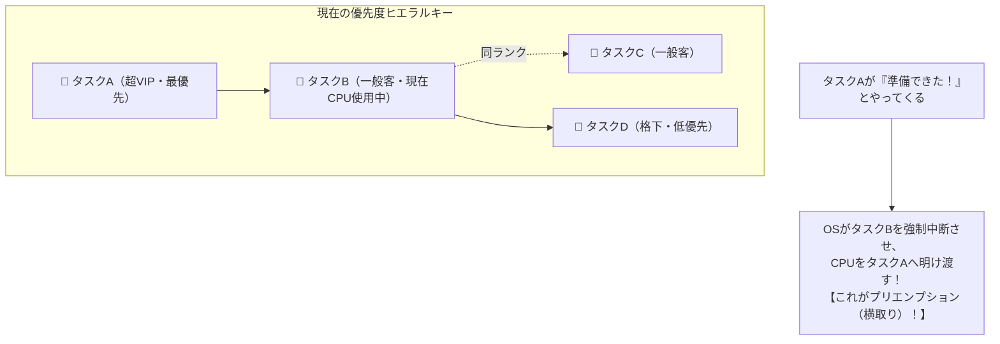

# プリエンプション方式：窓口で手続き中に「超VIP顧客」が乱入して横取り！

> **想定読者**: 「プリエンプション」「ディスパッチ」「タスク状態遷移」というOS用語の漢字とカタカナに圧倒される文系受験者  
> **省いたもの**: ラウンドロビン方式のタイムクォンタム微細チューニング、マルチプロセッサのアフィニティ制御  
> **所要時間**: 6分  
> **対象過去問**: 応用情報技術者 平成27年秋期 午前問16  

---

## 【対象過去問】平成27年秋期 午前問16

**【問題】**  
プリエンプション方式のタスクスケジューリングにおいて，タスクBの実行中にプリエンプションが発生する契機となるのはどれか。ここで，タスクの優先度は，タスクAが最も高く，タスクA＞タスクB＝タスクC＞タスクDの関係とする。

- **ア**: タスクAが実行可能状態になった。
- **イ**: タスクBが待ち状態になった。
- **ウ**: タスクCが実行可能状態になった。
- **エ**: タスクDが実行可能状態になった。

<details>
<summary>▶ 正解を表示する</summary>

**正解: ア（タスクAが実行可能状態になった。）**

</details>

---

## 0. 一枚で：優先度バトルの横取りルール！



### 合言葉：『 プリエンプションは「上のやつ」による強制横取り！ 』
- **プリエンプト（Preempt）** ＝ 先取りする、横取りする
- 現在実行中のやつ（B）よりも **身分が高いやつ（A）が準備完了になった瞬間だけ**、OSはCPUを奪い取ります！

---

## 1. なぜそうなるのか？（日常のたとえ話：市役所の窓口）

ワンオペの市役所の窓口（＝CPUが1個）をイメージしてください。

```
【登場人物の身分関係】
  👑 市長（タスクA: 最優先）
  👤 一般市民 佐藤さん（タスクB: 窓口で手続き中）
  👤 一般市民 鈴木さん（タスクC: Bと同じ一般客）
  👶 見学中の小学生（タスクD: 最低優先度）
```

いま、窓口の職員（CPU）は一般市民の佐藤さん（タスクB）の書類を処理しています。

そこに突然、**「市長（タスクA）が『至急の公務で手続きしたい』と窓口の前に現れた（実行可能状態になった）」** とします。

どうなるでしょうか？
1. 窓口の職員は、佐藤さん（タスクB）に**「すみません、市長の緊急案件が入ったので一旦お待ちください！」** と言って処理を一時中断させます。
2. 市長（タスクA）に窓口を強制的に明け渡します。

これがまさに **プリエンプション（CPUの横取り）** です！
- 実行中だったタスクBは、何も悪いことをしていないのに **「自分より偉いタスクAが来たから」という理由だけで無理やり中断** させられます。

---

## 2. 選択肢のひっかけ見分けポイント

作問者は「タスク状態の遷移」と「プリエンプションの厳密な定義」で受験者を引っ掛けにきます。

- **ア: タスクAが実行可能状態になった 【正解！】**  
  → 自分（B）より優先度が高い「タスクA」が準備完了になったため、OSが介入してBからCPUを強制的に奪います。これがプリエンプションの発生契機です（◯）。
- **イ: タスクBが待ち状態になった**  
  → 最も多いひっかけ選択肢！Bが待ち状態（入出力完了待ちなど）になったのは、**「B自身が『ちょっと書類取ってきます』と自分から席を外した（自発的解放）」** です。誰かに奪われたわけではないので、プリエンプションではありません（×）。
- **ウ: タスクCが実行可能状態になった**  
  → タスクCはタスクBと **「同じ優先度（B＝C）」** です。同じ身分の客が後ろに並んでも、窓口で手続き中の客をわざわざ途中で追い出す理由はありません。そのままBが続行されます（×）。
- **エ: タスクDが実行可能状態になった**  
  → タスクDは自分より **「格下（低優先度）」** です。格下が後ろに来ても、もちろん横取りは起きません（×）。

---

## 3. 午後試験 記述対策チェックリスト

- [ ] **Q. プリエンプティブ方式とノンプリエンプティブ方式の根本的な違いは？**  
  → **「プリエンプティブ方式はOSが強制的にタスクを中断してCPUを奪えるが、ノンプリエンプティブ方式はタスクが自発的にCPUを解放するまで奪えない点。」**（76字）
- [ ] **Q. プリエンプション発生時、中断されたタスクの状態はどう変わるか？**  
  → **「実行状態から実行可能状態へ遷移する。」**（21字）

---

## 🎯 次の2分アクション（定着チェック）

- [ ] **画面の一番上に戻り、「A＞B＝C＞D」という優先度を見て、「Bより偉いAが来た時だけ横取りされる」という理屈でアを選べるか確認しよう！**
