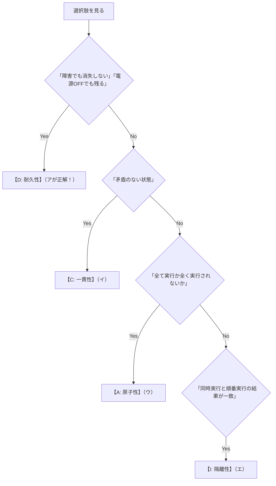

# トランザクションのACID特性：銀行のATM送金で覚える「4大ルール」

> **想定読者**: 「原子性」「一貫性」「独立性」「耐久性」の漢字がどれも同じに見えて、試験で毎回どれがどれだか迷子になる文系受験者  
> **省いたもの**: WAL（ログ先行書き込み）の物理ブロック構造、アリストテレスの原子論  
> **所要時間**: 7分  
> **対象過去問**: 応用情報技術者 令和2年秋期 午前問30（※超頻出テーマ）  

---

## 0. 一枚で：銀行の1万円送金で一発暗記！

ACID特性は、**「Aさんの口座からBさんの口座へ1万円振り込むとき」** を想像すると1秒で整理できます。

| 頭文字 | 英語と日本語 | 銀行送金に例えると？ | 試験で出る決定打キーワード |
| :---: | :--- | :--- | :--- |
| **A** | **Atomicity<br>（原子性）** | 途中で停電したら「1万引いたまま相手に届いてない」は許さない！引き落とし前に巻き戻す | **「全て実行されるか，全く実行されないかのいずれか（All or Nothing）」** |
| **C** | **Consistency<br>（一貫性）** | 送金の前後で、AさんとBさんの預金合計額に狂いがない（残高マイナス禁止ルールを守る） | **「矛盾のない状態」「整合性制約を満たす」** |
| **I** | **Isolation<br>（隔離性・独立性）** | 複数人が同時に口座を触っても、混ざらずに「1人ずつ順番に処理した」のと同じ結果になる | **「同時に実行しても、順番に実行した場合と結果が一致する」** |
| **D** ★ | **Durability<br>（耐久性・永続性）** | 完了画面が出た瞬間に銀行に雷が落ちても、**一度確定した送金結果は絶対に消えない！** | **「障害が発生してもデータベースから消失しない」** |

---

## 1. 頭文字の英単語で覚えるフック

```
【A】tomicity   ── アトム（これ以上割れない最小単位）＝「中途半端は禁止！全か無か！」
【C】onsistency ── コンシステント（首尾一貫している）＝「矛盾なし！」
【I】solation   ── アイソレーション（隔離）＝「他人と混ざらず一人ずつ！」
【D】urability  ── デュラブル（頑丈・長持ち）＝「停電しても消えない耐久力！」
```

---

## 2. 4つの選択肢を一瞬で見分ける判定マップ

令和2年秋期 問30の選択肢は、綺麗にACIDの4つに対応しています！



---

## 3. 午後試験 記述対策チェックリスト

- [ ] **Q. トランザクションの原子性（Atomicity）を保証するDBMSの機能は何か？**  
  → **「障害発生時にロールバック（後退復帰）を行い、処理前の状態に復元する機能。」**（37字）
- [ ] **Q. トランザクションの耐久性（Durability）を保証する仕組みは？**  
  → **「コミット時に更新ログを不揮発性記憶媒体（ディスク）に書き出して永続化する仕組み。」**（41字）

---

## 4. 実際の過去問で腕試し

### 【午前過去問】令和2年秋期 午前問30
**【問題】**  
トランザクションのACID特性のうち，耐久性(durability)に関する記述として，適切なものはどれか。

- **ア**: 正常に終了したトランザクションの更新結果は，障害が発生してもデータベースから消失しないこと
- **イ**: データベースの内容が矛盾のない状態であること
- **ウ**: トランザクションの処理が全て実行されるか，全く実行されないかのいずれかで終了すること
- **エ**: 複数のトランザクションを同時に実行した場合と，順番に実行した場合の処理結果が一致すること

<details>
<summary>正解とスピード解法を表示</summary>

**正解: ア**

**文系目線でのスピード解法:**
- 「耐久性（Durability）」＝ 障害や停電に耐えて **データが消えない頑丈さ！**
- **ア** に「障害が発生してもデータベースから消失しないこと」とドンピシャで書かれています！
- 他の選択肢：
  - **イ**: 矛盾がない $\rightarrow$ **C（一貫性）**
  - **ウ**: 全てか全くないか $\rightarrow$ **A（原子性）**
  - **エ**: 同時実行と順番実行の一致 $\rightarrow$ **I（隔離性）**
</details>
