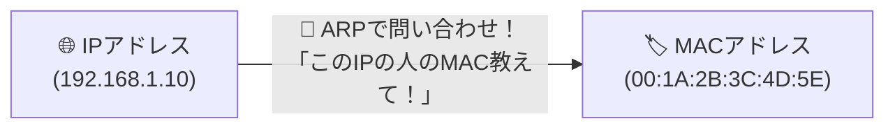

# ARP：IPアドレスからMACアドレスを調べる「校内放送」！

> **想定読者**: ARP、RARP、DHCP、ICMPの4兄弟の区別がつかない文系受験者
> **省いたもの**: Gratuitous ARPによるIP重複検知のシーケンス
> **所要時間**: 6〜8分
> **対象過去問**: 応用情報技術者 平成29年秋期 問34

---

## 【対象過去問】平成29年秋期 問34

**【問題】**
IPv4においてIPアドレスからMACアドレスを取得するために用いるプロトコルはどれか。

- **ア**: ARP
- **イ**: DHCP
- **ウ**: ICMP
- **エ**: RARP

▶ 正解を表示する

**正解: ア（ARP）**

---

## 0. 一枚で：『IPアドレスからMACアドレスを調べるプロトコル！』

### 🧠 脳に刻む合言葉：
> **『 ARPは「IP → MAC」！逆の「MAC → IP」はReverseのRARP！ 』**

---

## 1. なぜそうなるのか？（日常のたとえ話：座席表の番号（IP）から、実際に座っている人のマイナンバー（MAC）を呼び出すこと）

ネットワーク上で通信するとき、アプリや人間は「IPアドレス（論理アドレス）」を使います。
しかし、実際にLANケーブルやWi-Fiの基板同士が会話するには「MACアドレス（物理アドレス）」が必要です。

「IPアドレスは知っているけれど、相手のMACアドレスが分からない！」
というときに、「このIPアドレスを使っている人、MACアドレスを教えて！」と聞き出すプロトコルが **ARP（Address Resolution Protocol）** です。

逆に、自分のMACアドレスは知っているけれどIPアドレスが分からないときに使うのが **RARP（Reverse ARP）** です。

---

## 2. 選択肢のひっかけポイント ＆ 判定理由

- **ア: ARP 【正解！】** → IPアドレスからMACアドレスを取得するプロトコルです（◯）。
- **イ: DHCP** → PCに自動的にIPアドレスを割り振るプロトコルです（×）。
- **ウ: ICMP** → pingやエラー通知で使われるプロトコルです（×）。
- **エ: RARP** → MACアドレスからIPアドレスを取得する逆のプロトコルです（×）。

---

## 3. 午後試験 記述対策チェックリスト（※該当する場合）

- [ ] **Q. 同一サブネット内の端末と通信する際、相手のMACアドレスを解決するために用いられるプロトコルは何か？**  
  → **「ARP（Address Resolution Protocol）。」**

---

## 🎯 次の2分アクション（定着チェック）

- [ ] **画面の一番上に戻り、正解を隠した状態で正解肢「ア」を確信を持って選べるか試してみよう！**
