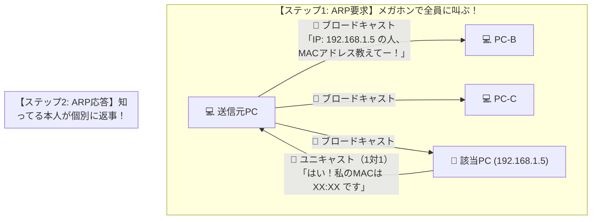

# ARPの要求と応答：探すときは「全員にメガホン」、返事は「コッソリ耳打ち」！

> **想定読者**: ARP要求と応答で通信種別（ブロードキャスト／ユニキャスト）がこんがらがる文系受験者
> **省いたもの**: Gratuitous ARPによるIP重複検知やARPキャッシュポイズニングの攻撃手法
> **所要時間**: 6〜8分
> **対象過去問**: 応用情報技術者 平成23年特別 問37

---

## 【対象過去問】平成23年特別 問37

**【問題】**
TCP/IPネットワークにおける，ARP要求パケットとARP応答パケットの種類の組合せはどれか。ここで，ARPキャッシュに保持するエントリの有効性を確認する場合は除くものとする。

- **ア**: ARP要求＝ユニキャスト、ARP応答＝ユニキャスト
- **イ**: ARP要求＝ブロードキャスト、ARP応答＝ユニキャスト
- **ウ**: ARP要求＝ブロードキャスト、ARP応答＝ブロードキャスト
- **エ**: ARP要求＝マルチキャスト、ARP応答＝ユニキャスト

▶ 正解を表示する

**正解: イ（ARP要求＝ブロードキャスト、ARP応答＝ユニキャスト）**

---

## 0. 一枚で：『要求＝ブロードキャスト（全員）、応答＝ユニキャスト（1対1）！』

### 🧠 脳に刻む合言葉：
> **『 ARPは「探すときは全員にメガホン（ブロードキャスト）、返事は直接耳打ち（ユニキャスト）」！ 』**

---

## 1. なぜそうなるのか？（日常のたとえ話：教室での落とし物探し。「このハンカチ誰のー？（全体放送）」→「あ、僕のです！（直接返しに行く）」）

教室で落とし物（IPアドレス）の持ち主（MACアドレス）を探す場面をイメージしてください。

1. **ARP要求（持ち主を探すとき）**:
   相手のMACアドレスが分からないから、最初から特定の誰かに直接話しかけることは不可能です。
   そのため、**「教室全体に大声でメガホンで叫ぶ（ブロードキャスト）」** しかありません！
   「IPアドレス 192.168.1.5 をお持ちの方、MACアドレスを教えてくださーい！」

2. **ARP応答（返事をするとき）**:
   該当する人（192.168.1.5 の持ち主）だけが名乗り出ます。
   このとき、質問してきた人のMACアドレスは要求パケットに書いてあるので分かっています。
   わざわざ教室全体に「僕のだよーー！！」と叫ぶ必要はなく、**「質問者の席まで行ってコッソリ1対1で渡す（ユニキャスト）」** のがスマートです。全員に返事したらうるさくて（トラフィックが無駄になって）迷惑ですよね！

したがって、**「要求はブロードキャスト、応答はユニキャスト」** が鉄則です！

---

## 2. 選択肢のひっかけポイント ＆ 判定理由

- **ア: 要求＝ユニキャスト、応答＝ユニキャスト** → 相手のMACアドレスが分からないから要求しているのに、最初から相手1人にユニキャストで送れるわけがありません（×）。
- **イ: 要求＝ブロードキャスト、応答＝ユニキャスト 【正解！】** → 要求は全員へ、応答は質問者だけに1対1で返します（◯）。
- **ウ: 要求＝ブロードキャスト、応答＝ブロードキャスト** → 応答まで全員宛てに叫んだら、ネットワーク帯域の無駄遣い（ブロードキャストストームの原因）になります（×）。
- **エ: 要求＝マルチキャスト、応答＝ユニキャスト** → ARPは特定のグループ宛てではなく、LAN内の全端末を対象にするためマルチキャストではなくブロードキャストです（×）。

---

## 3. 午後試験 記述対策チェックリスト（※該当する場合）

- [ ] **Q. ARP要求パケットがブロードキャストで送信される理由を、送信端末が保持していない情報に着目して説明せよ。**  
  → **「通信相手のIPアドレスに対応するMACアドレスが未解決で不明であるため。」**

---

## 🎯 次の2分アクション（定着チェック）

- [ ] **画面の一番上に戻り、正解を隠した状態で正解肢「イ」を確信を持って選べるか試してみよう！**
