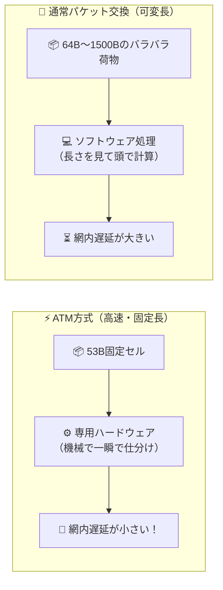

# ATM交換方式：サイズ固定（53バイト）のコンテナだから高速・低遅延！

> **想定読者**: ATM（非同期転送モード）と通常のパケット交換方式の違いがイメージできない文系受験者
> **省いたもの**: VPI/VCIによる仮想パス・仮想チャネル識別やAAL（ATMアダプテーション層）の種別
> **所要時間**: 6〜8分
> **対象過去問**: 応用情報技術者 平成20年秋期 問57

---

## 【対象過去問】平成20年秋期 問57

**【問題】**
ATMとパケット交換方式を比較した場合，ATMの特徴として適切なものはどれか。

- **ア**: データの分割単位＝可変長、網内遅延＝大きい
- **イ**: データの分割単位＝可変長、網内遅延＝小さい
- **ウ**: データの分割単位＝固定長、網内遅延＝大きい
- **エ**: データの分割単位＝固定長、網内遅延＝小さい

▶ 正解を表示する

**正解: エ（データの分割単位＝固定長、網内遅延＝小さい）**

---

## 0. 一枚で：『ATMは53バイトの固定長セル！ハードウェア処理で網内遅延が小さい！』

### 🧠 脳に刻む合言葉：
> **『 ATMは「きっちり53バイトの固定コンテナだから、機械（ハード）でスパッと捌けて遅延ゼロ感覚」！ 』**

---

## 1. なぜそうなるのか？（日常のたとえ話：宅配便のダンボール。サイズが全部同じ規格（固定長）ならベルトコンベアの機械で超高速に流せる！）

物流倉庫のベルトコンベアを想像してください。

- **通常のパケット交換方式**:
  荷物の大きさが大小バラバラ（可変長）です。小さな封筒もあれば、巨大な家具もあります。
  交換機（ルータ）は荷物が届くたびに「この荷物は長さ何センチだ？重さは？」とソフトウェアで計算して処理しなければならず、時間がかかります（網内遅延が大きい）。

- **ATM（Asynchronous Transfer Mode: 非同期転送モード）**:
  「全部きっかり同じサイズの箱（固定長＝53バイト）に統一しよう！」と決めました。
  （ヘッダ5バイト ＋ データ48バイト ＝ 合計53バイトの「セル」と呼ばれる小さな箱）。
  すべての箱が同じ形・同じサイズなので、人間の頭（ソフトウェア）で考えなくても、専用の機械（ハードウェア）でガシャンガシャンと超高速に右へ左へ振り分けられます！
  そのため、**「データの分割単位は固定長で、網内遅延は小さい」** という素晴らしい特徴が生まれます。

---

## 2. 選択肢のひっかけポイント ＆ 判定理由

- **ア: 可変長・大きい** → パケット交換方式の一般的な特徴に近いです（×）。
- **イ: 可変長・小さい** → 可変長だと機械での固定処理ができず遅延が小さくなりません（×）。
- **ウ: 固定長・大きい** → 固定長にすることで処理を高速化して遅延を「小さく」するのがATMの狙いです（×）。
- **エ: 固定長・小さい 【正解！】** → 53バイトの固定長セルを用い、ハードウェア処理により網内遅延を小さく抑えます（◯）。

---

## 3. 午後試験 記述対策チェックリスト（※該当する場合）

- [ ] **Q. ATM方式がパケット交換方式と比較して高速転送および低遅延を実現できる理由を簡潔に説明せよ。**  
  → **「データを53バイトの固定長セルに分割し、交換機がハードウェアで高速処理できるため。」**

---

## 🎯 次の2分アクション（定着チェック）

- [ ] **画面の一番上に戻り、正解を隠した状態で正解肢「エ」を確信を持って選べるか試してみよう！**
