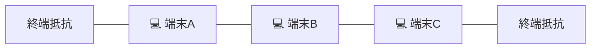

# バス型トポロジ：1本の長い大通り（同軸ケーブル）に全員が相乗り！

> **想定読者**: スター型、リング型、バス型、ツリー型の配線図の日本語説明が判別できない文系受験者
> **省いたもの**: 両端の終端抵抗（ターミネータ）による信号反射防止の電気的メカニズム
> **所要時間**: 6〜8分
> **対象過去問**: 応用情報技術者 平成19年秋期 問58

---

## 【対象過去問】平成19年秋期 問58

**【問題】**
LANのノード(制御装置，端末など)を接続する配線の形態の説明のうち，バス形配線に該当するものはどれか。

- **ア**: ケーブルを環状に敷設し，そこに全ノードを接続している。
- **イ**: 中央に制御用のノードを配置し，そこに全ノードを接続している。
- **ウ**: 中央のノードに幾つかのノードが接続され，更に別のノードが接続されている。
- **エ**: 同軸ケーブルなどの1本のケーブルに，全ノードが接続されている。

▶ 正解を表示する

**正解: エ（同軸ケーブルなどの1本のケーブルに，全ノードが接続されている。）**

---

## 0. 一枚で：『1本の基幹ケーブルに全ノードが接続されている形態！』

### 🧠 脳に刻む合言葉：
> **『 バス型は「1本の道路（バス）に全員がぶら下がる」！ 』**

---

## 1. なぜそうなるのか？（日常のたとえ話：電車の路線。1本のレールにすべての駅（端末）がぶら下がっている形）

LANケーブルの繋ぎ方（トポロジ）にはいくつかの歴史的な形があります。

- **スター型**: 中央のハブを中心に、星のように放射状に配線する形（現在のLANの主流）。
- **リング型**: ケーブルを輪っか（環状）にしてグルグル回す形（トークンリングなど）。
- **バス型**: **「1本の太い幹（同軸ケーブル）をドーンと通して、そこに全員が枝分かれして繋がる形」**。

路線バスのルートのように、1本の大通りにみんなが乗っかるので **バス型** と呼びます。
ケーブルの両端には、電気信号が跳ね返らないように「終端抵抗（ターミネータ）」というフタを付けるのがお約束でした。

---

## 2. 選択肢のひっかけポイント ＆ 判定理由

- **ア: ケーブルを環状に敷設し…** → リング型トポロジの説明です（×）。
- **イ: 中央に制御用のノードを配置し…** → スター型トポロジの説明です（×）。
- **ウ: 中央のノードに幾つかのノードが接続され、更に別のノードが…** → ツリー型（木構造）トポロジの説明です（×）。
- **エ: 同軸ケーブルなどの1本のケーブルに、全ノードが接続されている 【正解！】** → バス型トポロジの定義そのものです（◯）。

---

## 3. 午後試験 記述対策チェックリスト（※該当する場合）

- [ ] **Q. バス型トポロジにおいて、幹線ケーブルの1箇所が断線した場合、ネットワーク全体にどのような影響が出るか？**  
  → **「終端抵抗までの回路が途切れて信号の反射が発生し、接続されている全端末の通信が不能になる。」**

---

## 🎯 次の2分アクション（定着チェック）

- [ ] **画面の一番上に戻り、正解を隠した状態で正解肢「エ」を確信を持って選べるか試してみよう！**
