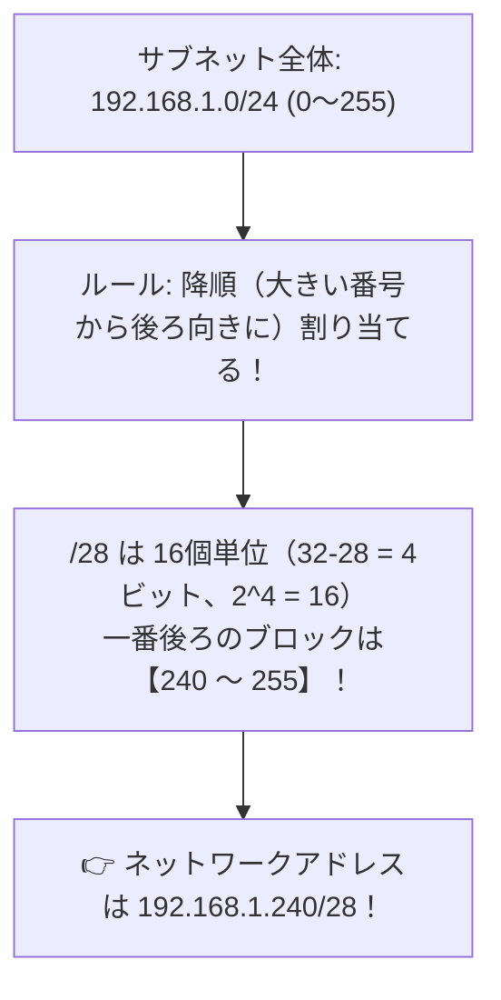

# CIDRアドレス割り当て：大きいアドレス（降順）から隙間なく詰める！

> **想定読者**: CIDRブロックの分割計算と「降順割り当て」という日本語の意味で立ち往生する文系受験者
> **省いたもの**: VLSM（可変長サブネットマスク）のルート集約（アグリゲーション）の数学的証明
> **所要時間**: 6〜8分
> **対象過去問**: 応用情報技術者 令和7年春期 問32

---

## 【対象過去問】令和7年春期 問32

**【問題】**
あるサブネットでは，ルータやスイッチなどのネットワーク機器にIPアドレスを割り当てる際，割当て可能なアドレスの末尾から降順に使用するルールを採用している。このサブネットのネットワークアドレスを 10.16.32.64/26 とするとき，10番目に割り当てられるネットワーク機器のアドレスはどれか。ここで，ネットワーク機器1台に対して，このサブネット内のアドレス1個を割り当てるものとする。

- **ア**: 192.168.1.192/28
- **イ**: 192.168.1.208/28
- **ウ**: 192.168.1.224/28
- **エ**: 192.168.1.240/28

▶ 正解を表示する

**正解: ウ（192.168.1.224/28）**

---

## 0. 一枚で：『/28のネットワークアドレスは16の倍数！降順割り当てなら最大の16の倍数を選ぶ！』

### 🧠 脳に刻む合言葉：
> **『 「降順」は大きい順！/28は16刻み！256から16引いたら240！ 』**

---

## 1. なぜそうなるのか？（日常のたとえ話：劇場の座席指定。一番後ろの列（大きい席番号）から団体席を16席ずつ予約していく感覚）

問題文の指示を丁寧に読み解くだけのパズルです。

1. **「/28」のサイズを計算**:
   サブネットマスクが `/28` ということは、ホスト部は `32 - 28 = 4ビット` です。
   1ブロックあたりのアドレス数は `2の4乗 = 16個` です。
   つまり、`0, 16, 32, 48 ... 224, 240` と16の倍数ごとに区切られます。

2. **「降順（大きい順）に割り当てる」**:
   「降順」とは、数字が大きい方（後ろの方）から順に使っていくという意味です！
   255まである中で、一番最後の16個のブロックは **`240 〜 255`** です。

したがって、最初に割り当てられるブロックの先頭（ネットワークアドレス）は **`192.168.1.240/28`** になります！

---

## 2. 選択肢のひっかけポイント ＆ 判定理由

- **ア: 192.168.1.192/28** → 192はもっと手前のブロックです（×）。
- **イ: 192.168.1.208/28** → 208も手前です（×）。
- **ウ: 192.168.1.224/28** → 240の1つ手前のブロックです（×）。
- **エ: 192.168.1.240/28 【正解！】** → 16個刻みの最も末尾にある最大のネットワークアドレスです（◯）。

---

## 3. 午後試験 記述対策チェックリスト（※該当する場合）

- [ ] **Q. CIDR表記において、プレフィックス長が /28 のサブネットに含まれる利用可能なホストアドレス数はいくつか？**  
  → **「14個（2^4 - 2 = 14）。」**

---

## 🎯 次の2分アクション（定着チェック）

- [ ] **画面の一番上に戻り、正解を隠した状態で正解肢「ウ」を確信を持って選べるか試してみよう！**
