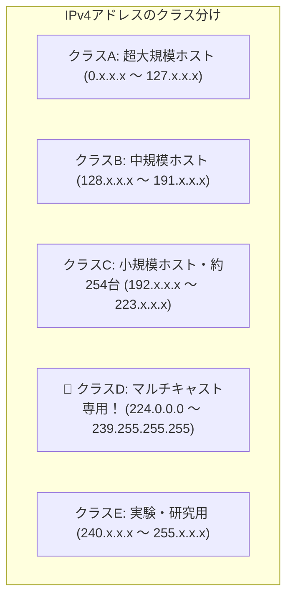

# クラスD：特定グループ全員に一斉配信する「マルチキャスト専用アドレス」！

> **想定読者**: クラスA、B、CとクラスD、Eの使い分けを覚えていない文系受験者
> **省いたもの**: 先頭ビット列「1110」のバイナリ構造とIGMP（グループ管理）プロトコルの詳細
> **所要時間**: 6〜8分
> **対象過去問**: 応用情報技術者 令和6年秋期 問35

---

## 【対象過去問】令和6年秋期 問35

**【問題】**
クラスDのIPアドレスを使用するのはどの場合か。

- **ア**: 端末250台程度までの比較的小規模なホストアドレスを割り当てる。
- **イ**: 端末65,000台程度の中規模なホストアドレスを割り当てる。
- **ウ**: プライベートアドレスを割り当てる。
- **エ**: マルチキャストアドレスを割り当てる。

▶ 正解を表示する

**正解: エ（マルチキャストアドレスを割り当てる。）**

---

## 0. 一枚で：『クラスDのIPアドレスは「マルチキャストアドレス」として使用される！』

### 🧠 脳に刻む合言葉：
> **『 「A・B・Cは普通のパソコン用、Dはマルチキャスト、Eは実験用」！ 』**

---

## 1. なぜそうなるのか？（日常のたとえ話：テレビやラジオのチャンネル。特定の周波数（クラスD）に合わせている人たち全員に映像や音声を同時配信する！）

IPv4アドレスは、かつて先頭ビットによって「クラス」に分類されていました。

- **クラスA**: 超巨大企業用（1600万台）
- **クラスB**: 中規模企業用（約6.5万台）
- **クラスC**: 小規模・家庭用（約254台）

ここまではすべて「パソコン1台1台に割り当てる普通のIPアドレス（ユニキャスト）」です。

では、**クラスD（224.0.0.0 〜 239.255.255.255）** は何に使うのでしょうか？
個々のパソコンに割り当てるのではなく、**「特定のグループ全員にデータを一斉配信する『マルチキャスト』専用」** として予約されています！
（ビデオ会議の配信やルーティング情報の交換などで使われます）。

---

## 2. 選択肢のひっかけポイント ＆ 判定理由

- **ア: 端末250台程度まで…** → クラスC（最大254台）の説明です（×）。
- **イ: 端末65,000台程度まで…** → クラスB（最大65,534台）の説明です（×）。
- **ウ: プライベートアドレス…** → 各クラス内に予約されたプライベート空間のことです（×）。
- **エ: マルチキャストアドレスを割り当てる 【正解！】** → クラスDの唯一無二の用途です（◯）。

---

## 3. 午後試験 記述対策チェックリスト（※該当する場合）

- [ ] **Q. IPv4におけるクラスDアドレスの範囲と、その主たる利用用途を答えよ。**  
  → **「224.0.0.0〜239.255.255.255の範囲であり、マルチキャスト通信に利用される。」**

---

## 🎯 次の2分アクション（定着チェック）

- [ ] **画面の一番上に戻り、正解を隠した状態で正解肢「エ」を確信を持って選べるか試してみよう！**
