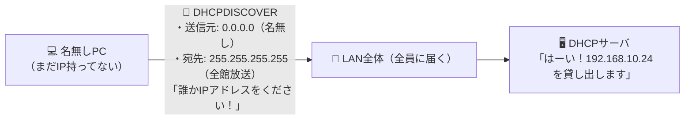

# DHCPDISCOVER：名無しPCの叫び「送信元 0.0.0.0 → 宛先 255.255.255.255」！

> **想定読者**: IPをもらう前のPCがどうやって通信しているのか謎に思っている文系受験者
> **省いたもの**: DHCPリレーエージェント経由でのユニキャスト転送（GIADDRフィールドの挙動）
> **所要時間**: 6〜8分
> **対象過去問**: 応用情報技術者 令和2年秋期 問35

---

## 【対象過去問】令和2年秋期 問35

**【問題】**
IPv4ネットワークにおいて，IPアドレスを付与されていないPCがDHCPサーバを利用してネットワーク設定を行う際，最初にDHCPDISCOVERメッセージをブロードキャストする。このメッセージの送信元IPアドレスと宛先IPアドレスの適切な組合せはどれか。ここで，このPCにはDHCPサーバからIPアドレス192.168.10.24が付与されるものとする。

- **ア**: 送信元: 0.0.0.0、宛先: 192.168.10.24
- **イ**: 送信元: 0.0.0.0、宛先: 255.255.255.255
- **ウ**: 送信元: 192.168.10.24、宛先: 255.255.255.255
- **エ**: 送信元: 255.255.255.255、宛先: 0.0.0.0

▶ 正解を表示する

**正解: イ（送信元: 0.0.0.0、宛先: 255.255.255.255）**

---

## 0. 一枚で：『送信元は名無し（0.0.0.0）、宛先は全館放送（255.255.255.255）！』

### 🧠 脳に刻む合言葉：
> **『 IPを持ってないから「送信元は 0.0.0.0」、サーバの場所も知らないから「宛先は 255.255.255.255」！ 』**

---

## 1. なぜそうなるのか？（日常のたとえ話：身分証なしで役所の総合受付に飛び込む人。「名無しの権兵衛（0.0.0.0）ですが、誰か番号札（IP）をください！（全館放送 255.255.255.255）」）

新しくLANケーブルを挿したばかりのPCをイメージしてください。

このPCは、まだ誰からもIPアドレスを教えてもらっていません。自分の名前（IP）すら分からない「名無しの権兵衛」です。
そして、このネットワークのどこにDHCPサーバ（番号札をくれる窓口）があるのかも全く知りません。

そんな状態のPCが「IPアドレスをください！」と叫ぶ最初のパケット（DHCPDISCOVER）を作るとき、IPヘッダには何を書くでしょうか？

1. **送信元IPアドレス**:
   まだIPを持っていないので、自分のIP欄には **「0.0.0.0（未設定・名無し）」** と書くしかありません！
   （後で付与される予定の `192.168.10.24` を最初から書けるはずがありません。預言者じゃないのですから！）

2. **宛先IPアドレス**:
   DHCPサーバがどこにいるか分からないので、ネットワーク内の全員に向けて **「255.255.255.255（リミテッド・ブロードキャスト＝全館放送）」** で叫びます！

これを受け取ったDHCPサーバが「おっ、名無しさんが困ってるな。じゃあ空いてるIPをあげるよ」と助けてくれるのです。

---

## 2. 選択肢のひっかけポイント ＆ 判定理由

- **ア: 送信元 0.0.0.0、宛先 192.168.10.24** → 付与される予定のIPアドレスはまだ確定していないので宛先にも使えません（×）。
- **イ: 送信元 0.0.0.0、宛先 255.255.255.255 【正解！】** → 自分のIPがないので0.0.0.0、サーバを探すためブロードキャスト（255.255.255.255）で送信します（◯）。
- **ウ: 送信元 192.168.10.24、宛先 255.255.255.255** → まだ付与されていないIPアドレスを送信元に設定することはできません（×）。
- **エ: 送信元 255.255.255.255、宛先 0.0.0.0** → 送信元と宛先が完全に逆です（×）。

---

## 3. 午後試験 記述対策チェックリスト（※該当する場合）

- [ ] **Q. DHCPクライアントが初期接続時に送信元IPアドレスとして 0.0.0.0 を設定する理由を説明せよ。**  
  → **「自身のIPアドレスが未割り当てであり、有効なIPアドレスを保持していないため。」**

---

## 🎯 次の2分アクション（定着チェック）

- [ ] **画面の一番上に戻り、正解を隠した状態で正解肢「イ」を確信を持って選べるか試してみよう！**
