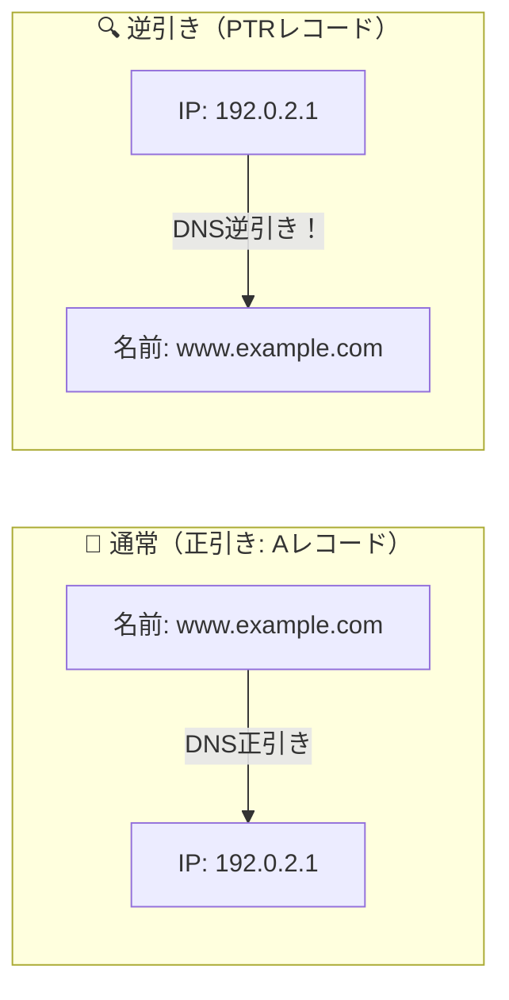

# DNS逆引き：IPアドレスからホスト名を調べる「電話番号からのハローページ検索」！

> **想定読者**: 正引きと逆引き、MXレコードやNSレコードの用語が頭の中でごちゃ混ぜな文系受験者
> **省いたもの**: in-addr.arpaドメインのツリー構造とPTRレコードの委譲設定
> **所要時間**: 6〜8分
> **対象過去問**: 応用情報技術者 令和6年秋期 問33

---

## 【対象過去問】令和6年秋期 問33

**【問題】**
DNSに関する記述のうち，適切なものはどれか。

- **ア**: DNSサーバのホスト名を登録するレコードをMXレコードという。
- **イ**: DNSサーバに問合せを行うソフトウェアをゾーンという。
- **ウ**: IPアドレスに対応するホスト名を調べることを逆引きという。
- **エ**: 同一ホスト名に対して別名を登録するレコードをNSレコードという。

▶ 正解を表示する

**正解: ウ（IPアドレスに対応するホスト名を調べることを逆引きという。）**

---

## 0. 一枚で：『IPアドレスに対応するホスト名を調べることを「逆引き」と呼ぶ！』

### 🧠 脳に刻む合言葉：
> **『 名前からIPを引くのが「正引き」、IPから名前を調べるのが「逆引き（PTR）」！ 』**

---

## 1. なぜそうなるのか？（日常のたとえ話：電話帳。人名から電話番号を調べるのが正引き、電話番号から誰の番号か調べるのが逆引き！）

私たちが普段ブラウザに `google.com` と打ち込むと、DNSサーバがIPアドレス（例: `142.250.x.x`）を教えてくれます。
このように **「ドメイン名（人間用） → IPアドレス（コンピュータ用）」** に変換する通常の動作を **「正引き」** と呼びます。

その真逆の動作、つまり **「IPアドレスから、そのIPを使っているホスト名（ドメイン名）を調べる」** 動作のことを **「逆引き」** と呼びます！
（ログ解析やスパムメール対策などで、「このアクセス元のIPはどこの会社のマシンだ？」と調べるときに使われます）。

他の用語の誤り：
- `MXレコード`: メールサーバ（Mail eXchanger）を指定するレコード
- `リゾルバ`: DNSサーバに問い合わせを行うクライアント側ソフトウェア（ゾーンではない）
- `CNAMEレコード`: 別名（エイリアス）を登録するレコード（NSはネームサーバの登録）

---

## 2. 選択肢のひっかけポイント ＆ 判定理由

- **ア: ホスト名を登録するレコードをMXレコード…** → MXはメールサーバを指定するレコードです（×）。
- **イ: 問合せを行うソフトウェアをゾーン…** → 問合せを行うのは「リゾルバ」です（×）。
- **ウ: IPアドレスに対応するホスト名を調べることを逆引き 【正解！】** → 逆引き（リバースルックアップ）の正確な定義です（◯）。
- **エ: 別名を登録するレコードをNSレコード…** → 別名は「CNAMEレコード」です。NSはDNSサーバ自身を指定します（×）。

---

## 3. 午後試験 記述対策チェックリスト（※該当する場合）

- [ ] **Q. DNSにおいて、IPアドレスからホスト名（ドメイン名）を逆引きする際に利用されるリソースレコードの種別名は何か？**  
  → **「PTRレコード（ポインタレコード）。」**

---

## 🎯 次の2分アクション（定着チェック）

- [ ] **画面の一番上に戻り、正解を隠した状態で正解肢「ウ」を確信を持って選べるか試してみよう！**
