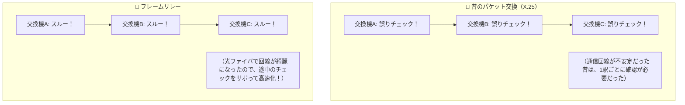

# フレームリレー：各駅停車のチェックをサボって爆走する「急行電車」！

> **想定読者**: パケット交換（X.25）とフレームリレーの歴史的な進化の理由が分からない文系受験者
> **省いたもの**: DLCI（データリンク接続識別子）とFECN/BECN輻輳通知ビットの制御
> **所要時間**: 6〜8分
> **対象過去問**: 応用情報技術者 平成18年秋期 問56

---

## 【対象過去問】平成18年秋期 問56

**【問題】**
パケット交換とフレームリレー方式を比較した記述のうち，適切なものはどれか。

- **ア**: ともに蓄積交換によるデータ伝送であるが，網内のトラフィックが増大した場合，フレームリレーの方がフレームの廃棄率が低くなる。
- **イ**: パケット交換では，あらかじめ伝送速度を固定しておくことが接続条件となるが，フレームリレーでは，複数の伝送速度から選択できる。
- **ウ**: パケット交換では，送信元から送信先へパケットの伝送順序が保証されるが，フレームリレーでは，網内遅延を小さくするためにデータの順序は保証されない。
- **エ**: フレームリレーは，パケット交換に比べて誤り制御処理を簡略化することによって，網内遅延の低減を図っている。

▶ 正解を表示する

**正解: エ（フレームリレーは，パケット交換に比べて誤り制御処理を簡略化することによって，網内遅延の低減を図っている。）**

---

## 0. 一枚で：『交換機での誤り制御処理を省略して、網内遅延を小さくした！』

### 🧠 脳に刻む合言葉：
> **『 フレームリレーは「途中の誤りチェックをサボって飛ばす急行電車」！ 』**

---

## 1. なぜそうなるのか？（日常のたとえ話：荷物の検問。昔は各都道府県の関所ごとに荷物を全部開けて検査していたが、道路が良くなったので「最後の受取人がまとめて確認すればOK」にした！）

昔の通信回線（銅線）はノイズだらけで、データがしょっちゅう壊れていました。
そのため、古い **パケット交換（X.25）** では、途中の交換機を通るたびに「データ壊れてないかな？」と厳重に誤りチェックと再送確認をしていました。そのため、すごく遅かったのです（網内遅延が大きい）。

時代が進んで **「光ファイバ」** が普及すると、回線の品質が劇的に良くなり、途中でデータが壊れることなんて滅多になくなりました。

そこで登場したのが **フレームリレー（Frame Relay）** です！
**「途中の交換機での面倒な誤りチェック処理を全部サボって、そのまま次の機器へ右から左へ受け流そう！もし壊れてたら両端の端末同士（TCPなど）で勝手に再送してくれ！」**
こうして余計な仕事を省略したおかげで、パケット交換に比べて **「網内遅延を大幅に小さくする」** ことができました！

---

## 2. 選択肢のひっかけポイント ＆ 判定理由

- **ア: フレームリレーの方が廃棄率が低い…** → 混雑時（輻輳時）はフレームリレーの方が容赦なくフレームを破棄します（×）。
- **イ: パケット交換は固定、フレームリレーは複数選択…** → どちらも複数の速度やCIR（認定情報速度）を選択できます（×）。
- **ウ: 順序は保証されない…** → フレームリレーも同一仮想回線上では順序が保たれます（×）。
- **エ: 誤り制御処理を簡略化して網内遅延の低減を図っている 【正解！】** → フレームリレーの最大の特徴です（◯）。

---

## 3. 午後試験 記述対策チェックリスト（※該当する場合）

- [ ] **Q. フレームリレー方式が従来のパケット交換方式と比較して高速化・低遅延化を実現できた技術的理由を答えよ。**  
  → **「中継交換機におけるフロー制御や誤り再送制御を省略し、データ転送処理を簡略化したため。」**

---

## 🎯 次の2分アクション（定着チェック）

- [ ] **画面の一番上に戻り、正解を隠した状態で正解肢「エ」を確信を持って選べるか試してみよう！**
