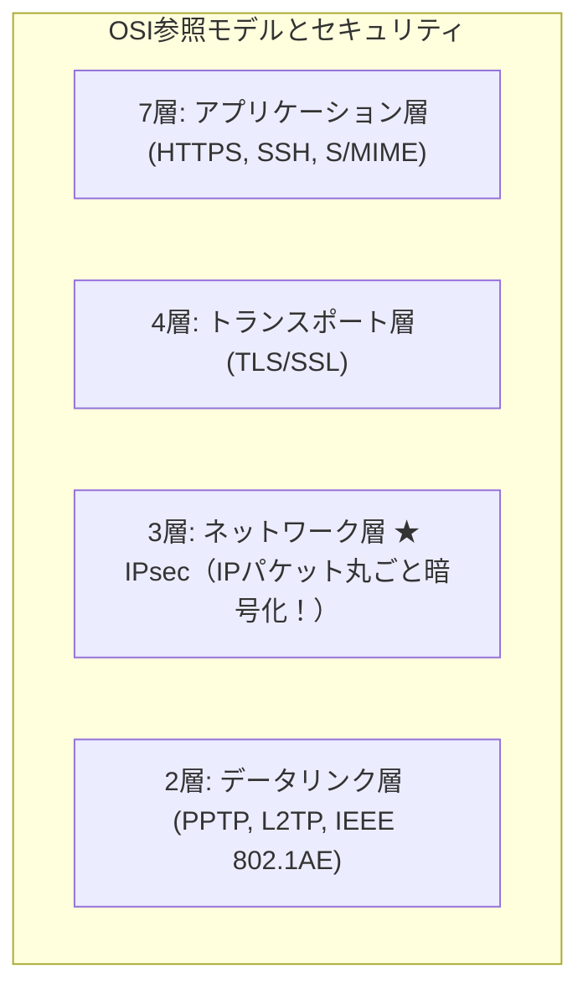

# IPsec：ネットワーク層（L3）を丸ごとトンネル化する頑丈なVPN！

> **想定読者**: IPsec、TLS、SSH、PPTPがどのOSI層で動いているか区別できない文系受験者
> **省いたもの**: IKE（Internet Key Exchange）のメインモードとアグレッシブモードのハンドシェイク詳細
> **所要時間**: 6〜8分
> **対象過去問**: 応用情報技術者 平成19年秋期 問59

---

## 【対象過去問】平成19年秋期 問59

**【問題】**
インターネットを使ってVPNを構築する際に利用されるネットワーク層(IP層)のセキュリティプロトコルはどれか。

- **ア**: アプリケーション層
- **イ**: セッション層
- **ウ**: データリンク層
- **エ**: ネットワーク層

▶ 正解を表示する

**正解: ア（アプリケーション層）**

---

## 0. 一枚で：『IPsecはネットワーク層（第3層）で通信を暗号化・認証する！』

### 🧠 脳に刻む合言葉：
> **『 IPsecの「IP」はネットワーク層（第3層）のIP！IPパケットごと地下トンネルに通す！ 』**

---

## 1. なぜそうなるのか？（日常のたとえ話：高速道路の地下トンネル。トラックの荷物（アプリ）が何であれ、道路（IP）ごと頑丈に守る！）

インターネットを経由して東京本社と大阪支社を安全に繋ぐVPN（仮想専用線）を作るとき、主役となるのが **IPsec（Security Architecture for IP）** です。

名前の中に「IP」と入っている通り、**OSI参照モデルの第3層（ネットワーク層）** で動作します。

- 第7層（アプリ層）の暗号化（HTTPSなど）だと、Webブラウザ以外の専用通信には使えません。
- しかし第3層のIPsecなら、上に乗っかる通信がWebだろうがメールだろうがファイル共有だろうが、**「IPパケット丸ごと暗号化してトンネルに通す」** ことができます！
アプリ側が暗号化を意識しなくてよいのが最大のメリットです。

---

## 2. 選択肢のひっかけポイント ＆ 判定理由

- **ア: アプリケーション層** → S/MIMEやHTTPS、SSHなどが該当します（×）。
- **イ: セッション層** → 第5層です。IPsecの動作層ではありません（×）。
- **ウ: データリンク層** → PPTPやL2TP、MACsecなどが該当します（×）。
- **エ: ネットワーク層 【正解！】** → IPsecはネットワーク層（IP層）で動作するセキュリティ規格です（◯）。

---

## 3. 午後試験 記述対策チェックリスト（※該当する場合）

- [ ] **Q. IPsecを導入することで、上位のアプリケーション層に対してどのような利点があるか？**  
  → **「アプリケーションに依存せず、すべての通信パケットを意識することなく一括して暗号化・認証できる。」**

---

## 🎯 次の2分アクション（定着チェック）

- [ ] **画面の一番上に戻り、正解を隠した状態で正解肢「ア」を確信を持って選べるか試してみよう！**
