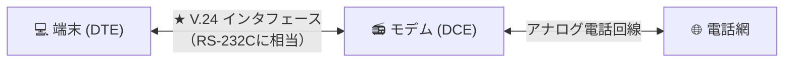

# V.24：パソコンとモデムを繋ぐ「ITU-Tの直通コンセント規格」！

> **想定読者**: IEEE 802.3やX.25など記号だらけの通信規格の区別がつかない文系受験者
> **省いたもの**: RS-232Cのピン配置（TXD, RXD, RTS, CTS, DTR, DSR）と電圧レベル仕様
> **所要時間**: 6〜8分
> **対象過去問**: 応用情報技術者 平成17年春期 問54

---

## 【対象過去問】平成17年春期 問54

**【問題】**
図は，あるデータ通信システムの端末，モデム，アナログ回線の接続を示している。端末とモデム間のモデム制御信号の規定など，物理層のインタフェースを規定している規格はどれか。

- **ア**: IEEE 488
- **イ**: IEEE 802.3
- **ウ**: V.24
- **エ**: X.25

▶ 正解を表示する

**正解: ウ（V.24）**

---

## 0. 一枚で：『端末（DTE）とモデム（DCE）間のインタフェース規格は V.24！』

### 🧠 脳に刻む合言葉：
> **『 モデム（アナログ電話）に繋ぐ昔ながらのシリアル規格が「V.24（ブイ・ニジュウヨン）」！ 』**

---

## 1. なぜそうなるのか？（日常のたとえ話：テレビとビデオデッキを繋ぐ3色ケーブル（赤白黄）。機器同士を繋ぐための端子規格！）

電話回線を使ってインターネットをしていた時代の通信機器の接続図です。

- **DTE（データ端末装置）**: パソコンのこと
- **DCE（データ回線終端装置）**: モデムのこと

パソコンとモデムの間をケーブルで繋ぐとき、信号のやり取り（「送信していいですか？」「はい、どうぞ」）のルールを決めた国際規格（ITU-T勧告）が **V.24**（アメリカ規格の RS-232C とほぼ同等）です。

他の選択肢：
- `IEEE 802.3`: 有線LAN（イーサネット）の規格
- `X.25`: パケット交換網の規格
- `IEEE 488`: 計測器を繋ぐGPIB規格

---

## 2. 選択肢のひっかけポイント ＆ 判定理由

- **ア: IEEE 488** → 電子計測機器を接続するためのGPIBバス規格です（×）。
- **イ: IEEE 802.3** → 有線LAN（イーサネット）の規格です（×）。
- **ウ: V.24 【正解！】** → DTE（端末）とDCE（モデム）間の相互接続回路を規定したITU-T勧告です（◯）。
- **エ: X.25** → パケット交換網と端末を接続するプロトコル規格です（×）。

---

## 3. 午後試験 記述対策チェックリスト（※該当する場合）

- [ ] **Q. モデムなどのデータ回線終端装置（DCE）とコンピュータ（DTE）を接続するシリアルインタフェースの代表例を答えよ。**  
  → **「ITU-T V.24（または EIA RS-232C）。」**

---

## 🎯 次の2分アクション（定着チェック）

- [ ] **画面の一番上に戻り、正解を隠した状態で正解肢「ウ」を確信を持って選べるか試してみよう！**
