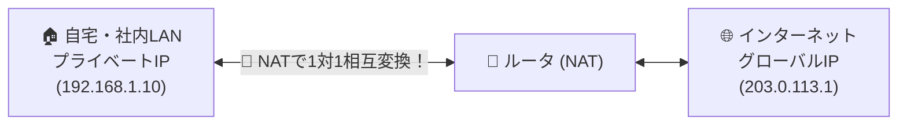

# NAT：プライベートIPとグローバルIPを1対1で両替する「入国審査官」！

> **想定読者**: NATの基本的な日本語定義がパッと浮かばない文系受験者
> **省いたもの**: スタティックNATとダイナミックNATのプール枯渇時の挙動
> **所要時間**: 6〜8分
> **対象過去問**: 応用情報技術者 平成18年秋期 問58

---

## 【対象過去問】平成18年秋期 問58

**【問題】**
インターネット接続用ルータのNAT機能の説明として，適切なものはどれか。

- **ア**: インターネットへのアクセスをキャッシュしておくことにより，以後に同一IPアドレスのサイトへアクセスする場合，高速表示できる機能である。
- **イ**: 通信中のIPパケットのビットパターンを監視し，不正な侵入を検知する機能である。
- **ウ**: 特定の端末から送信されたIPパケットだけを通過させる機能である。
- **エ**: プライベートIPアドレスとグローバルIPアドレスを相互に変換する機能である。

▶ 正解を表示する

**正解: エ（プライベートIPアドレスとグローバルIPアドレスを相互に変換する機能である。）**

---

## 0. 一枚で：『プライベートIPアドレスとグローバルIPアドレスを相互に変換する！』

### 🧠 脳に刻む合言葉：
> **『 NAT（Network Address Translation）はその名の通り「アドレス変換」！内線IPを外線IPに両替！ 』**

---

## 1. なぜそうなるのか？（日常のたとえ話：空港の両替所。日本円（プライベートIP）をドル（グローバルIP）に両替して海外（インターネット）へ旅立つ！）

社内や家庭で使っている「プライベートIPアドレス（192.168.x.xなど）」は、インターネット上では通用しません。そのまま外に出ると迷子になってしまいます。

そこでルータが間に入って行うのが **NAT（Network Address Translation: ネットワークアドレス変換）** です。

LANからインターネットへパケットが出ていくときに、送信元の「プライベートIPアドレス」を世界で通用する「グローバルIPアドレス」へと書き換えます。
返信が返ってきたら、再びプライベートIPアドレスに書き戻して元のPCへ届けます。
このように、**「プライベートIPとグローバルIPを相互に変換する」** のがNATの定義そのものです！

---

## 2. 選択肢のひっかけポイント ＆ 判定理由

- **ア: キャッシュして高速表示…** → プロキシサーバ（キャッシュサーバ）の説明です（×）。
- **イ: ビットパターンを監視し不正侵入を検知…** → IDS/IPS（侵入検知・防止システム）の説明です（×）。
- **ウ: 特定のパケットだけを通過…** → パケットフィルタリング（ファイアウォール）の説明です（×）。
- **エ: プライベートIPとグローバルIPを相互に変換 【正解！】** → NATの正確な定義です（◯）。

---

## 3. 午後試験 記述対策チェックリスト（※該当する場合）

- [ ] **Q. ルータのNAT機能がインターネット接続において果たす役割を簡潔に説明せよ。**  
  → **「LAN内のプライベートIPアドレスとインターネット上のグローバルIPアドレスを相互に変換する。」**

---

## 🎯 次の2分アクション（定着チェック）

- [ ] **画面の一番上に戻り、正解を隠した状態で正解肢「エ」を確信を持って選べるか試してみよう！**
