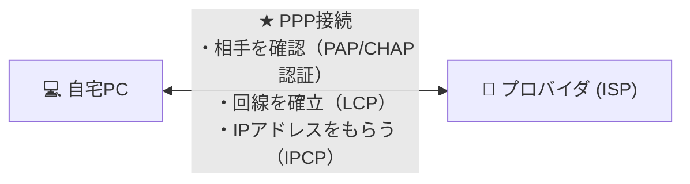

# PPP：電話線で「1対1」の直通通話！認証もエラーチェックもこなす万能プロトコル

> **想定読者**: PPP、SLIP、FTP、UDPなどの違いが分からない文系受験者
> **省いたもの**: LCP（リンク制御プロトコル）とNCP（ネットワーク制御プロトコル）の2層ハンドシェイク仕様
> **所要時間**: 6〜8分
> **対象過去問**: 応用情報技術者 平成29年春期 問33

---

## 【対象過去問】平成29年春期 問33

**【問題】**
WANを介して二つのノードをダイヤルアップ接続するときに使用されるプロトコルで，リンク制御やエラー処理機能をもつものはどれか。

- **ア**: FTP
- **イ**: PPP
- **ウ**: SLIP
- **エ**: UDP

▶ 正解を表示する

**正解: イ（PPP）**

---

## 0. 一枚で：『WANの1対1接続で認証・リンク制御・誤り処理を行うプロトコル！』

### 🧠 脳に刻む合言葉：
> **『 Point-to-Point（1対1）で繋ぐからPPP！古いSLIPに認証とエラー処理を足した上位互換！ 』**

---

## 1. なぜそうなるのか？（日常のたとえ話：直通の糸電話。相手が誰か確認（認証）してから会話をスタート！）

電話回線を使ってプロバイダにダイヤルアップ接続していた時代をイメージしてください。

昔は **SLIP** という単純なプロトコルを使っていましたが、「エラー訂正がない」「ユーザー認証ができない」という欠点だらけでした。

そこで作られたのが **PPP（Point-to-Point Protocol）** です！
その名の通り「2つの地点を1対1で繋ぐ」ためのプロトコルです。

1. **リンク確立**: 「もしもし、回線繋がった？（LCP）」
2. **ユーザー認証**: 「IDとパスワードを教えて（PAP / CHAP）」
3. **エラー検出**: 届いたパケットが壊れていないかチェック

これらを全部セットで面倒見てくれる、WAN接続の頼れる相棒です！現在でも光回線の「PPPoE（PPP over Ethernet）」として生き残っています。

---

## 2. 選択肢のひっかけポイント ＆ 判定理由

- **ア: FTP** → ファイルを転送するためのアプリケーション層プロトコルです（×）。
- **イ: PPP 【正解！】** → 2つのノードを1対1で接続し、認証やリンク制御・エラー処理を行うプロトコルです（◯）。
- **ウ: SLIP** → PPPの先代。エラー処理や認証機能を持たない古いプロトコルです（×）。
- **エ: UDP** → トランスポート層のコネクションレス型プロトコルです（×）。

---

## 3. 午後試験 記述対策チェックリスト（※該当する場合）

- [ ] **Q. 光回線などのブロードバンド接続で、イーサネット上でPPPの機能（ユーザー認証等）を実現するプロトコルは何か？**  
  → **「PPPoE（Point-to-Point Protocol over Ethernet）。」**

---

## 🎯 次の2分アクション（定着チェック）

- [ ] **画面の一番上に戻り、正解を隠した状態で正解肢「イ」を確信を持って選べるか試してみよう！**
