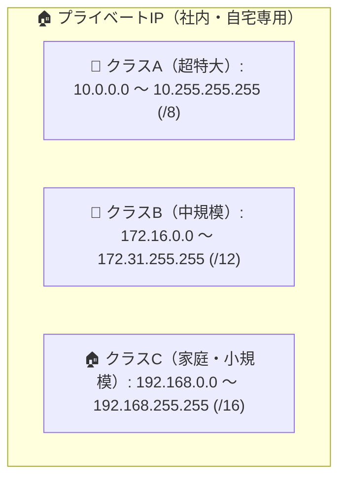

# プライベートIPアドレス：クラスCは「192.168.0.0 〜 192.168.255.255」！

> **想定読者**: クラスA、B、CのプライベートIP範囲が暗記できずに混同する文系受験者
> **省いたもの**: RFC 1918以前の歴史的経緯やIPv6におけるULA（ユニークローカルアドレス）
> **所要時間**: 6〜8分
> **対象過去問**: 応用情報技術者 平成19年春期 問54

---

## 【対象過去問】平成19年春期 問54

**【問題】**
クラスCのプライベートIPアドレスとして利用できる範囲はどれか。

- **ア**: 10.0.0.0〜10.255.255.255
- **イ**: 128.0.0.0〜128.255.255.255
- **ウ**: 172.16.0.0〜172.31.255.255
- **エ**: 192.168.0.0〜192.168.255.255

▶ 正解を表示する

**正解: エ（192.168.0.0〜192.168.255.255）**

---

## 0. 一枚で：『クラスCのプライベートIPは 192.168.0.0〜192.168.255.255！』

### 🧠 脳に刻む合言葉：
> **『 「10番（クラスA）、172の16〜31（クラスB）、192.168（クラスC）」！自宅ルータはいつだって192.168！ 』**

---

## 1. なぜそうなるのか？（日常のたとえ話：社内の内線電話番号。内線番号だから社外（インターネット）には直接通じない！）

世界中で自由に使える「社内・家庭用の内線電話番号（プライベートIP）」には、3つのクラスごとに予約された範囲があります。

1. **クラスA（超大企業用）**: `10.0.0.0 〜 10.255.255.255`（約1677万台）
2. **クラスB（中規模企業用）**: `172.16.0.0 〜 172.31.255.255`（約104万台）
3. **クラスC（小規模・家庭用）**: **`192.168.0.0 〜 192.168.255.255`**（約6.5万台）

ご自宅のWi-Fiルータの管理画面を開くと、ほぼ100%「192.168.1.1」などになっているはずです。
身近なクラスCの範囲は「192.168.x.x」と一瞬で思い出しましょう！

---

## 2. 選択肢のひっかけポイント ＆ 判定理由

- **ア: 10.0.0.0〜10.255.255.255** → クラスAのプライベートIPです（×）。
- **イ: 128.0.0.0〜128.255.255.255** → グローバルIPアドレスであり、プライベート用ではありません（×）。
- **ウ: 172.16.0.0〜172.31.255.255** → クラスBのプライベートIPです（×）。
- **エ: 192.168.0.0〜192.168.255.255 【正解！】** → クラスCのプライベートIP範囲です（◯）。

---

## 3. 午後試験 記述対策チェックリスト（※該当する場合）

- [ ] **Q. プライベートIPアドレスを持つ端末がインターネットと直接通信できない理由を簡潔に説明せよ。**  
  → **「インターネット上のルータでルーティング（中継）されない規約になっているため。」**

---

## 🎯 次の2分アクション（定着チェック）

- [ ] **画面の一番上に戻り、正解を隠した状態で正解肢「エ」を確信を持って選べるか試してみよう！**
