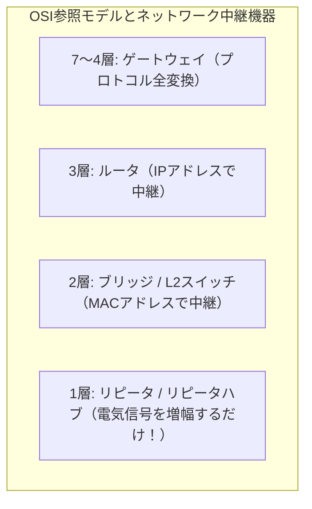

# リピータ：弱まった電気信号を元気に増幅する「物理層（第1層）のメガホン」！

> **想定読者**: ゲートウェイ、ルータ、ブリッジ、リピータの対応するOSI階層が混乱する文系受験者
> **省いたもの**: ツイストペアケーブルにおけるカテゴリ規格（Cat5e/Cat6）の減衰特性
> **所要時間**: 6〜8分
> **対象過去問**: 応用情報技術者 平成20年秋期 問59

---

## 【対象過去問】平成20年秋期 問59

**【問題】**
LAN間をOSI基本参照モデルの物理層で相互に接続する装置はどれか。

- **ア**: ゲートウェイ
- **イ**: ブリッジ
- **ウ**: リピータ
- **エ**: ルータ

▶ 正解を表示する

**正解: ウ（リピータ）**

---

## 0. 一枚で：『物理層（第1層）で信号を増幅・中継する装置はリピータ！』

### 🧠 脳に刻む合言葉：
> **『 「1階リピータ、2階ブリッジ、3階ルータ、最上階ゲートウェイ」のエレベーター暗記！ 』**

---

## 1. なぜそうなるのか？（日常のたとえ話：マラソンの給水所。ヘトヘトになって電波（信号）が弱まったランナーにポカリを飲ませて元気に走らせる！）

LANケーブルの中を流れる電気信号は、ケーブルが長くなればなるほど弱まって波形が崩れていきます（減衰）。放っておくと途中でデータが消えてしまいます。

そこで、ケーブルの途中に挟んで **「弱くなった電気信号を波形整形して元気に増幅し、遠くまで届くようにする装置」** が **リピータ（Repeater）** です！

リピータは中身のデータ（IPアドレスやMACアドレス）なんて一切見ていません。ただ電気の波を整えて送り出すだけなので、**OSI参照モデルの第1層（物理層）** で動作します。

- 1層（物理層）: **リピータ**（電気信号を増幅）
- 2層（データリンク層）: **ブリッジ**（MACアドレスを見る）
- 3層（ネットワーク層）: **ルータ**（IPアドレスを見る）
- 4〜7層（上位層）: **ゲートウェイ**（プロトコルを変換）

---

## 2. 選択肢のひっかけポイント ＆ 判定理由

- **ア: ゲートウェイ** → トランスポート層〜アプリケーション層（4〜7層）で異なるプロトコルを相互変換する装置です（×）。
- **イ: ブリッジ** → データリンク層（2層）でMACアドレスを見て中継する装置です（×）。
- **ウ: リピータ 【正解！】** → 物理層（1層）で電気信号を波形整形・増幅する装置です（◯）。
- **エ: ルータ** → ネットワーク層（3層）でIPアドレスを見て中継する装置です（×）。

---

## 3. 午後試験 記述対策チェックリスト（※該当する場合）

- [ ] **Q. OSI基本参照モデルにおける物理層の中継装置と、データリンク層の中継装置の名称をそれぞれ答えよ。**  
  → **「物理層はリピータ、データリンク層はブリッジ（またはレイヤ2スイッチ）。」**

---

## 🎯 次の2分アクション（定着チェック）

- [ ] **画面の一番上に戻り、正解を隠した状態で正解肢「ウ」を確信を持って選べるか試してみよう！**
