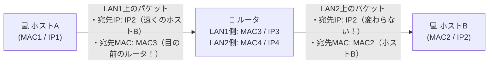

# ルータ越え通信：宛先IPは「最後の目的地（ホストB）」、宛先MACは「次の関所（ルータ）」！

> **想定読者**: ルータを通るとIPとMACのどちらが書き換わるのか混乱する文系受験者
> **省いたもの**: TTL（Time To Live）のデクリメント処理やチェックサム再計算の手順
> **所要時間**: 6〜8分
> **対象過去問**: 応用情報技術者 平成31年春期 問33

---

## 【対象過去問】平成31年春期 問33

**【問題】**
図のようなIPネットワークのLAN環境で，ホストAからホストBにパケットを送信する。LAN1において，パケット内のイーサネットフレームの宛先とIPデータグラムの宛先の組合せとして，適切なものはどれか。ここで，図中の MACn/IPm はホスト又はルータがもつインタフェースのMACアドレスとIPアドレスを示す。

- **ア**: 宛先MAC: MAC1、宛先IP: IP1
- **イ**: 宛先MAC: MAC2、宛先IP: IP2
- **ウ**: 宛先MAC: MAC3、宛先IP: IP2
- **エ**: 宛先MAC: MAC3、宛先IP: IP3

▶ 正解を表示する

**正解: ウ（宛先MAC: MAC3、宛先IP: IP2）**

---

## 0. 一枚で：『宛先IPはずっと変わらない（IP2）、宛先MACはルータ（MAC3）！』

### 🧠 脳に刻む合言葉：
> **『 IPアドレスは「最終目的地（北海道の実家）」、MACアドレスは「次の乗り継ぎ駅（東京駅）」！ 』**

---

## 1. なぜそうなるのか？（日常のたとえ話：旅行のチケット。目的地はずっと「北海道」だが、乗る電車は「まず東京駅行き、次は新函館北斗行き」と乗り継ぐ！）

ホストAから別のネットワークにあるホストBへデータを送る場面です。

- **IPアドレス（ネットワーク層）**:
  「最終的に誰に届けたいか？」という最終ゴールを示します。
  パケットが旅をする間、宛先IPアドレスはずっと **「ホストBのIPアドレス（IP2）」のまま変わりません！**

- **MACアドレス（データリンク層）**:
  「LANケーブルの中で、次の一歩（次のホップ）として誰に渡すか？」を示します。
  ホストAは直接ホストBへLANの電気信号を届けることはできないので、まずは **「目の前にある出口のルータ（LAN1側のMAC3）」** を宛先MACアドレスにして送ります！

ルータに届いた後、ルータがMACアドレスを「ホストBのMACアドレス（MAC2）」に貼り替えて次のLAN2へ送り出します。
したがって、LAN1を流れるパケットは **「宛先MAC＝MAC3、宛先IP＝IP2」** となります！

---

## 2. 選択肢のひっかけポイント ＆ 判定理由

- **ア: 宛先MAC: MAC1、宛先IP: IP1** → 送信元自身の情報です（×）。
- **イ: 宛先MAC: MAC2、宛先IP: IP2** → 異なるネットワークのホストBのMACアドレスへは直接LAN1で届けられません（×）。
- **ウ: 宛先MAC: MAC3、宛先IP: IP2 【正解！】** → 次の中継点であるルータのMACアドレス（MAC3）と、最終目的地のホストBのIPアドレス（IP2）です（◯）。
- **エ: 宛先MAC: MAC3、宛先IP: IP3** → 宛先IPをルータにしてしまうと、パケットがルータ自身で止まってホストBに届きません（×）。

---

## 3. 午後試験 記述対策チェックリスト（※該当する場合）

- [ ] **Q. ルータを経由して異なるネットワーク間をパケットが転送される際、IPヘッダの宛先IPアドレスとイーサネットヘッダの宛先MACアドレスの挙動の違いを述べよ。**  
  → **「宛先IPアドレスは最終目的地まで不変だが、宛先MACアドレスは中継機器を経由するごとに次のホップのMACアドレスに書き換わる。」**

---

## 🎯 次の2分アクション（定着チェック）

- [ ] **画面の一番上に戻り、正解を隠した状態で正解肢「ウ」を確信を持って選べるか試してみよう！**
