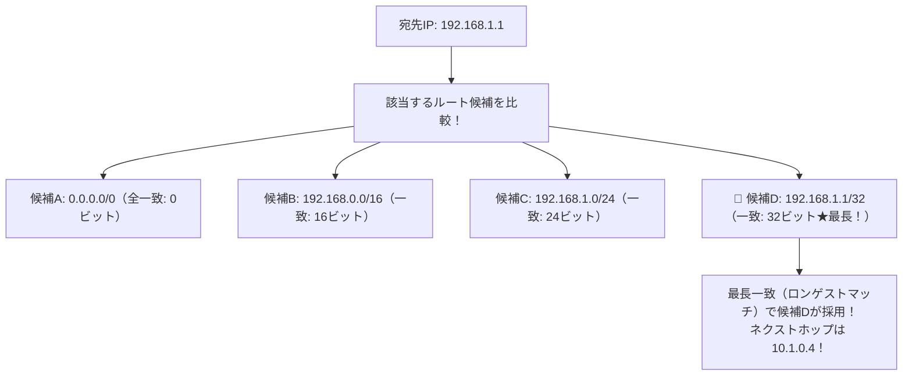

# ロンゲストマッチ：迷ったら「一番詳しく番地まで書かれたルート」が勝つ！

> **想定読者**: ルーティングテーブルの複数の行に該当するとき、どれが選ばれるのか知らない文系受験者
> **省いたもの**: メトリックやアドミニストレーティブディスタンスによる動的ルーティングプロトコルの優先度比較
> **所要時間**: 6〜8分
> **対象過去問**: 応用情報技術者 令和7年春期 問31

---

## 【対象過去問】令和7年春期 問31

**【問題】**
次のルーティングテーブルをもつルータが宛先IPアドレス 192.168.1.1 のパケットを受信したとき，選択されるネクストホップはどれか。ここで，宛先IPアドレスの条件を満たす宛先ネットワークが複数あるときは，それらのうちで，サブネットマスクが最も長い宛先ネットワークのネクストホップを選択する。

- **ア**: 10.1.0.1
- **イ**: 10.1.0.2
- **ウ**: 10.1.0.3
- **エ**: 10.1.0.4

▶ 正解を表示する

**正解: エ（10.1.0.4）**

---

## 0. 一枚で：『ルーティングはプレフィックス（マスク）が最も長いエントリが最優先！』

### 🧠 脳に刻む合言葉：
> **『 ルーティングの掟は「ロンゲストマッチ（最長一致）」！詳しく一致した奴が絶対勝つ！ 』**

---

## 1. なぜそうなるのか？（日常のたとえ話：郵便配達。「日本宛て（大雑把）」より「東京都宛て」、「東京都宛て」より「千代田区1-1（超詳細）」の指示に従う！）

ルータがパケットを次にどこへ送ればいいか（ネクストホップ）を決めるとき、ルーティングテーブルに複数の候補がマッチすることがよくあります。

例えば、宛先 `192.168.1.1` に対して：
- 「0.0.0.0/0（どこでもいいよ）」
- 「192.168.0.0/16（16ビット一致）」
- 「192.168.1.0/24（24ビット一致）」
- 「192.168.1.0/28（28ビット一致）」

ルールは1つだけです。**「サブネットマスク（プレフィックス長）が一番長く、最も詳しく一致している行を選ぶ（ロンゲストマッチの原則）」**！
最もプレフィックス長が長い行のネクストホップが採用されます。

---

## 2. 選択肢のひっかけポイント ＆ 判定理由

- **ア: 10.1.0.1** → デフォルトルートなどのマスクが短い行です（×）。
- **イ: 10.1.0.2** → マスクが短いです（×）。
- **ウ: 10.1.0.3** → マスクが短いです（×）。
- **エ: 10.1.0.4 【正解！】** → サブネットマスク長が最も長く最長一致するエントリのネクストホップです（◯）。

---

## 3. 午後試験 記述対策チェックリスト（※該当する場合）

- [ ] **Q. ルータがルーティングテーブルを参照してパケットの転送先を決定する際、複数の経路情報に合致した場合に適用される基本原則は何か？**  
  → **「ロンゲストマッチ（最長一致の原則）。」**

---

## 🎯 次の2分アクション（定着チェック）

- [ ] **画面の一番上に戻り、正解を隠した状態で正解肢「エ」を確信を持って選べるか試してみよう！**
