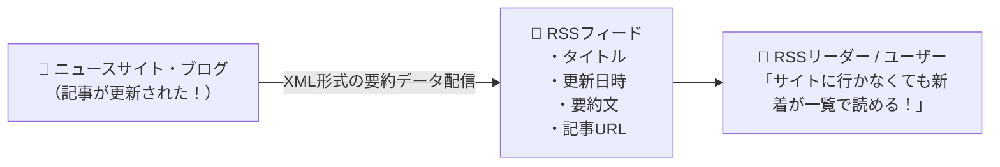

# RSS：Webサイトの新着記事をXMLでまとめて通知する「チラシ配信」！

> **想定読者**: BPEL、RSS、SOAP、WSDLなどアルファベットのWeb技術の略称でパニックになる文系受験者
> **省いたもの**: RSS 1.0 (RDFベース) と RSS 2.0、Atom規格のタグ定義の違い
> **所要時間**: 6〜8分
> **対象過去問**: 応用情報技術者 平成26年春期 問35

---

## 【対象過去問】平成26年春期 問35

**【問題】**
Webページの見出しや要約などのデータについて，XMLを使って更新を通知するためのフォーマットはどれか。

- **ア**: BPEL
- **イ**: RSS
- **ウ**: SOAP
- **エ**: WSDL

▶ 正解を表示する

**正解: イ（RSS）**

---

## 0. 一枚で：『見出しや要約の更新をXMLで通知するフォーマットは RSS！』

### 🧠 脳に刻む合言葉：
> **『 ブログのオレンジのアンテナマークはRSS！「XMLで更新を配信する規格」！ 』**

---

## 1. なぜそうなるのか？（日常のたとえ話：新聞の朝刊の「1面見出し一覧」。見出しと要約だけを毎朝ポストに投函してくれる！）

ブログやニュースサイトでよく見かけるオレンジ色の電波マーク、あれが **RSS（Really Simple Syndication）** です！

わざわざ毎日Webサイトを巡回して「新しい記事上がってるかな？」と見に行かなくても、サイト側が **「新着記事のタイトル、要約、更新日時、リンク」** をXML形式でまとめて配信してくれます。

他のXML関連用語の整理：
- `SOAP`: XMLを使ってネットワーク経由でプログラム（Webサービス）を呼び出すプロトコル
- `WSDL`: Webサービスが「どんな関数（メソッド）を提供しているか」をXMLで記述する仕様書
- `BPEL`: 複数のWebサービスを連携させるビジネスプロセスの記述言語

---

## 2. 選択肢のひっかけポイント ＆ 判定理由

- **ア: BPEL** → 複数のWebサービスを連携実行させるためのビジネスプロセス記述言語です（×）。
- **イ: RSS 【正解！】** → Webサイトの見出しや要約・更新情報をXML形式で配信するフォーマットです（◯）。
- **ウ: SOAP** → Webサービス間でXMLメッセージをやり取りするためのプロトコルです（×）。
- **エ: WSDL** → Webサービスが提供する機能やインターフェースをXMLで記述した仕様書です（×）。

---

## 3. 午後試験 記述対策チェックリスト（※該当する場合）

- [ ] **Q. Webサイトの更新情報を購読者に配信するために用いられるXMLベースの文書フォーマットの代表例を答えよ。**  
  → **「RSS（または Atom）。」**

---

## 🎯 次の2分アクション（定着チェック）

- [ ] **画面の一番上に戻り、正解を隠した状態で正解肢「イ」を確信を持って選べるか試してみよう！**
