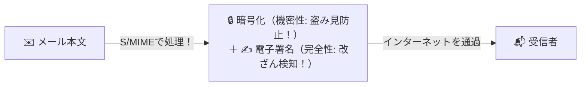

# S/MIME：メールに「実印（電子署名）」と「頑丈な金庫（暗号化）」を施す！

> **想定読者**: IMAP4、POP3、SMTP、S/MIMEの役割の差が分からない文系受験者
> **省いたもの**: S/MIME v4における共通鍵暗号アルゴリズム（AES-GCM等）のパラメータ仕様
> **所要時間**: 6〜8分
> **対象過去問**: 応用情報技術者 平成27年秋期 問33

---

## 【対象過去問】平成27年秋期 問33

**【問題】**
電子メールの内容の機密性を高めるために用いられるプロトコルはどれか。

- **ア**: IMAP4
- **イ**: POP3
- **ウ**: SMTP
- **エ**: S/MIME

▶ 正解を表示する

**正解: エ（S/MIME）**

---

## 0. 一枚で：『メールの内容の機密性（暗号化）と改ざん検知を行うのは S/MIME！』

### 🧠 脳に刻む合言葉：
> **『 S/MIMEは「SecurityなMIME」！暗号化と電子署名でメールの機密性を守る！ 』**

---

## 1. なぜそうなるのか？（日常のたとえ話：手紙を封蝋（シーリングワックス）で閉じて頑丈なアタッシュケースに入れて送るイメージ）

普段私たちが使っているメール（SMTP）は、インターネット上を「ハガキ」のように丸見えの平文で飛んでいきます。途中で誰かに盗み見られたり、書き換えられたりする危険があります。

そこで、メールの内容に高い「機密性（暗号化）」を持たせるために作られた規格が **S/MIME（Secure / Multipurpose Internet Mail Extensions）** です！

公開鍵暗号基盤（PKI）と電子証明書を利用して：
1. **暗号化**: 宛先の人しか読めないように本文をカギでロック！（盗聴防止）
2. **電子署名**: 送信者が本人であること、途中で改ざんされていないことを保証！

これでハガキが「鍵付きの頑丈な封書」に早変わりします。

---

## 2. 選択肢のひっかけポイント ＆ 判定理由

- **ア: IMAP4** → メールサーバ上のメールを受信・管理するプロトコルです（×）。
- **イ: POP3** → メールサーバから端末にメールをダウンロードするプロトコルです（×）。
- **ウ: SMTP** → メールを送信・転送するためのプロトコル（平文）です（×）。
- **エ: S/MIME 【正解！】** → 公開鍵暗号を用いてメールの暗号化と署名を行うセキュリティ規格です（◯）。

---

## 3. 午後試験 記述対策チェックリスト（※該当する場合）

- [ ] **Q. S/MIMEを利用して送信者がメール本文の改ざん検知および送信元認証を実現するために付与するものは何か？**  
  → **「送信者の秘密鍵で作成したディジタル署名。」**

---

## 🎯 次の2分アクション（定着チェック）

- [ ] **画面の一番上に戻り、正解を隠した状態で正解肢「エ」を確信を持って選べるか試してみよう！**
