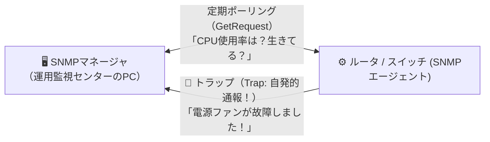

# SNMP：ルータやスイッチの健康状態を見守る「集中管理モニタ」！

> **想定読者**: NTP、SMTP、NNTP、SNMPなどNとPの略語に惑わされる文系受験者
> **省いたもの**: MIB-2（管理情報ベース）のOIDツリー構造とSNMPv3の認証暗号化仕様
> **所要時間**: 6〜8分
> **対象過去問**: 応用情報技術者 平成26年春期 問34

---

## 【対象過去問】平成26年春期 問34

**【問題】**
TCP/IPの環境で使用されるプロトコルのうち，構成機器や障害時の情報収集を行うために使用されるネットワーク管理プロトコルはどれか。

- **ア**: NNTP
- **イ**: NTP
- **ウ**: SMTP
- **エ**: SNMP

▶ 正解を表示する

**正解: エ（SNMP）**

---

## 0. 一枚で：『ネットワーク機器の監視や障害情報収集を行うプロトコルは SNMP！』

### 🧠 脳に刻む合言葉：
> **『 SNMP（Simple Network Management Protocol）＝ ネットワークのManager（管理者）！ 』**

---

## 1. なぜそうなるのか？（日常のたとえ話：ビルの防災センター。各部屋の火災報知器（エージェント）の異常信号を集中モニタ（マネージャ）で監視する！）

会社の中に何十台もあるルータやスイッチングハブ。
いちいち人間が1台ずつ見回りに行って「異常はないかな？」と確認するのは不可能です。

そこで使われるネットワーク管理の業界標準プロトコルが **SNMP（Simple Network Management Protocol）** です！

- **SNMPマネージャ（親玉）**: 監視サーバ。「おいルータ、CPU使用率を教えろ」と定期的に問い合わせます。
- **SNMPエージェント（手下）**: ルータやスイッチ。「異常なしです」と答えたり、故障した瞬間に「助けて！（Trap: トラップ）」と自発的に警報を飛ばします。

他のプロトコル：
- `NTP`: 時計の時刻合わせ
- `SMTP`: メール送信
- `NNTP`: ネットニュース転送

---

## 2. 選択肢のひっかけポイント ＆ 判定理由

- **ア: NNTP** → ネットニュース（Usenet）を転送する古いプロトコルです（×）。
- **イ: NTP** → ネットワーク経由でコンピュータの時計を合わせるプロトコルです（×）。
- **ウ: SMTP** → メールを送信するためのプロトコルです（×）。
- **エ: SNMP 【正解！】** → 構成機器の監視や障害情報収集を行うネットワーク管理プロトコルです（◯）。

---

## 3. 午後試験 記述対策チェックリスト（※該当する場合）

- [ ] **Q. SNMPにおいて、監視対象機器（エージェント）が異常を検知した際に自発的にマネージャへ通知する仕組みは何か？**  
  → **「SNMPトラップ（Trap）。」**

---

## 🎯 次の2分アクション（定着チェック）

- [ ] **画面の一番上に戻り、正解を隠した状態で正解肢「エ」を確信を持って選べるか試してみよう！**
