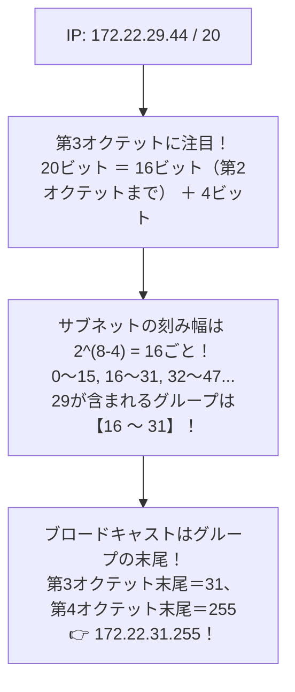

# ブロードキャストアドレス計算（/20）：ホスト部を全部「1」にするパズル！

> **想定読者**: /20のような中途半端なサブネットマスクの計算でパニックになる文系受験者
> **省いたもの**: ワイルドカードマスクを使ったCiscoルータのACL設定構文
> **所要時間**: 6〜8分
> **対象過去問**: 応用情報技術者 平成26年春期 問33

---

## 【対象過去問】平成26年春期 問33

**【問題】**
IPv4アドレス 172.22.29.44/20 のホストが存在するネットワークのブロードキャストアドレスはどれか。

- **ア**: 172.22.29.255
- **イ**: 172.22.30.255
- **ウ**: 172.22.31.255
- **エ**: 172.22.32.255

▶ 正解を表示する

**正解: ウ（172.22.31.255）**

---

## 0. 一枚で：『172.22.29.44/20 のブロードキャストは 172.22.31.255！』

### 🧠 脳に刻む合言葉：
> **『 「刻み幅パズル」で解く！/20は16刻み！29がいるグループは16〜31だから末尾は31.255！ 』**

---

## 1. なぜそうなるのか？（日常のたとえ話：16部屋区切りのアパート。29号室がある棟の最後の部屋（全館放送）は31号室！）

`/20` のブロードキャストアドレスは、2進数の筆算をしなくても暗算で解けます！

IPアドレスは8ビット×4つ（合計32ビット）です。
- 第1オクテット: 8ビット
- 第2オクテット: 8ビット（ここまでで16ビット）
- 第3オクテット: ここに残り「4ビット」が入る！（16 + 4 = 20）

第3オクテットの8ビットのうち、上位4ビットがネットワーク部、下位4ビットがホスト部です。
下位4ビットの重みは `2の4乗 ＝ 16` です。つまり、**第3オクテットは「16刻み」でグループ分けされています！**

- グループ1: 0 〜 15
- グループ2: **16 〜 31**  ← 問題の「29」はここにいる！
- グループ3: 32 〜 47

ブロードキャストアドレスとは「そのグループの最後の番号（ホスト部全部1）」のことです。
グループ2の最後は、第3オクテットが `31`、第4オクテットが `255` です。
したがって、**`172.22.31.255`** になります！

---

## 2. 選択肢のひっかけポイント ＆ 判定理由

- **ア: 172.22.29.255** → /24（256個刻み）と勘違いした引っかけです（×）。
- **イ: 172.22.30.255** → 末尾の255だけ見て中途半端な数字を選ばせる罠です（×）。
- **ウ: 172.22.31.255 【正解！】** → 16〜31のグループの最大値（ホスト部全ビット1）です（◯）。
- **エ: 172.22.32.255** → 次のグループの先頭（32）を跨いでしまっています（×）。

---

## 3. 午後試験 記述対策チェックリスト（※該当する場合）

- [ ] **Q. IPv4において、サブネット内のすべての端末にパケットを一斉送信するためのブロードキャストアドレスのビット構成上の特徴は何か？**  
  → **「ホスト部のビットがすべて1に設定されている。」**

---

## 🎯 次の2分アクション（定着チェック）

- [ ] **画面の一番上に戻り、正解を隠した状態で正解肢「ウ」を確信を持って選べるか試してみよう！**
