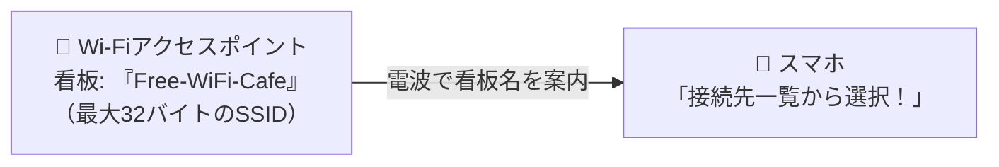

# SSID：Wi-Fiの「最大32文字の看板」！アクセスポイントの識別名

> **想定読者**: SSIDとMACアドレス（48ビット）の桁数・役割をごちゃ混ぜにしている文系受験者
> **省いたもの**: ESSIDとBSSIDの構造的違いやビーコンフレームのフォーマット
> **所要時間**: 6〜8分
> **対象過去問**: 応用情報技術者 平成29年秋期 問31

---

## 【対象過去問】平成29年秋期 問31

**【問題】**
無線LANで用いられるSSIDの説明として，適切なものはどれか。

- **ア**: 48ビットのネットワーク識別子であり，アクセスポイントのMACアドレスと一致する。
- **イ**: 48ビットのホスト識別子であり，有線LANのMACアドレスと同様の役割をもつ。
- **ウ**: 最大32オクテットのネットワーク識別子であり，接続するアクセスポイントの選択に用いる。
- **エ**: 最大32オクテットのホスト識別子であり，ネットワーク内で一意である。

▶ 正解を表示する

**正解: ウ（最大32オクテットのネットワーク識別子であり，接続するアクセスポイントの選択に用いる。）**

---

## 0. 一枚で：『最大32オクテット（文字）のネットワーク識別子！』

### 🧠 脳に刻む合言葉：
> **『 SSIDは「最大32文字のネットワーク識別名」！48ビットはMACアドレス！ 』**

---

## 1. なぜそうなるのか？（日常のたとえ話：カフェのWi-Fi一覧に出る「店舗の名前（看板）」。好きな看板を選んでタップして繋ぐ！）

カフェやホテルでスマホのWi-Fi設定を開いたときに出てくる「Starbucks_Wi-Fi」や「Hotel-Guest-5G」などの名前、これが **SSID（Service Set Identifier）** です！

- **長さ**: 最長で **32オクテット（32バイト＝半角英数32文字）** まで名前を付けられます。
- **役割**: どのアクセスポイント（ネットワーク）に接続するかを選ぶための「ネットワーク識別子」です。

48ビット（6バイト）というのはハードウェア固有の「MACアドレス」の長さなので、選択肢の「48ビット」は即座に除外できます！

---

## 2. 選択肢のひっかけポイント ＆ 判定理由

- **ア: 48ビットのネットワーク識別子…** → 48ビットはMACアドレス（BSSID）です（×）。
- **イ: 48ビットのホスト識別子…** → SSIDはホスト識別子ではなくネットワーク識別子です（×）。
- **ウ: 最大32オクテットのネットワーク識別子… 【正解！】** → 最大32文字のアクセスポイント選択用識別子です（◯）。
- **エ: 最大32オクテットのホスト識別子…** → ホスト（端末）の識別子ではありません（×）。

---

## 3. 午後試験 記述対策チェックリスト（※該当する場合）

- [ ] **Q. 無線LANにおいて、混信や不正接続を防ぐためにアクセスポイントが自身のSSIDを周囲に通知しないようにする機能を何と呼ぶか？**  
  → **「SSIDステルス（ステルスモード）。」**

---

## 🎯 次の2分アクション（定着チェック）

- [ ] **画面の一番上に戻り、正解を隠した状態で正解肢「ウ」を確信を持って選べるか試してみよう！**
