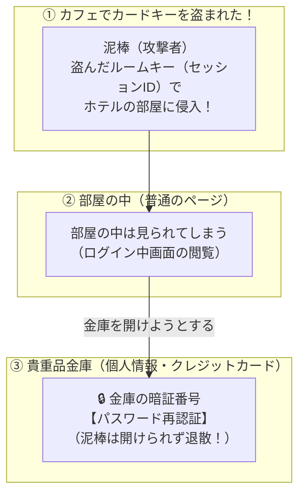

# セッション乗っ取り対策：Amazonの購入直前でわかる「再認証の秘密」

> **想定読者**: 「セッション乗っ取り」「Cookie」「通信暗号化」などの用語が並ぶと、どれが何の対策なのか混乱してしまう文系受験者  
> **省いたもの**: CookieのSecure属性/HttpOnly属性の技術仕様、セッション固定化攻撃の詳細  
> **所要時間**: 6分  
> **対象過去問**: 応用情報技術者 平成28年春期 午前問41  

---

## 0. 一枚で：Amazonでよく見る「あの画面」で一発暗記！

Amazonやネット銀行を使っているとき、**すでにログインしているのに「カード番号の変更」や「送金」を押すと、もう一度パスワードを聞かれますよね？**

```
┌──────────────────────────────────────────────┐
│ 【重要操作の直前】                           │
│  セキュリティ保護のため、パスワードを        │
│  もう一度入力してください。                  │
│  パスワード: [ ********** ]  [ 認証する ]    │
└──────────────────────────────────────────────┘
```

これがまさに **「重要情報を表示・変更する直前の再認証（パスワード入力）」** です！

| 疑問 | 答え | なぜか？（理由） |
| :--- | :--- | :--- |
| **セッションを乗っ取られたらどうなる？** | 攻撃者は「ログイン中のあなた」になりすましてサイトを閲覧できる | 入館バッジ（セッションID）を盗まれた状態だから |
| **通信暗号化（HTTPS）で防げないの？** | **防げない！**（盗まれた後だから） | 暗号化は「通信経路の盗聴」を防ぐもので、すでに盗まれた鍵を使われるのは防げない |
| **最後の砦となる対策は？** | **「重要情報の直前でパスワードを再入力させる（エが正解）」** | 鍵（セッションID）を持っていても、**本物のパスワードを知らなければ金庫は開かない** から！ |

---

## 1. ホテルのカードキーで理解する「二重の防犯」

セッション管理は、**「ホテルの部屋と貴重品金庫」** に例えると一発で納得できます。



1. **セッションID（カードキー）**:  
   ログイン時に渡される「入館バッジ」。これをCookieなどに保存しておくことで、毎回パスワードを打たずにページ移動できる。
2. **乗っ取り（カードキー紛失）**:  
   もし悪意ある第三者にこのカードキーをコピーされたら、部屋（ログイン状態）には入られてしまいます。
3. **再認証（金庫の暗証番号）**:  
   しかし、「住所を見る」「カード番号を変える」という重要アクションの直前で **「もう一回パスワード（暗証番号）を入れて！」** と要求すれば、泥棒は手も足も出ません！

---

## 2. 選択肢のひっかけポイント

平成28年春期 問41の選択肢は、文系が引っかかりやすい罠だらけです：

- **ア: 通信を暗号化する**:  
  $\rightarrow$ 通信の盗聴は防げますが、**「すでに乗っ取られた後」の攻撃には全く効果がありません**！
- **イ・ウ: セッションIDをCookieやURLに入れる**:  
  $\rightarrow$ むしろURLにセッションIDを入れると、URL流出で乗っ取られやすくなり逆効果（大悪手）です！
- **エ: パスワードによる利用者認証を行う（正解！）**:  
  $\rightarrow$ たとえセッションIDが盗まれても、最後の金庫を開けさせないための決定打！

---

## 3. 午後試験 記述対策チェックリスト

- [ ] **Q. セッションハイジャックされた場合でも個人情報流出を防ぐWebアプリ側の対策は？**  
  → **「個人情報の表示や変更などの重要処理の直前に、パスワードの再入力を要求する。」**（39字）

---

## 4. 実際の過去問で腕試し

### 【午前過去問】平成28年春期 午前問41
**【問題】**  
Webアプリケーションのセッションが攻撃者に乗っ取られ，攻撃者が乗っ取ったセッションを利用してアクセスした場合でも，個人情報の漏えいなどの被害が拡大しないようにするために，Webアプリケーションが重要な情報をWebブラウザに送信する直前に行う対策として，最も適切なものはどれか。

- **ア**: Webブラウザとの間の通信を暗号化する。
- **イ**: 発行済セッションIDをCookieに格納する。
- **ウ**: 発行済セッションIDをURLに設定する。
- **エ**: パスワードによる利用者認証を行う。

<details>
<summary>正解とスピード解法を表示</summary>

**正解: エ**

**文系目線でのスピード解法:**
- 問題文の前提：**「すでにセッションが乗っ取られた場合でも！」**
- 暗号化（ア）は「乗っ取られる前」の対策なので手遅れ。
- 泥棒が部屋に入ってきても最後の金庫を開けさせない方法は、**「エ: もう一度パスワードを入れさせる（再認証）」** だけです！
</details>
