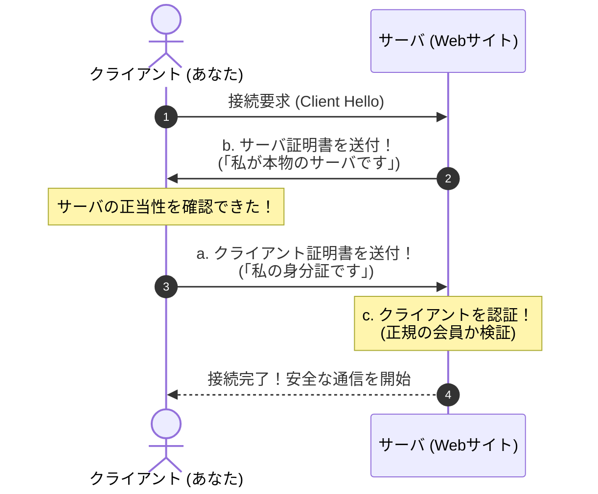

# TLSクライアント認証：高級クラブの名刺交換で覚える「証明書の送付順序」

> **想定読者**: TLSハンドシェイクやクライアント認証で、「どっちが先に証明書を出すんだっけ？」と順番がこんがらがってしまう文系受験者  
> **省いたもの**: 暗号スイートの選定バイト列、Pre-Master Secretの暗号化計算  
> **所要時間**: 6分  
> **対象過去問**: 応用情報技術者 令和3年春期 午前問45  

---

## 【対象過去問】令和3年春期 午前問45

**【問題】**  
TLSのクライアント認証における次の処理a～cについて，適切な順序はどれか。

- **a**: クライアントが，サーバにクライアント証明書を送付する。
- **b**: サーバが，クライアントにサーバ証明書を送付する。
- **c**: サーバが，クライアントを認証する。

- **ア**: a → b → c
- **イ**: a → c → b
- **ウ**: b → a → c
- **エ**: c → a → b

<details>
<summary>▶ 正解を表示する</summary>

**正解: ウ（b → a → c）**

</details>

---

## 0. 一枚で：名刺交換のマナーで一発暗記！

TLSのやり取りは、**「高級会員制クラブの入店」** と全く同じです。

```
【ステップ1：お店側が先に名刺を出す】（b）
  店「いらっしゃいませ。私が支配人の〇〇です（サーバ証明書）」
    │
    ▼
【ステップ2：客が会員証を差し出す】（a）
  客「はい、私の会員カードです（クライアント証明書）」
    │
    ▼
【ステップ3：お店が会員名簿と照合する】（c）
  店「確かに当店のお客様ですね。どうぞお入りください！（認証）」
```

👉 だから順番は絶対に **「b（店から） $\rightarrow$ a（客から） $\rightarrow$ c（店が確認）」** になります！

---

## 1. なぜ「サーバ（お店）」が先なの？（セキュリティの鉄則）

文系の方が疑問に思うのが、**「なんで客が先じゃなくて、お店（サーバ）が先に名刺を出すの？」** という点です。

理由は簡単です：  
**「偽物の詐欺サイトかもしれない相手に、自分の大事な個人情報（クライアント証明書）を先に出すわけにはいかないから！」**

1. まず相手のWebサイトが本物であることを確認する（**サーバ証明書の検証: b**）。
2. 「よし、本物の安全なサーバだな」と確認できてから初めて、自分の証明書を送る（**クライアント証明書の送付: a**）。
3. 送られてきた証明書をもとに、サーバが正規クライアントか判定する（**クライアントの認証: c**）。

---

## 2. Mermaidで見る処理シーケンス



---

## 3. 午後試験 記述対策チェックリスト

- [ ] **Q. TLSクライアント認証を導入するセキュリティ上の目的は？**  
  → **「正当なクライアント証明書を持つ端末のみにアクセスを制限し、不正端末の侵入を防ぐため。」**（44字）
- [ ] **Q. 通常のSSL/TLS通信とクライアント認証の違いは？**  
  → **「通常の通信はサーバのみを認証するが、クライアント認証では端末とサーバの双方向で認証を行う。」**（47字）
