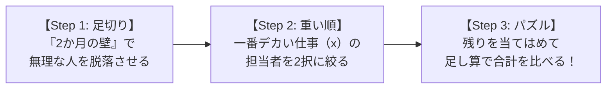

# プロジェクト要員割り当てパズル：数学10点でも解ける「最小コストの解き方」

> **想定読者**: 表がたくさん並んだ文章題を見ると「どこから計算すればいいの？」とパニックになってしまう文系受験者  
> **省いたもの**: 線形計画法などの難しい数学理論、工数管理の専門理論  
> **所要時間**: 8分  
> **対象過去問**: 応用情報技術者 令和元年秋期 午前問54（※過去問道場で間違えた計算問題）  

---

## 【対象過去問】令和元年秋期 午前問54

**【問題】**  
プログラムx，y，zの開発を2か月以内に完了したい。外部から調達可能な要員はA，B，Cの3名であり，開発生産性と単価が異なる。このプログラム群を開発する最小のコストは，何千円か。ここで，各プログラムの開発は，それぞれ1名が担当し，要員は開発生産性どおりの効率で開発できるものとする。また，それぞれの要員は，担当したプログラムの開発が完了する時点までの契約とする。

**〔プログラムの規模〕**
- x: 4 キロステップ
- y: 2 キロステップ
- z: 2 キロステップ

**〔要員の開発生産性と単価〕**
- A: 生産性 2 キロステップ/月、単価 1,000 千円/月
- B: 生産性 2 キロステップ/月、単価 900 千円/月
- C: 生産性 1 キロステップ/月、単価 400 千円/月

- **ア**: 3,200
- **イ**: 3,400
- **ウ**: 3,600
- **エ**: 3,700

▶ 正解を表示する

**正解: ウ（3,600千円）**

---

## 0. 一枚で：解く手順は必ずこの「3ステップ」！

この手の「一番安くなる組み合わせを探す問題」は、**難しい計算式は一切不要** です！小学生の算数パズルとして解きます。

### 合言葉：『 期限で絞って・重い順に・パズルする！ 』
1. **期限で絞る**: 「2か月以内に終わらない人」をまず除外する（足切り）！
2. **重い順に決める**: 一番規模の大きい仕事（プログラムx）を誰にやらせるか決める！
3. **パズルして足す**: 残った仕事を当てはめて、掛け算と足し算で比べる！

---

## 1. 問題の表を日本語に翻訳する

問題文には2つの表があります。

### 【表1】プログラムの仕事量
- **x**: 4 キロステップ（一番デカくて重い仕事！）
- **y**: 2 キロステップ
- **z**: 2 キロステップ

### 【表2】3人の能力と月給
- **Aさん**: 毎月 2 キロ進む（月給 100万円）
- **Bさん**: 毎月 2 キロ進む（月給 90万円 $\rightarrow$ **Aさんと同じ速さで10万円安い！**）
- **Cさん**: 毎月 1 キロ進む（月給 40万円 $\rightarrow$ **遅いけど激安！**）

---

## 2. ステップ・バイ・ステップでパズルを解く！

### Step 1：期限（2か月）の足切り
条件は **「2か月以内に終わらせること」** です。

一番重い **プログラムx（4キロ）** を、一番遅い **Cさん（月1キロ）** が担当したらどうなるでしょうか？
$$4 \text{キロ} \div 1 \text{キロ/月} = \mathbf{4か月かかる！}$$
👉 **期限オーバーでクビ！Cさんは絶対にxを担当できません！**  
これだけで、**「x を担当できるのは Aさん か Bさん の2人だけ」** に絞られます！

---

### Step 2：パターンを2つに分けて計算する

#### 【パターン1】安いBさんが重い「x」を担当する場合（大本命！）
- **x (4キロ) $\rightarrow$ Bさん**:
  - かかる月数: $4 \div 2 = \mathbf{2か月}$（期限ぴったり！）
  - 費用: $90万円 \times 2か月 = \mathbf{1,800千円}$
- 残りは **Aさん** と **Cさん** で、仕事は **y (2キロ)** と **z (2キロ)** です：
  - 遅い **Cさん** に y をやらせる:  
    $2 \div 1 = \mathbf{2か月}$（2か月以内OK！） $\rightarrow$ $40万円 \times 2か月 = \mathbf{800千円}$
  - 早い **Aさん** に z をやらせる:  
    $2 \div 2 = \mathbf{1か月}$（1か月で完了！） $\rightarrow$ $100万円 \times 1か月 = \mathbf{1,000千円}$

👉 **合計コスト（パターン1）**:
$$1,800 + 800 + 1,000 = \mathbf{3,600千円}$$

---

#### 【パターン2】高いAさんが重い「x」を担当する場合（念のための確認）
- **x (4キロ) $\rightarrow$ Aさん**:
  - かかる月数: $4 \div 2 = \mathbf{2か月}$
  - 費用: $100万円 \times 2か月 = \mathbf{2,000千円}$
- 残りは **Bさん** と **Cさん**：
  - 遅い **Cさん** に y: $2 \div 1 = 2か月 \rightarrow 40 \times 2 = \mathbf{800千円}$
  - 早い **Bさん** に z: $2 \div 2 = 1か月 \rightarrow 90 \times 1 = \mathbf{900千円}$

👉 **合計コスト（パターン2）**:
$$2,000 + 800 + 900 = \mathbf{3,700千円}$$

---

### Step 3：比べる
- パターン1: **3,600千円（ウ：正解！）**
- パターン2: 3,700千円

安くて勝つのは **3,600千円（ウ）** です！
