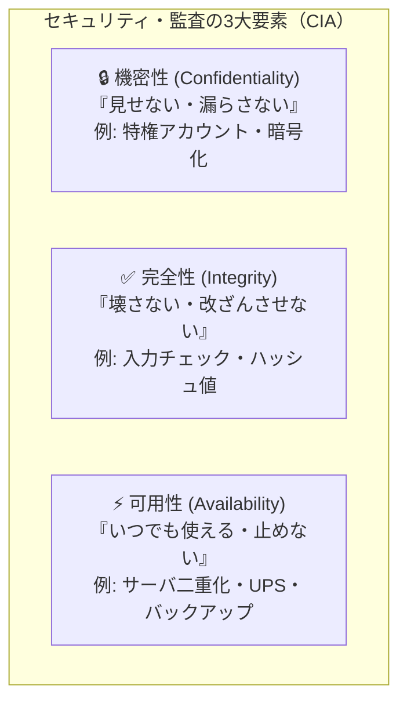

# システム監査の「可用性」：金庫のCIA3兄弟！「いつでも使える」を守る二重化

> **想定読者**: システム監査の「可用性」「完全性」「機密性」の用語が問題文に出てくると区別がつかなくなる文系受験者  
> **省いたもの**: システム監査基準（経済産業省）の詳細条文番号、真正性・信頼性の細分化理論  
> **所要時間**: 6分  
> **対象過去問**: 応用情報技術者 令和3年春期 午前問59  

---

## 【対象過去問】令和3年春期 午前問59

**【問題】**  
マスタファイル管理に関するシステム監査項目のうち，可用性に該当するものはどれか。

- **ア**: マスタファイルが置かれているサーバを二重化し，耐障害性の向上を図っていること
- **イ**: マスタファイルのデータを複数件まとめて検索・加工するための機能が，システムに盛り込まれていること
- **ウ**: マスタファイルのメンテナンスは，特権アカウントを付与された者だけに許されていること
- **エ**: マスタファイルへのデータ入力チェック機能が，システムに盛り込まれていること

<details>
<summary>▶ 正解を表示する</summary>

**正解: ア（マスタファイルが置かれているサーバを二重化し，耐障害性の向上を図っていること）**

</details>

---

## 0. 一枚で：セキュリティ3大要件「CIA」の見分け方！



### 合言葉：『 可用性は「アベイラブル（いつでも利用可能）」！ 』
- **可用性（Availability）** ＝ 使える（Available）状態を維持すること！
- サーバ故障や停電があってもシステムを止めないための **「二重化」「冗長化」「バックアップ」** が可用性の典型例です。

---

## 1. なぜそうなるのか？（日常のたとえ話：オフィスの超重要金庫）

社内の「重要マスタファイル（顧客名簿・価格表など）」を、会社の **大事な金庫** に例えてみましょう。

監査員がやってきて、「この金庫はちゃんと管理されていますか？」とチェックするとき、3つの視点（CIA）で見ます。

```
1. 🔒【機密性（C）のチェック】
   「暗証番号を知っている人（特権アカウント）だけが開けられますか？」
   👉 見せてはいけない部外者に見られないこと！

2. ✅【完全性（I）のチェック】
   「中身の書類に落書きされたり、改ざんされたりしていませんか？」
   👉 入力チェック機能などで、正しい正確な状態が保たれていること！

3. ⚡【可用性（A）のチェック】
   「もし鍵が壊れても、書類を取り出せなくなって業務が止まりませんか？」
   👉 予備の金庫（サーバ二重化）を用意して、いつでも使える状態にしていること！
```

今回の問題で聞かれているのは **「可用性（A）」** です。
- 「サーバを二重化して、片方が壊れてもシステムが止まらないようにしている（いつでも利用可能）」という **ア** が完璧に合致します！

---

## 2. 選択肢のひっかけ見分けポイント

4つの選択肢が、見事に「システム監査の別カテゴリ」を代表しています。

- **ア: サーバを二重化し，耐障害性の向上を図っていること 【正解！】**  
  → **「可用性（Availability）」** です。システム障害時でも止まらずに使い続けられる状態を確保しています（◯）。
- **イ: 複数件まとめて検索・加工するための機能が盛り込まれていること**  
  → これはセキュリティの3要件ではなく、単なるシステムの **「利便性・効率性（ユーザビリティ）」** です。監査項目としては可用性には該当しません（×）。
- **ウ: メンテナンスは特権アカウントを付与された者だけに許されていること**  
  → **「機密性（Confidentiality）」** です。許可された正当な権限者だけが情報にアクセスできるように制限しています（×）。
- **エ: データ入力チェック機能が盛り込まれていること**  
  → **「完全性（Integrity）」** です。フォーマットエラーや入力ミスなどのゴミデータが混入するのを防ぎ、データの正確性・整合性を保ちます（×）。

---

## 3. 午後試験 記述対策チェックリスト

- [ ] **Q. 可用性を脅かす脅威の代表例と、その対策は？**  
  → **「機器故障や災害によるシステム停止が脅威であり、機器の冗長化や定期バックアップが対策となる。」**（49字）
- [ ] **Q. システム監査において「コントロール（統制）」を評価する2つの観点は？**  
  → **「コントロールが適切に設計されているか（整備状況）と、実際に運用されているか（運用状況）。」**（47字）

---

## 🎯 次の2分アクション（定着チェック）

- [ ] **画面の一番上に戻り、「可用性 ＝ いつでも使える ＝ サーバ二重化」という連想で選択肢アを即答できるか確認しよう！**
