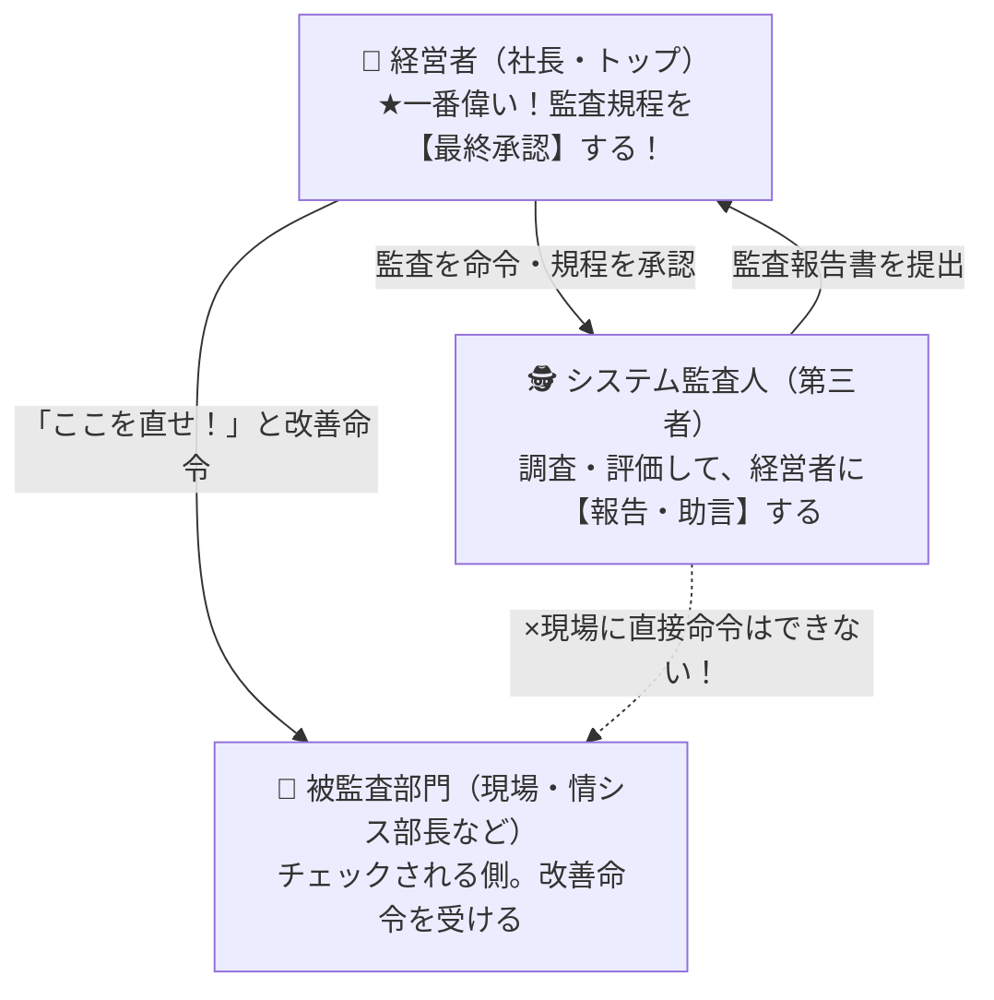

# システム監査の人間関係：なぜ規程の承認者は「社長（経営者）」一択なのか？

> **想定読者**: システム監査の問題で「情報システム部長」「監査人」「経営者」の誰が何を承認・命令するのか役割分担がごちゃごちゃになってしまう文系受験者  
> **省いたもの**: システム監査基準の条文番号の暗記、監査証拠の収集技法の詳細  
> **所要時間**: 6分  
> **対象過去問**: 応用情報技術者 平成30年春期 午前問59（※過去問道場で2回間違えた重要問題）  

---

## 【対象過去問】平成30年春期 午前問59

**【問題】**  
企業において整備したシステム監査規程の最終的な承認者として、最も適切な者は誰か。

- **ア**: 監査対象システムの利用部門の長
- **イ**: 経営者
- **ウ**: 情報システム部門の長
- **エ**: 被監査部門の長

▶ 正解を表示する

**正解: イ（経営者）**

---

## 0. 一枚で：監査の「三角関係」で一発暗記！

システム監査は、**「経営者・監査人・現場」の3者の力関係** さえ掴めば絶対に間違えません。

### なぜ規程の承認は「経営者（社長）」しかダメなのか？
もし現場の「情報システム部長」や「利用部門の長」が監査ルールを承認できたらどうなるでしょうか？  
**「自分の都合の悪い不正がバレないような甘いルール」** を勝手に作ってしまいますよね（**自己監査の禁止**）。

監査人に絶大な調査権限を与え、全社にルールを守らせる力を持っているのは、会社で一番偉い **「経営者（社長）」** だけです！

---

## 1. 試験で絶対に落とせない「監査の3大鉄則」

システム監査では、以下の3つの役割分担が繰り返し問われます。

| 疑問・アクション | 正しい人 | なぜか？（理由） |
| :--- | :--- | :--- |
| **監査規程の最終承認者は？** | **経営者（社長）★正解: イ** | 全社に監査を受けさせる権限を持つのはトップだけだから |
| **現場に改善命令を出すのは？** | **経営者（社長）** | **監査人には現場を直接指導・命令する権限はない** から！（報告書を経営者に出すだけ） |
| **監査人になれるのは？** | **現場から独立した人** | 開発や運用に携わった人が自分で自分を監査してはならないから（外観的・精神的独立性） |

※選択肢のア（利用部門の長）、ウ（情報システム部門の長）、エ（被監査部門の長）はすべて「チェックされる現場側」なので不適当です。

---

## 2. 午後試験 記述対策チェックリスト

- [ ] **Q. システム監査人が被監査部門に対して直接改善指示を行わない理由は？**  
  → **「監査人は助言・勧告を行う権限にとどまり、業務の改善命令権限は経営者にあるため。」**（40字）
- [ ] **Q. システム監査における外観的独立性とは何か？**  
  → **「監査対象の部門や業務との間に、利害関係や過去の担当経験などの偏りがない状態。」**（40字）
