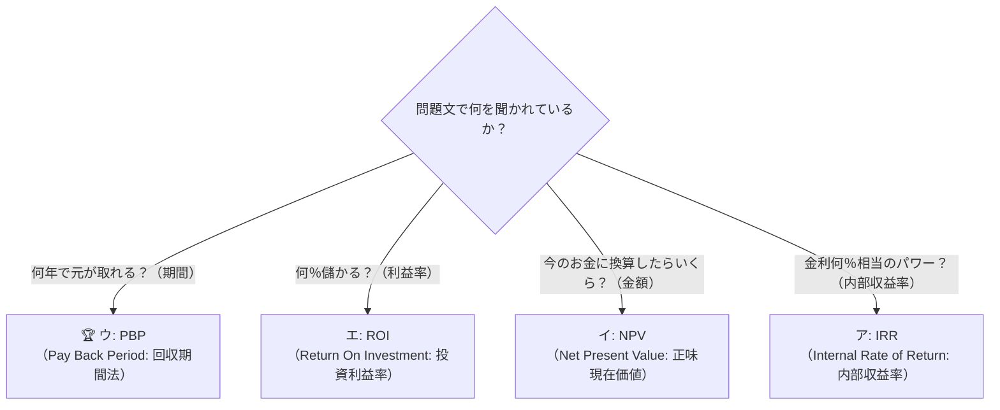

# PBP（回収期間法）：100万円のカフェマシン代、何年で「元が取れる」？

> **想定読者**: IRR、NPV、ROI、PBPなどアルファベット3文字の財務・投資用語に拒絶反応が出る文系受験者  
> **省いたもの**: DCF法（割引キャッシュフロー）の複利現価係数テーブル、IRRの補間法計算式  
> **所要時間**: 6分  
> **対象過去問**: 応用情報技術者 令和5年秋期 午前問64  

---

## 【対象過去問】令和5年秋期 午前問64

**【問題】**  
IT投資効果の評価方法において，キャッシュフローベースで初年度の投資によるキャッシュアウトを何年後に回収できるかという指標はどれか。

- **ア**: IRR (Internal Rate of Return)
- **イ**: NPV (Net Present Value)
- **ウ**: PBP (Pay Back Period)
- **エ**: ROI (Return On Investment)

<details>
<summary>▶ 正解を表示する</summary>

**正解: ウ（PBP: Pay Back Period）**

</details>

---

## 0. 一枚で：投資評価アルファベット4兄弟の見分け方！



### 合言葉：『 ペイバック（PBP）は元を取るピリオド（年数）！ 』
- **Pay Back** ＝ 元を取る（払い戻す）
- **Period** ＝ 期間（何年後？）
- 問題文に **「何年後に回収できるか」** とあれば、Period（期間）の **PBP一択** です！

---

## 1. なぜそうなるのか？（日常のたとえ話：カフェの店長）

あなたが個人カフェをオープンし、**「初期投資 100万円」** で全自動エスプレッソマシンを買うか悩んでいるとします。

```
【初期投資（キャッシュアウト）】
  💸 最初に出ていくお金: 100万円

【毎年入ってくる効果（キャッシュイン）】
  ☕ 1年目: ＋40万円の利益
  ☕ 2年目: ＋40万円の利益（累計80万円…まだ足りない）
  ☕ 3年目: ＋40万円の利益（累計120万円…元を取った！）
```

このとき、店長が真っ先に気にするのは：
> **「で、結局『何年で元が取れる』わけ？」**

この「元を取るまでの年数（期間）」を計算するのが **PBP（回収期間法）** です。
- 今回の例なら、100万円 ÷ 40万円 ＝ **2.5年（2年半で回収！）**。
- 銀行融資を受ける際や、資金繰りに余裕がない中小企業では「とにかく早く現金を回収できるか」が最重要指標になります。

---

## 2. 選択肢のひっかけポイント（3文字英語トラップ）

試験では「PBP」「ROI」「NPV」「IRR」が必ずセットで登場し、文系受験者を混乱させます。末尾の英単語に注目すると1秒で罠を見破れます。

- **ア: IRR (Internal Rate of Return: 内部収益率)**  
  → **「率（Rate）」** です。投資から得られる将来キャッシュフローの現在価値と、初期投資額が等しくなる（NPV＝0になる）割引率。「何年後」という期間ではありません（×）。
- **イ: NPV (Net Present Value: 正味現在価値)**  
  → **「価値・金額（Value）」** です。将来入ってくるお金を「現在の価値」に割り引いて初期投資を引いた「差額の金額」。「何年後」ではなく「トータルでいくら儲かるか（プラスなら投資GO）」を判定します（×）。
- **ウ: PBP (Pay Back Period: 回収期間法) 【正解！】**  
  → **「期間（Period）」** です。「何年後に回収できるか」という問いに対して、唯一「年数・時間」を答える指標です（◯）。
- **エ: ROI (Return On Investment: 投資利益率)**  
  → **「投資（Investment）に対するリターン（利益）の割合」** です。「利益 ÷ 投資額 × 100 ＝ 〇％」というパーセント指標であり、「何年後」ではありません（×）。

---

## 3. 午後試験 記述対策チェックリスト

- [ ] **Q. PBP（回収期間法）の最大のメリットとデメリットは？**  
  → **「メリットは直感的に理解しやすく資金回収リスクを評価できる点、デメリットは回収後の利益や貨幣の時間価値を無視する点。」**（59字）
- [ ] **Q. NPV（正味現在価値法）で投資を実行すべき基準は？**  
  → **「NPVがゼロより大きい（プラスである）場合。」**（24字）

---

## 🎯 次の2分アクション（定着チェック）

- [ ] **画面の一番上に戻り、問題文の「何年後に回収できるか」というキーワードを見て、迷わず「ウ（PBP）」を選べるか試してみよう！**
