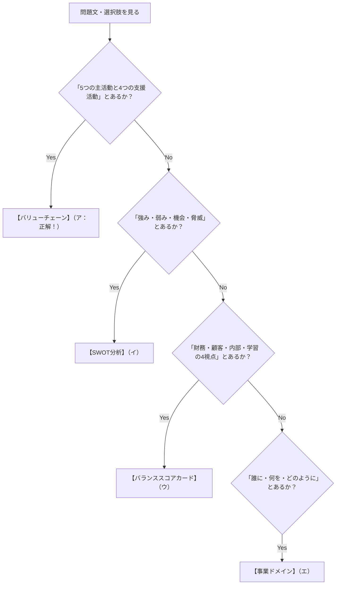

# バリューチェーンと経営フレームワーク：パン屋さんで覚える「4大スターの見分け方」

> **想定読者**: 「バリューチェーン」「SWOT」「バランススコアカード」などのカタカナ経営用語が選択肢に並ぶと、どれがどれだか区別がつかなくなる文系受験者  
> **省いたもの**: マイケル・ポーターの原著の詳細学説、複雑な戦略マップの作成技法  
> **所要時間**: 7分  
> **対象過去問**: 応用情報技術者 令和3年秋期 午前問67（※過去問道場で2回間違えた重要問題）  

---

## 【対象過去問】令和3年秋期 午前問67

**【問題】**  
バリューチェーンの説明はどれか。

- **ア**: 企業活動を，五つの主活動と四つの支援活動に区分し，企業の競争優位の源泉を分析するフレームワーク
- **イ**: 企業の内部環境と外部環境を分析し，自社の強みと弱み，自社を取り巻く機会と脅威を整理し明確にする手法
- **ウ**: 財務，顧客，内部ビジネスプロセス，学習と成長の四つの視点から企業を分析し，戦略マップを策定するフレームワーク
- **エ**: 商品やサービスを，誰に，何を，どのように提供するかを分析し，事業領域を明確にする手法

<details>
<summary>▶ 正解を表示する</summary>

**正解: ア（企業活動を，五つの主活動と四つの支援活動に区分し，企業の競争優位の源泉を分析するフレームワーク）**

</details>

---

## 0. 一枚で：試験に出る「4大フレームワーク」の決定打！

令和3年秋期 問67の選択肢に出ている4つの用語は、すべて試験の常連です。このキーワードで一瞬で見分けられます。

| フレームワーク | 日常のたとえ（パン屋） | 試験で出る決定打キーワード |
| :--- | :--- | :--- |
| **バリューチェーン (価値連鎖)** ★ | **「小麦の仕入れからパンが焼けてお客さんの胃袋に入るまでのバトンリレー」** | **「5つの主活動と4つの支援活動」「競争優位の源泉」** |
| **SWOT分析** | **「うちのパンは美味しい（強み）が、駅前に大手チェーンができた（脅威）」** | **「強み・弱み（内部）」＋「機会・脅威（外部）」** |
| **バランススコアカード (BSC)** | **「売上（財務）だけでなく、リピーター（顧客）や新レシピ開発（学習）も評価する」** | **「財務・顧客・業務プロセス・学習と成長の4つの視点」** |
| **事業ドメイン (Who/What/How)** | **「近所の主婦に（誰に）、無添加食パンを（何を）、対面販売で（どのように）届ける」** | **「誰に・何を・どのように提供するか」** |

---

## 1. バリューチェーンってなに？（矢印の形のバトンリレー）

バリューチェーン（Value Chain: 価値連鎖）は、経営学の大家マイケル・ポーターが考えた枠組みです。  
企業活動を **「主活動（メインの現場）」** と **「支援活動（バックオフィス）」** の2階建てで整理します。

```
┌────────────────────────────────────────────────────────┐
│ 【支援活動】（下支えする部署）                         │
│  ・全般管理（経理・総務）  ・人事・労務管理（採用・給料）│
│  ・技術開発（新商品開発）  ・調達活動（設備や原料の契約）│
├───────┬───────┬───────┬───────┬────────────────┤
│購買物流│製　造 │出荷物流│販売・ │アフターサービス│ ＝ 利益
│(仕入れ)│(調理) │(配送) │マーケ │(クレーム対応)  │
└───────┴───────┴───────┴───────┴────────────────┘
            【5つの主活動】（パン屋さんの現場）
```

- **主活動（5つ）**: 小麦粉を仕入れて $\rightarrow$ パンを焼いて $\rightarrow$ 店に並べて $\rightarrow$ 売って $\rightarrow$ ポイントカードを押す。
- **支援活動（4つ）**: その裏で、総務・人事・開発・調達が現場をバックアップする。

「うちの会社は、このリレーのどこで他社より安く作れているか？どこで高い価値を出せているか？」を分析することを **バリューチェーン分析** と呼びます。

---

## 2. 4つの選択肢を一瞬で見分ける判定マップ



- **ア**: 5つの主活動と4つの支援活動 $\rightarrow$ **バリューチェーン ★正解！**
- **イ**: 強み・弱み・機会・脅威 $\rightarrow$ **SWOT分析**
- **ウ**: 財務・顧客・内部ビジネスプロセス・学習と成長の4視点 $\rightarrow$ **バランススコアカード (BSC)**
- **エ**: 誰に・何を・どのように $\rightarrow$ **事業ドメイン**

---

## 3. 午後試験 記述対策チェックリスト

- [ ] **Q. バリューチェーン分析を行う目的は何か？**  
  → **「事業活動を一連の価値連鎖として捉え、どの活動で競合に対する競争優位が生み出されているかを特定するため。」**（51字）
- [ ] **Q. バランススコアカード（BSC）の4つの視点は何か？**  
  → **「財務の視点、顧客の視点、内部ビジネスプロセスの視点、学習と成長の視点の4つ。」**（40字）
