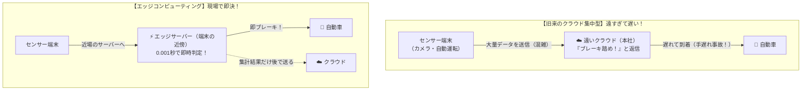

# エッジコンピューティング：現場の店長が即決！「本社（クラウド）待ち」をなくす仕組み

> **想定読者**: 「エッジコンピューティング」「クラウド」「IoT」の通信関係がごちゃ混ぜになってしまう文系受験者  
> **省いたもの**: フォグコンピューティングとの境界線論争、コンテナ仮想化の詳細スペック  
> **所要時間**: 6分  
> **対象過去問**: 応用情報技術者 令和6年春期 午前問72  

---

## 【対象過去問】令和6年春期 午前問72

**【問題】**  
IoTの技術として注目されている，エッジコンピューティングの説明として，最も適切なものはどれか。

- **ア**: 演算処理のリソースをセンサー端末の近傍に置くことによって，アプリケーション処理の低遅延化や通信トラフィックの最適化を行う。
- **イ**: 人体に装着して脈拍センサーなどで人体の状態を計測して解析を行う。
- **ウ**: ネットワークを介して複数のコンピュータを結ぶことによって，全体として処理能力が高いコンピュータシステムを作る。
- **エ**: 周りの環境から微小なエネルギーを収穫して，電力に変換する。

▶ 正解を表示する

**正解: ア（演算処理のリソースをセンサー端末の近傍に置くことによって，アプリケーション処理の低遅延化や通信トラフィックの最適化を行う。）**

---

## 0. 一枚で：現場（エッジ）で即判断するフロー！

### 合言葉：『 エッジ（端っこ・現場）の近傍で、遅延ゼロ！ 』
- **Edge（端・現場）**: センサーや端末のすぐ近く（**近傍**）に計算用コンピュータを置く！
- **低遅延**: 遠くのアメリカや東京のクラウドまで往復する時間をゼロにする！
- **通信量の削減**: ゴミデータまで全部ネットに流さず、現場で間引いてから送る！

---

## 1. なぜ「エッジ（現場）」で計算させるの？（自動運転のたとえ）

自動運転車が「目の前に人が飛び出してきた！」瞬間をイメージしてください。

1. **クラウド型の場合**:  
   「カメラ映像をネットで本社クラウドに送る $\rightarrow$ クラウドのAIが解析 $\rightarrow$ 『止まれ！』と電波を送り返す」  
   $\rightarrow$ もし通信が混んでいて **1秒遅れたら轢いてしまいます！**
2. **エッジコンピューティングの場合**:  
   車のすぐ近く（車載コンピュータや近くの電柱）に頭脳（エッジ）を置いておき、**「0.001秒でその場で即ブレーキ判定」** を下します。

👉 だから **「端末の近傍にリソースを置き、低遅延化とトラフィック最適化を図る（ア）」** が正解になります！

---

## 2. 選択肢のひっかけ見分け判定

試験によく出る周辺の最新キーワードが綺麗に並んでいます：

- **ア: エッジコンピューティング（正解！）**:  
  $\rightarrow$ キーワードは **「端末の近傍」「低遅延化」「トラフィック最適化」**！
- **イ: ウェアラブル端末**:  
  $\rightarrow$ Apple Watchなどのスマートウォッチ（人体に装着して脈拍等を計測）。
- **ウ: グリッドコンピューティング / クラスタ**:  
  $\rightarrow$ 複数のPCを繋いで1台のスーパーマシンにする仕組み。
- **エ: エネルギーハーベスティング（環境発電）**:  
  $\rightarrow$ 振動や室内の光、熱などの微小な環境エネルギーから電気を作る技術。

---

## 3. 午後試験 記述対策チェックリスト

- [ ] **Q. クラウド集中型と比較した場合のエッジコンピューティングの利点を2つ挙げよ。**  
  → **「通信遅延が極めて短縮される点と、クラウドへの通信トラフィックを削減できる点。」**（41字）
