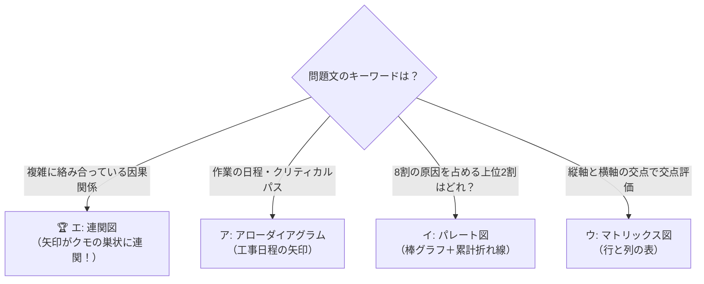

# 連関図：原因と結果がクモの巣のように絡み合う「大元の犯人」を暴く！

> **想定読者**: QC7つ道具と新QC7つ道具の図の名前が多すぎて、どれがどれだか混同してしまう文系受験者  
> **省いたもの**: 各種統計的有意差検定、系統図法との数学的マトリックス変換論  
> **所要時間**: 6分  
> **対象過去問**: 応用情報技術者 平成26年秋期 午前問75  

---

## 【対象過去問】平成26年秋期 午前問75

**【問題】**  
分析対象としている問題に数多くの要因が関係し，それらが相互に絡み合っているとき，原因と結果，目的と手段といった関係を追求していくことによって，因果関係を明らかにし，解決の糸口をつかむための図はどれか。

- **ア**: アローダイアグラム
- **イ**: パレート図
- **ウ**: マトリックス図
- **エ**: 連関図

<details>
<summary>▶ 正解を表示する</summary>

**正解: エ（連関図）**

</details>

---

## 0. 一枚で：新旧QC図形の見分けチャート！



### 合言葉：『 絡み合う因果の糸は「連関図」で解く！ 』
- **連関（れんかん）** ＝ 互いに連なり関係し合っていること。
- 問題文に **「相互に絡み合っている」「因果関係を明らかにし」** とあれば、100% **連関図** です！

---

## 1. なぜそうなるのか？（日常のたとえ話：なぜか最近太った問題）

「最近、なぜか急激に体重が5kg増えた…」という悩みをイメージしてください。

原因は1つでしょうか？

```
「残業が多い」 ──────→ 「ストレスが溜まる」 ───┐
      │                                         │
      ▼                                         ▼
「睡眠不足になる」 ───→ 「代謝が落ちる」 ───→ 「太る！」
      ▲                                         ▲
      │                                         │
「深夜にラーメン食べる」 ───────────────────────┘
```

このように、現実に起きるトラブルは **「原因と結果が複雑に絡み合ってループ（悪循環）」** しています。

このとき：
1. 「何が原因で、何が結果なのか」をカードに書き出す。
2. 要因どうしを **「矢印（原因 → 結果）」** で結んでいく。
3. **「矢印が一番多く出ていく根本原因（元凶）」** や、**「矢印が集まる核心問題」** を見つけ出す。

これを行うのが **連関図（れんかんず）** です！
- クモの巣のように絡まり合った複雑な糸を、矢印の向きで解きほぐすための最強ツールです。

---

## 2. 選択肢のひっかけ見分けポイント

頻出の「図の名前」4つ。作問者の出題パターンは決まっています。

- **ア: アローダイアグラム**  
  → **「作業日程・工程管理」** の図です。丸（イベント）と矢印（作業）で工事や開発のスケジュールを表し、「一番時間のかかるルート（クリティカルパス）」を計算するときに使います。「因果関係」ではありません（×）。
- **イ: パレート図**  
  → **「重点分析（ABC分析）」** の図です。不具合件数などを大きい順に並べた「棒グラフ」と、その累積比率を表す「折れ線グラフ」を組み合わせ、「全体の8割を占める重要な不具合はどれか」を見つけるときに使います（×）。
- **ウ: マトリックス図**  
  → **「行（縦軸）と列（横軸）」** の格子状の表です。例えば「顧客の要望（縦）」と「製品の機能（横）」を交差させ、その交差点に◎や◯をつけて関係の深さを整理します（×）。
- **エ: 連関図 【正解！】**  
  → **「複雑に絡み合った因果関係」** を論理的に矢印で結んで整理する図です（◯）。

---

## 3. 午後試験 記述対策チェックリスト

- [ ] **Q. 連関図において「根本原因（真因）」と判断される要素の特徴は？**  
  → **「他の要因へ向かう矢印（出ていく矢印）だけが多く、入ってくる矢印が少ない要素。」**（40字）
- [ ] **Q. QC7つ道具と新QC7つ道具の根本的な違いは？**  
  → **「旧QCは数値データの統計的分析が中心であり、新QCは言語・定性データの論理的整理が中心である点。」**（51字）

---

## 🎯 次の2分アクション（定着チェック）

- [ ] **画面の一番上に戻り、問題文の「相互に絡み合っている」「因果関係」というキーワードを見て、迷わずエ（連関図）を選べるか試してみよう！**
