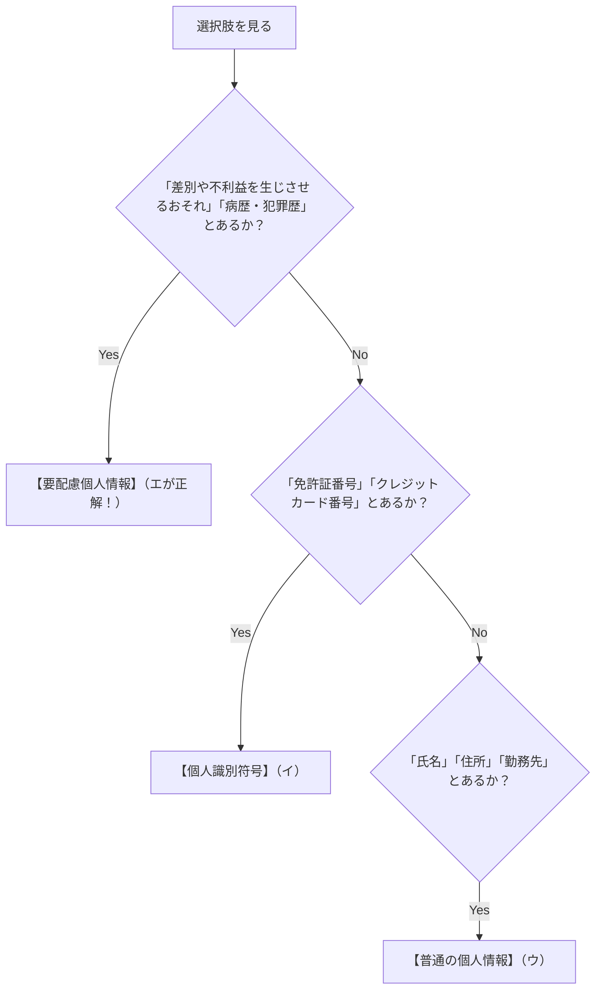

# 個人情報保護法：病歴・前科で覚える「要配慮個人情報」の境界線

> **想定読者**: 「要配慮個人情報」「個人識別符号」「普通の個人情報」の違いが曖昧で、法律問題で消去法に迷ってしまう文系受験者  
> **省いたもの**: GDPR（EU一般データ保護規則）との条文比較、細かいオプトアウト手続の例外  
> **所要時間**: 6分  
> **対象過去問**: 応用情報技術者 令和6年春期 午前問80  

---

## 0. 一枚で：個人情報の「デリケート度」3段階！

個人情報は、**「もし他人に知られたらどれくらいヤバいか？」** のレベルで3段階に分類されています。

```
┌────────────────────────────────────────────────────────┐
│ 【最高警戒】要配慮個人情報 ★（最頻出！）               │
│  ・病歴、前科、人種、信条（宗教）など                  │
│  👉【知られたら不当な差別・偏見につながる危険な情報】  │
├────────────────────────────────────────────────────────┤
│ 【厳重管理】個人識別符号                               │
│  ・マイナンバー、免許証番号、パスポート番号、指紋データ │
│  👉【その番号やデータ単体で特定の1人を特定できるもの】 │
├────────────────────────────────────────────────────────┤
│ 【一般情報】普通の個人情報                             │
│  ・氏名、生年月日、住所、電話番号、勤務先              │
└────────────────────────────────────────────────────────┘
```

---

## 1. なぜ「要配慮」という名前なの？（差別の防止）

「要配慮（配慮が必要）」という柔らかい言葉が使われていますが、法律の本当の趣旨は **「絶対に差別を生むな！」** です。

- もし企業の採用面接で「過去の病歴」や「信仰している宗教」が勝手に調べられて出回ったら、就職差別や結婚差別などの深刻な人権侵害が起きてしまいます。
- だから、**「不当な差別や偏見、不利益を生じさせるおそれがある情報」** を法律で特別扱いし、**取得するときは原則として本人の事前同意が必須** になっています！

---

## 2. 試験の選択肢を一瞬で見分ける判定マップ



- **ア のひっかけ**: 「本人が配慮を申告する」から要配慮個人情報になるわけではありません！法律で客観的に決まっています。

---

## 3. 午後試験 記述対策チェックリスト

- [ ] **Q. 要配慮個人情報とは何か？（定義を説明せよ）**  
  → **「本人の人種、信条、病歴、犯罪歴など、不当な差別や偏見が生じるおそれがある個人情報。」**（43字）
- [ ] **Q. 要配慮個人情報の取得における原則ルールは？**  
  → **「あらかじめ本人の同意を得ないで取得してはならない。」**（26字）

---

## 4. 実際の過去問で腕試し

### 【午前過去問】令和6年春期 午前問80
**【問題】**  
個人情報のうち，個人情報保護法における要配慮個人情報に該当するものはどれか。

- **ア**: 個人情報の取得時に，本人が取扱いの配慮を申告することによって設定される情報
- **イ**: 個人に割り当てられた，運転免許証，クレジットカードなどの番号
- **ウ**: 生存する個人に関する，個人を特定するために用いられる勤務先や住所などの情報
- **エ**: 本人の病歴，犯罪の経歴など不当な差別や不利益を生じさせるおそれのある情報

<details>
<summary>正解とスピード解法を表示</summary>

**正解: エ**

**文系目線でのスピード解法:**
- 「要配慮」の目的は **「差別の防止」**！
- 選択肢を見ると、**エ** に「病歴、犯罪の経歴など不当な差別や不利益を生じさせるおそれのある情報」と完璧に書かれています！
- 他の選択肢：
  - **イ**: 免許証番号などは **個人識別符号**
  - **ウ**: 住所や勤務先は **普通の個人情報**
</details>
